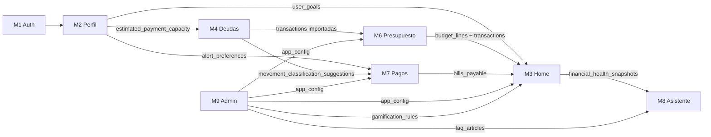

# Índice — Casos de Uso Walvy MVP

Cada archivo describe los flujos principales de cada módulo: actores, precondiciones, diagramas de secuencia (FE → BE → DB) y diagramas ER de las tablas involucradas.

---

## Módulos disponibles

| Archivo | Módulo | Tablas principales |
|---------|--------|-------------------|
| [uc-modulo-1-auth-onboarding.md](uc-modulo-1-auth-onboarding.md) | M1 — Auth y Onboarding | `users`, `refresh_tokens`, `password_reset_tokens`, `email_verification_tokens`, `biometric_preferences`, `onboarding_state` |
| [uc-modulo-2-perfil.md](uc-modulo-2-perfil.md) | M2 — Perfil y Configuración | `user_financial_profile`, `user_goals`, `alert_preferences` |
| [uc-modulo-3-home.md](uc-modulo-3-home.md) | M3 — Home y Motivación | `financial_health_snapshots`, `gamification_events`, `user_gamification_stats`, `user_score_history`, `recommendation_events` |
| [uc-modulo-4-deudas.md](uc-modulo-4-deudas.md) | M4 — Motor de Deudas | `debts`, `debt_snowball_plan`, `statement_imports`, `import_line_items`, `movement_classification_suggestions` |
| [uc-modulo-6-presupuesto.md](uc-modulo-6-presupuesto.md) | M6 — Presupuestos | `budget_periods`, `budget_lines`, `categories`, `subcategories`, `ant_expense_rules` |
| [uc-modulo-7-pagos.md](uc-modulo-7-pagos.md) | M7 — Pagos | `bills_payable`, `recurring_payment_suggestions`, `notification_queue` |
| [uc-modulo-8-asistente.md](uc-modulo-8-asistente.md) | M8 — Asistente IA | `ai_conversations`, `ai_messages`, `ai_tool_invocations`, `ai_context_snapshots`, `faq_articles` |
| [uc-modulo-9-admin.md](uc-modulo-9-admin.md) | M9 — Administración | `admin_users`, `app_config`, `gamification_rules`, `admin_audit_log`, `report_snapshots` |

---

## Casos de uso por módulo

### M1 — Auth y Onboarding
- UC-01: Registro con formulario unificado
- UC-02: Verificar correo electrónico (código 6 dígitos)
- UC-03: Login con identificador flexible (email / RUT / username)
- UC-04: Refresh de token (sesión persistente)
- UC-05: Recuperar contraseña por email
- UC-06: Activar autenticación biométrica
- UC-07: Completar onboarding paso a paso

### M2 — Perfil y Configuración
- UC-01: Configurar perfil financiero
- UC-02: Definir metas globales
- UC-03: Configurar preferencias de alertas
- UC-04: Actualizar email o contraseña
- UC-05: Estimar capacidad de pago mensual

### M3 — Home, Seguimiento y Motivación
- UC-01: Ver dashboard del Home
- UC-02: Calcular y actualizar semáforo financiero (job diario)
- UC-03: Otorgar puntos de gamificación
- UC-04: Mostrar recomendación contextual
- UC-05: Ver historial de score personal
- UC-06: Ver gráfico de gastos por categoría

### M4 — Motor de Deudas (Bola de Nieve)
- UC-01: Registrar deuda manualmente
- UC-02: Importar cartola bancaria
- UC-03: Revisar y clasificar movimientos importados
- UC-04: Ver plan Bola de Nieve
- UC-05: Simular pago extra
- UC-06: Registrar pago de deuda

### M6 — Presupuestos
- UC-01: Crear período de presupuesto mensual
- UC-02: Ajustar líneas de presupuesto
- UC-03: Ver cumplimiento en tiempo real
- UC-04: Recibir alerta de sobreconsumo
- UC-05: Detectar y reportar gasto hormiga
- UC-06: Navegar a vista semanal/diaria

### M7 — Pagos
- UC-01: Registrar cuenta por pagar
- UC-02: Marcar cuenta como pagada
- UC-03: Aceptar sugerencia de pago recurrente
- UC-04: Job diario — actualizar semáforos y marcar vencidos
- UC-05: Vincular pago con transacción importada

### M8 — Asistente IA y Soporte
- UC-01: Iniciar una nueva conversación
- UC-02: Enviar mensaje de texto y recibir respuesta
- UC-03: Enviar mensaje de voz
- UC-04: Consultar FAQ
- UC-05: Ver historial de conversación previa
- UC-06: Mostrar recomendación contextual en pantalla

### M9 — Administración (Backoffice)
- UC-01: Login de administrador
- UC-02: Cambiar parámetro de configuración del sistema
- UC-03: Editar reglas de gamificación
- UC-04: Gestionar artículos FAQ
- UC-05: Ver y generar reportes del sistema
- UC-06: Crear nuevo admin (solo super_admin)
- UC-07: Ver log de auditoría

---

## Convenciones de los diagramas

- **`sequenceDiagram`**: flujos FE → BE → DB con mensajes reales (endpoints, queries SQL)
- **`flowchart TD`**: lógica de decisión (algoritmos, jobs, criterios)
- **`stateDiagram-v2`**: ciclos de vida de entidades (estados de un import, bill, etc.)
- **`erDiagram`**: relaciones entre tablas del módulo

---

## Dependencias cross-módulo críticas

