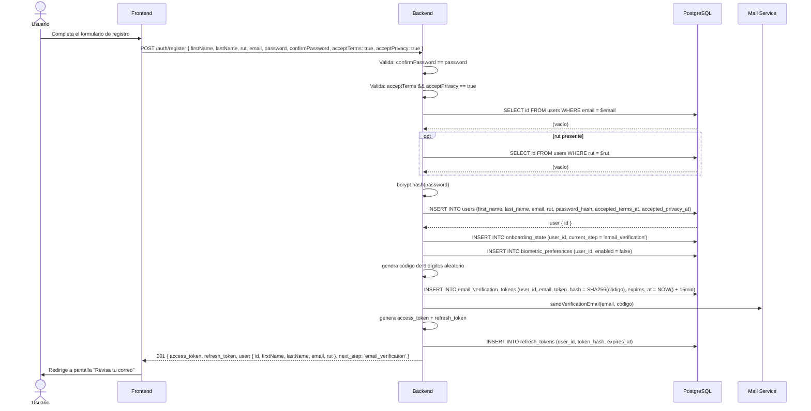
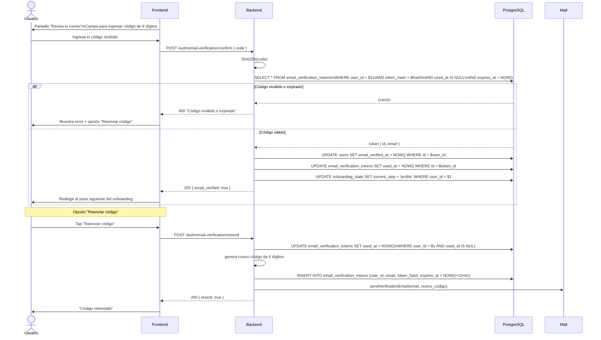
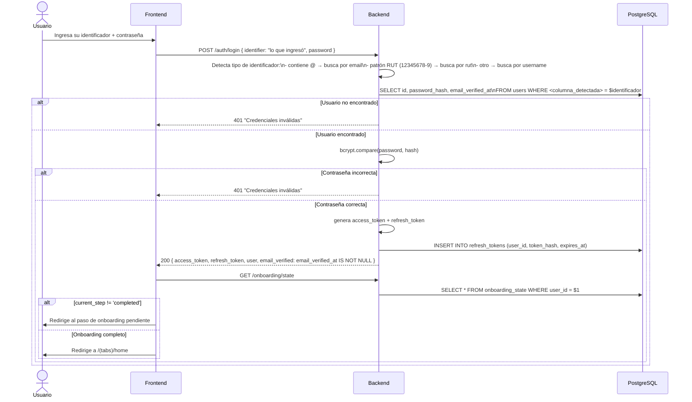
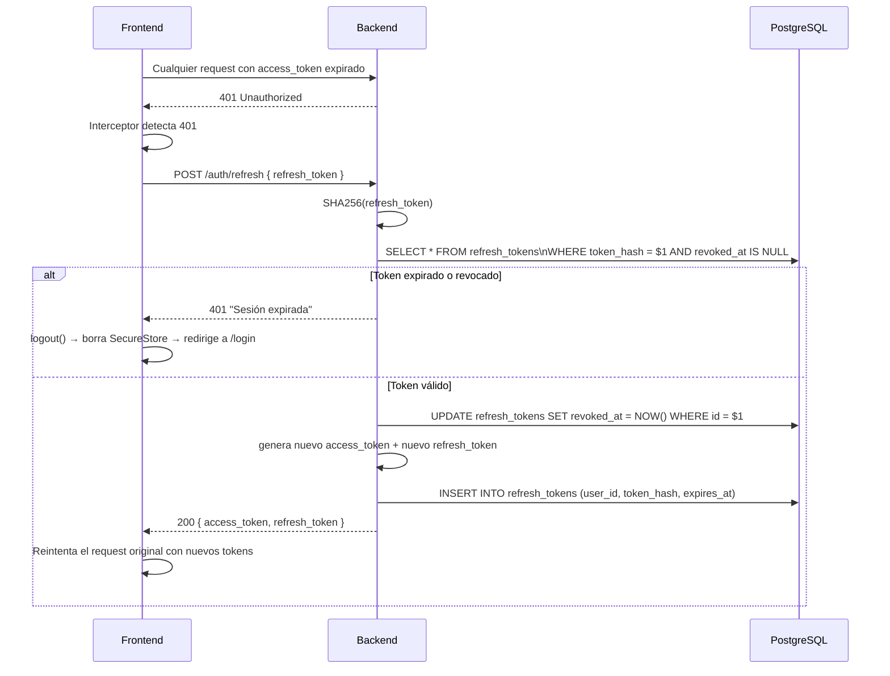
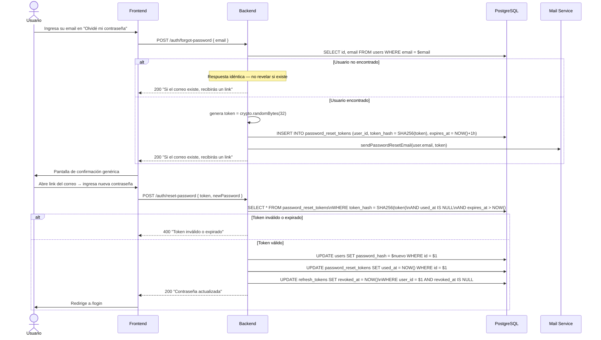
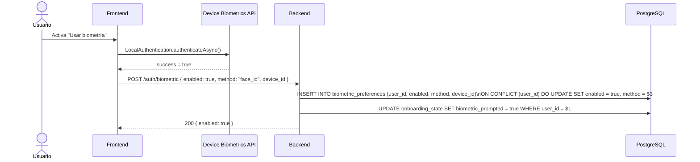
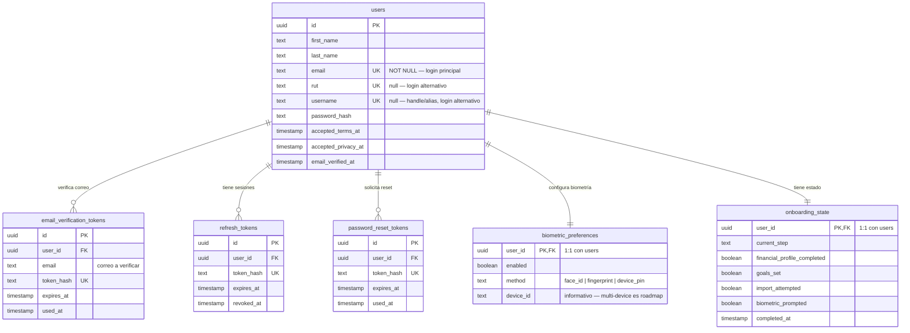

# Casos de Uso — Módulo 1: Enrolamiento y Onboarding

**Tablas involucradas:** `users`, `refresh_tokens`, `password_reset_tokens`, `email_verification_tokens`, `biometric_preferences`, `onboarding_state`

---

## Actores

| Actor | Descripción |
|-------|-------------|
| **Usuario nuevo** | No tiene cuenta en Walvy |
| **Usuario registrado** | Tiene cuenta y sesión activa o expirada |
| **Sistema (job)** | Limpieza automática de tokens vencidos |

---

## Schema requerido — tabla `users`

La tabla `users` usa `email` como identificador primario (NOT NULL UNIQUE). El login también acepta `rut` y `username` como identificadores secundarios.

```dbml
Table users {
  id                  uuid [pk]
  first_name          text [not null]
  last_name           text [not null]
  email               text [not null, unique, note: 'Identificador primario. Verificado post-registro.']
  rut                 text [null, unique, note: 'RUT normalizado sin puntos con guión (12345678-9). Opcional.']
  username            text [null, unique, note: 'Handle/alias opcional. null hasta que el usuario lo configure.']
  password_hash       text [not null]
  accepted_terms_at   timestamptz
  accepted_privacy_at timestamptz
  email_verified_at   timestamptz [note: 'null = correo no verificado']
  created_at          timestamptz [not null]
  updated_at          timestamptz [not null]
}
```

## Schema requerido — tabla `email_verification_tokens`

Almacena los tokens de verificación de correo para el flujo post-registro.

```dbml
Table email_verification_tokens {
  id         uuid        [pk]
  user_id    uuid        [not null, ref: > users.id]
  email      text        [not null, note: 'El correo que se está verificando']
  token_hash text        [not null, unique, note: 'SHA-256 del código de 6 dígitos']
  expires_at timestamptz [not null, note: 'Expira en 15 minutos']
  used_at    timestamptz [note: 'null = pendiente de uso']
  created_at timestamptz [not null]
}
```

---

## UC-01: Registro con formulario unificado

**Actor:** Usuario nuevo  
**Precondición:** La app está abierta en la pantalla de bienvenida

El registro usa un único formulario. El email siempre es requerido y se envía código de verificación inmediatamente.



---

## UC-02: Verificar correo electrónico

**Actor:** Usuario nuevo (post-registro)  
**Precondición:** Código enviado al correo, pantalla "Revisa tu correo" activa



---

## UC-03: Login con identificador flexible

**Actor:** Usuario registrado  
**Precondición:** Cuenta activa con contraseña establecida



### Regla de detección del identificador

| Lo que escribe el usuario | Criterio de detección | Se busca en |
|--------------------------|----------------------|-------------|
| `tu@correo.cl` | Contiene `@` | `users.email` (case-insensitive) |
| `12345678-9` | Patrón `/^\d{7,8}-[\dkK]$/` | `users.rut` |
| `userwalvy` | Ninguno de los anteriores | `users.username` (case-insensitive) |

---

## UC-04: Refresh de token (sesión persistente)

**Actor:** Sistema (interceptor del cliente)  
**Precondición:** Access token expirado, refresh token vigente



---

## UC-05: Recuperar contraseña

**Actor:** Usuario registrado  
**Precondición:** El usuario olvidó su contraseña



---

## UC-06: Activar autenticación biométrica

**Actor:** Usuario registrado  
**Precondición:** Dispositivo soporta Face ID o huella



---

## UC-07: Completar onboarding paso a paso

**Actor:** Usuario nuevo (post-registro y verificación de correo)

```mermaid
flowchart TD
    START([Registro completado]) --> EMAIL_VER{¿email_verified_at\nno es null?}
    EMAIL_VER --> |No verificado| VER_STEP[Pantalla: Revisa tu correo\nUC-02]
    EMAIL_VER --> |Verificado| STEP1
    VER_STEP --> |Código correcto| STEP1

    STEP1[Onboarding: Perfil financiero\nM2 → user_financial_profile] --> MARK1
    MARK1[UPDATE onboarding_state\nfinancial_profile_completed = true] --> STEP2

    STEP2[Onboarding: Metas globales\nM2 → user_goals] --> MARK2
    MARK2[UPDATE onboarding_state\ngoals_set = true] --> STEP3

    STEP3{¿Importar cartola?} --> |Intenta| IMPORT[M4: statement_imports]
    STEP3 --> |Salta| BIO
    IMPORT --> MARK3[UPDATE onboarding_state\nimport_attempted = true]
    MARK3 --> BIO

    BIO[Ofrecer biometría] --> |Activa| BIO_ON[INSERT biometric_preferences\nbiometric_prompted = true]
    BIO --> |Omite| BIO_SKIP[biometric_prompted = true]
    BIO_ON --> DONE
    BIO_SKIP --> DONE

    DONE[UPDATE onboarding_state\ncurrent_step = 'completed'\ncompleted_at = NOW()] --> HOME([Redirige a home])
```

### Estados de `onboarding_state`

| Campo | Valor inicial | Se actualiza cuando |
|-------|--------------|---------------------|
| `current_step` | `'email_verification'` | Avanza con cada paso |
| `financial_profile_completed` | `false` | Usuario guarda perfil financiero (M2) |
| `goals_set` | `false` | Usuario define al menos 1 meta (M2) |
| `import_attempted` | `false` | Usuario intenta importar cartola (M4) |
| `biometric_prompted` | `false` | Se le ofreció biometría (aceptó o rechazó) |
| `completed_at` | `null` | Al terminar todos los pasos |

---

## Diagrama de relación entre tablas — M1


