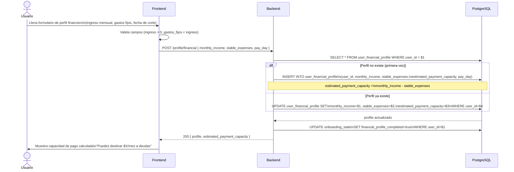
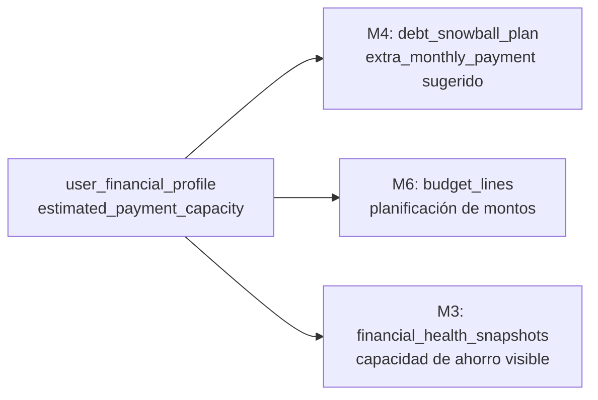
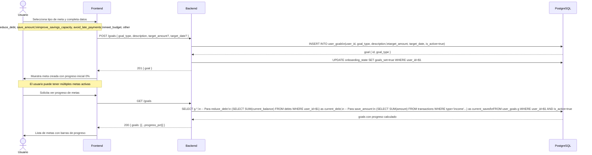
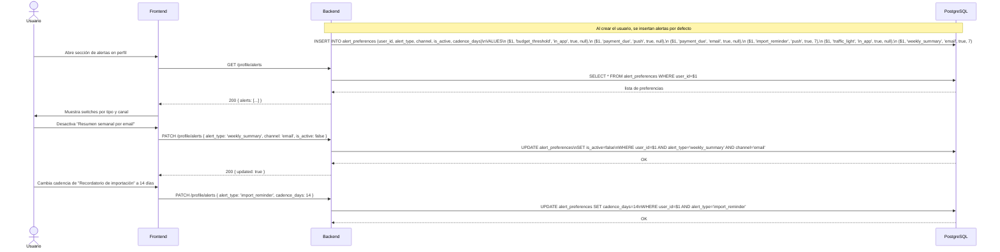
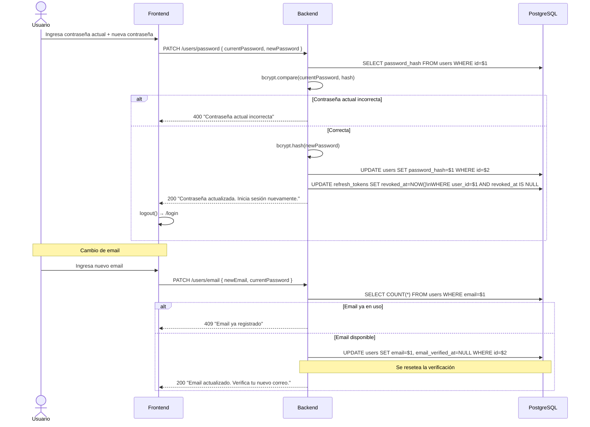
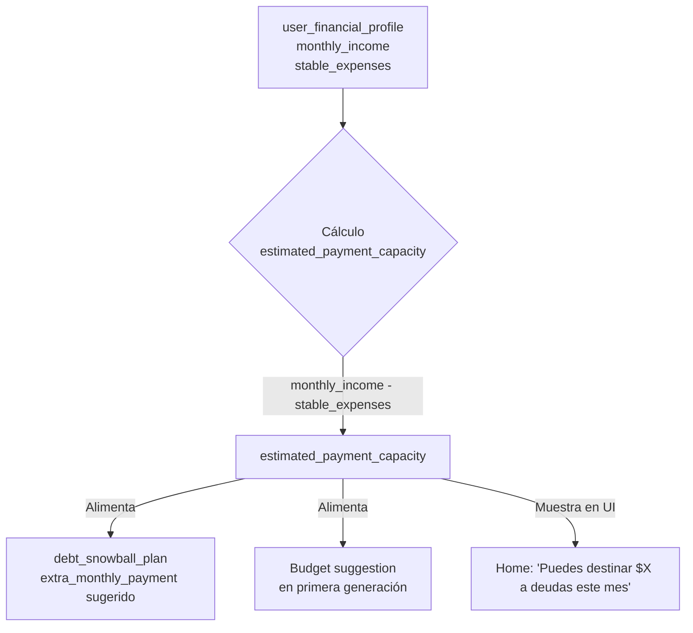
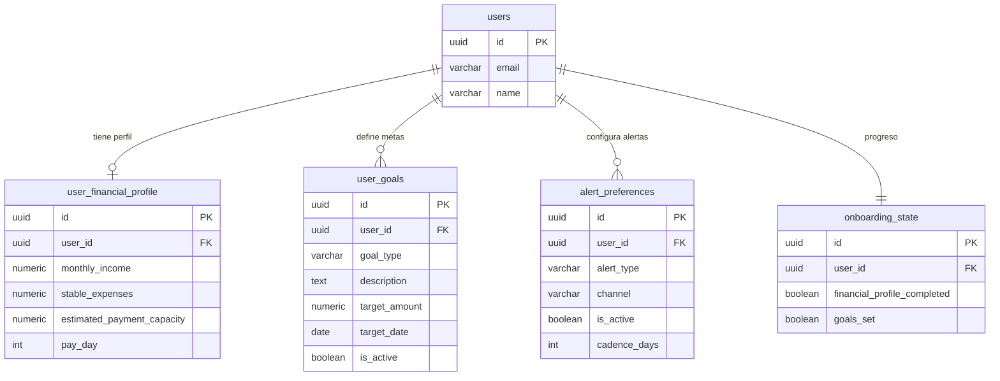

# Casos de Uso — Módulo 2: Perfil y Configuración

**Tablas involucradas:** `user_financial_profile`, `user_goals`, `alert_preferences`, `onboarding_state`, `users`

---

## Actores

| Actor | Descripción |
|-------|-------------|
| **Usuario** | Configura su perfil financiero y preferencias |
| **Sistema** | Lee el perfil para calcular capacidad de pago, sugerencias de presupuesto |

---

## UC-01: Configurar perfil financiero

**Actor:** Usuario
**Precondición:** Usuario autenticado. Puede ser el primer acceso (onboarding) o una actualización posterior.

### Campo clave: `estimated_payment_capacity`

Este valor es consumido por múltiples módulos:

---

## UC-02: Definir metas globales

**Actor:** Usuario
**Precondición:** Usuario tiene perfil financiero configurado

### Regla de progreso por tipo de meta

| `goal_type` | Fórmula de progreso | Fuente de datos |
|-------------|---------------------|----------------|
| `reduce_debt` | `(initial_debt - current_debt) / initial_debt` | `debts.current_balance` |
| `save_amount` | `current_saved / target_amount` | `transactions` (ingresos) |
| `improve_savings_capacity` | `current_capacity / target_capacity` | `user_financial_profile` |
| `avoid_late_payments` | `meses_sin_vencimiento / target_months` | `bills_payable` |
| `meet_budget` | `meses_dentro_presupuesto / target_months` | `budget_lines` + `transactions` |

---

## UC-03: Configurar preferencias de alertas

**Actor:** Usuario
**Precondición:** Usuario autenticado, perfil básico completo

### Matriz de alertas por defecto

| `alert_type` | `channel` | `is_active` | `cadence_days` | Cuándo se dispara |
|-------------|----------|-------------|---------------|-------------------|
| `budget_threshold` | `in_app` | `true` | `null` | Cuando categoría supera 80% del presupuesto |
| `payment_due` | `push` | `true` | `null` | 7, 3 y 1 día antes del vencimiento |
| `payment_due` | `email` | `true` | `null` | 7, 3 y 1 día antes del vencimiento |
| `import_reminder` | `push` | `true` | `7` | Cada 7 días si no ha importado cartola |
| `traffic_light` | `in_app` | `true` | `null` | Cuando el semáforo cambia de estado |
| `weekly_summary` | `email` | `true` | `7` | Cada domingo |

---

## UC-04: Actualizar email o contraseña

**Actor:** Usuario
**Precondición:** Usuario autenticado

---

## UC-05: Estimar capacidad de pago mensual

Este cálculo es central para M4 (Bola de Nieve). El backend lo ejecuta cada vez que cambia el perfil financiero.

### Reglas de negocio aplicadas

- Si `estimated_payment_capacity <= 0`: alerta de advertencia al usuario ("Tus gastos fijos superan tu ingreso")
- El valor se recalcula automáticamente cada vez que se modifica `monthly_income` o `stable_expenses`
- El `pay_day` determina el día de corte del período del presupuesto en M6

---

## Diagrama de relación entre tablas — M2

