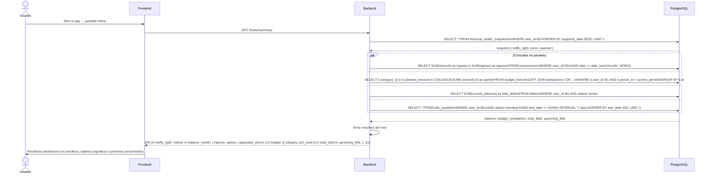
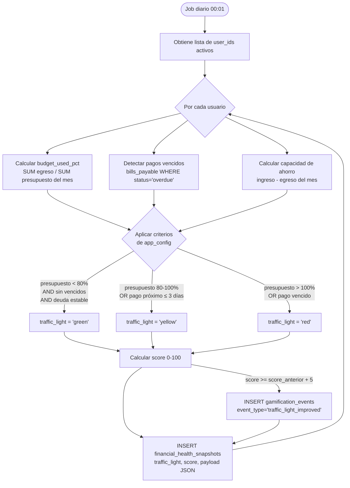
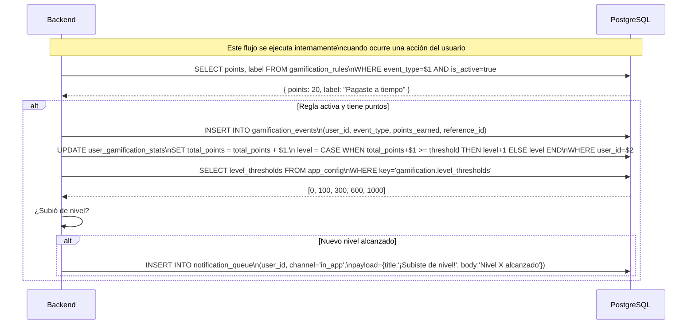
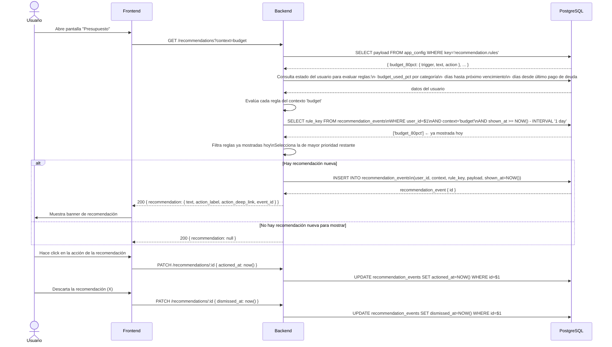
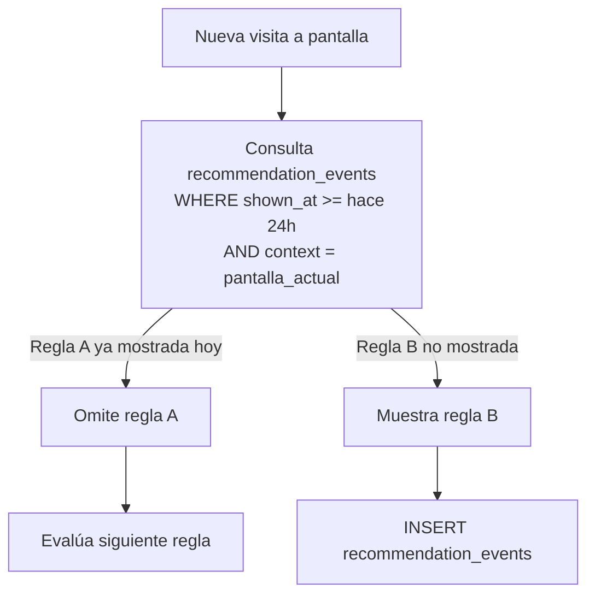
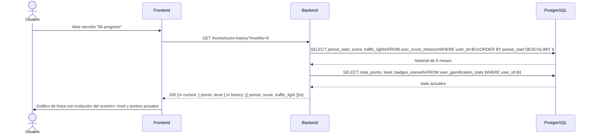
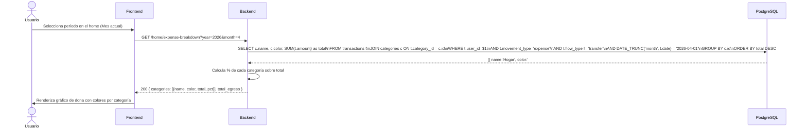
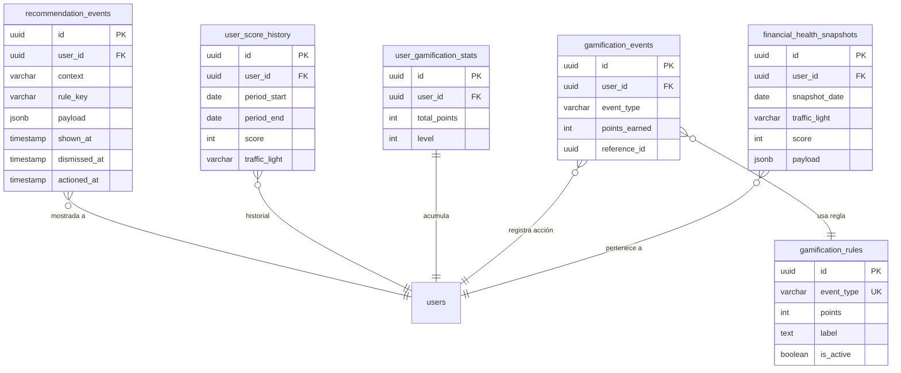

# Casos de Uso — Módulo 3: Home, Seguimiento y Motivación

**Tablas involucradas:** `financial_health_snapshots`, `gamification_events`, `user_gamification_stats`, `user_score_history`, `recommendation_events`, `gamification_rules`, `transactions`, `budget_lines`, `debts`, `bills_payable`, `user_goals`

---

## Actores

| Actor | Descripción |
|-------|-------------|
| **Usuario** | Visualiza su estado financiero diario |
| **Sistema (job diario)** | Genera snapshots del semáforo y score |
| **Sistema (evento)** | Otorga puntos al detectar acciones del usuario |

---

## UC-01: Ver dashboard del Home

**Actor:** Usuario
**Precondición:** Usuario autenticado, al menos 1 transacción o deuda registrada



---

## UC-02: Calcular y actualizar semáforo financiero (job diario)

**Actor:** Sistema (cron job — corre diariamente a las 00:01)
**Precondición:** Existen usuarios con transacciones del mes actual



### Estructura del `payload` del snapshot

```json
{
  "budget_used_pct": 73.5,
  "total_debt": 4500000,
  "active_goals": 2,
  "payments_overdue": 0,
  "savings_capacity": 280000,
  "top_expense_category": "Hogar",
  "alerts_active": ["budget_threshold"]
}
```

---

## UC-03: Otorgar puntos de gamificación

**Actor:** Sistema (evento disparado por acciones del usuario)
**Precondición:** Módulo de gamificación activo (`app_config.gamification.enabled = true`)



### Eventos configurables y cuándo se disparan

| `event_type` | `points` | Cuándo se dispara en el backend |
|-------------|---------|--------------------------------|
| `register_transaction` | 5 | Después de `POST /transactions` exitoso |
| `pay_on_time` | 20 | Al marcar `bills_payable` como `paid` ANTES de `due_date` |
| `stay_under_budget` | 30 | Job mensual detecta que todos los budget_lines < 100% |
| `register_debt` | 10 | Después de `POST /debts` exitoso |
| `debt_paid` | 50 | Al cambiar `debts.status = 'paid'` |
| `complete_onboarding` | 25 | Al completar todos los flags de `onboarding_state` |

---

## UC-04: Mostrar recomendación contextual

**Actor:** Usuario (al abrir cualquier pantalla)
**Precondición:** Existen reglas en `app_config.recommendation.rules`



### Regla de no-repetición



---

## UC-05: Ver historial de score personal

**Actor:** Usuario
**Precondición:** Al menos 1 mes con snapshot generado



---

## UC-06: Ver gráfico de gastos por categoría

**Actor:** Usuario
**Precondición:** Al menos 1 transacción del mes actual



---

## Diagrama de relación entre tablas — M3


