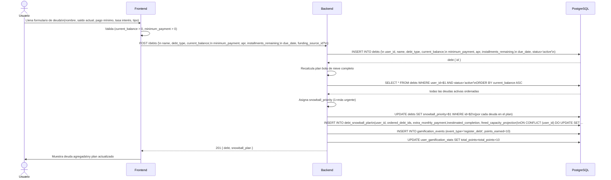
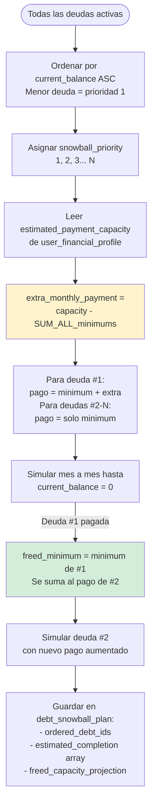
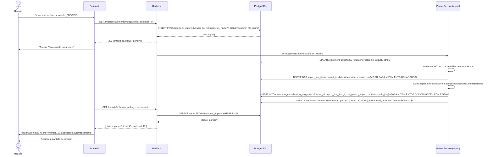
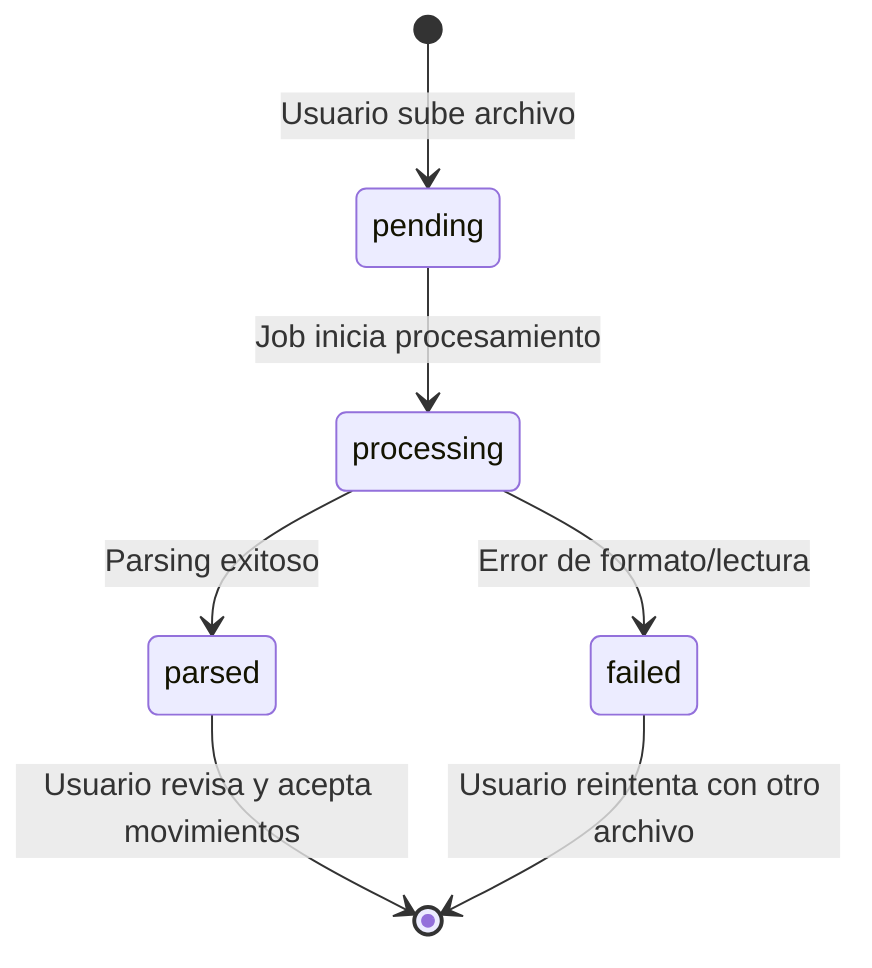
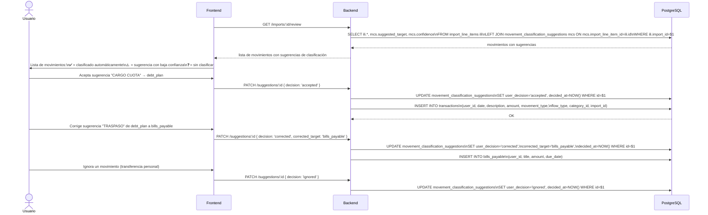
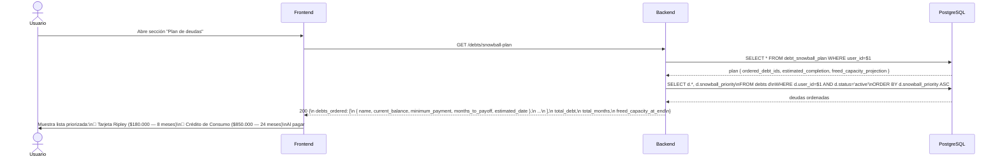
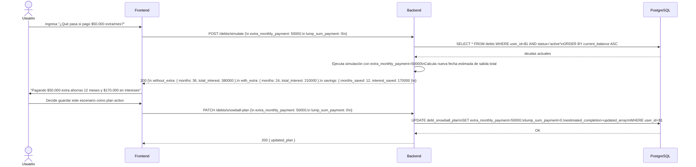
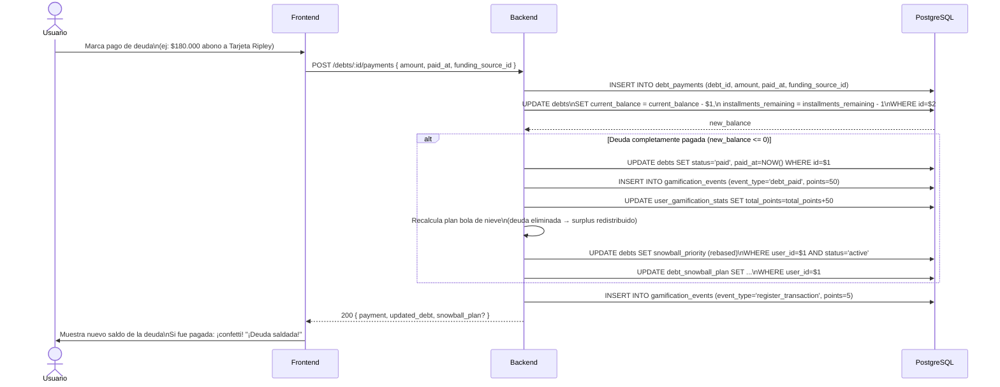
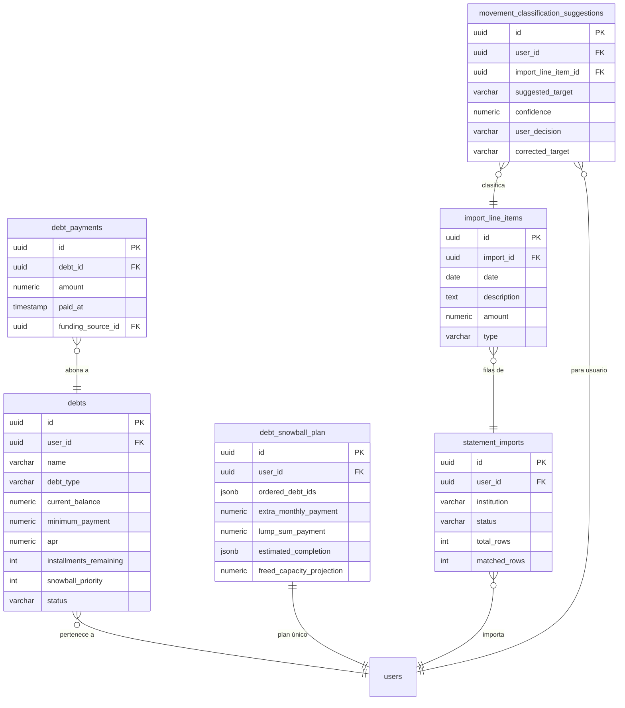

# Casos de Uso — Módulo 4: Motor de Deudas (Bola de Nieve)

**Tablas involucradas:** `debts`, `debt_schedules`, `debt_payments`, `debt_attachments`, `debt_snowball_plan`, `statement_imports`, `import_line_items`, `movement_classification_suggestions`, `transactions`, `funding_sources`

---

## Actores

| Actor | Descripción |
|-------|-------------|
| **Usuario** | Registra deudas, importa cartolas, clasifica movimientos |
| **Sistema (algoritmo)** | Calcula prioridades y el plan bola de nieve |
| **Sistema (job)** | Procesa archivos importados (pipeline async) |

---

## UC-01: Registrar deuda manualmente

**Actor:** Usuario
**Precondición:** Usuario autenticado, tiene al menos 1 deuda

### Algoritmo Bola de Nieve (implementación)

---

## UC-02: Importar cartola bancaria

**Actor:** Usuario
**Precondición:** Usuario tiene archivo PDF o CSV de su banco

### Estados del pipeline de importación

---

## UC-03: Revisar y clasificar movimientos importados

**Actor:** Usuario
**Precondición:** `statement_imports.status = 'parsed'`

### Reglas de clasificación automática (por keyword en descripción)

| Keyword en `description` | `suggested_target` | `confidence` |
|--------------------------|-------------------|-------------|
| "CUOTA", "CUOTAS" | `debt_plan` | 0.9 |
| "CREDITO CONSUMO" | `debt_plan` | 0.85 |
| "LINEA DE CREDITO" | `debt_plan` | 0.85 |
| "INTERES", "MORA" | `debt_plan` | 0.8 |
| "ARRIENDO" | `bills_payable` | 0.9 |
| "DIVIDENDO" | `bills_payable` | 0.85 |
| "NETFLIX", "SPOTIFY" | `bills_payable` | 0.8 |
| Glosa repetida ≥3 veces | `bills_payable` | 0.7 |

---

## UC-04: Ver plan Bola de Nieve

**Actor:** Usuario
**Precondición:** Al menos 2 deudas activas registradas

---

## UC-05: Simular pago extra (Bola de Nieve mejorada)

**Actor:** Usuario
**Precondición:** Plan de deudas activo

---

## UC-06: Registrar pago de deuda

**Actor:** Usuario
**Precondición:** Deuda activa en el plan

---

## Diagrama de relación entre tablas — M4

