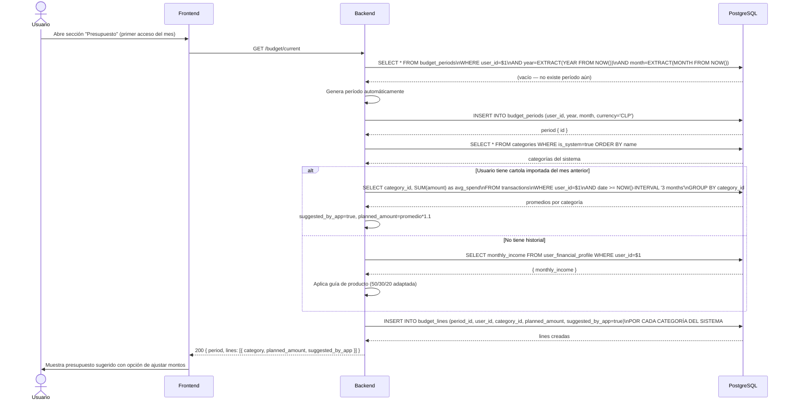
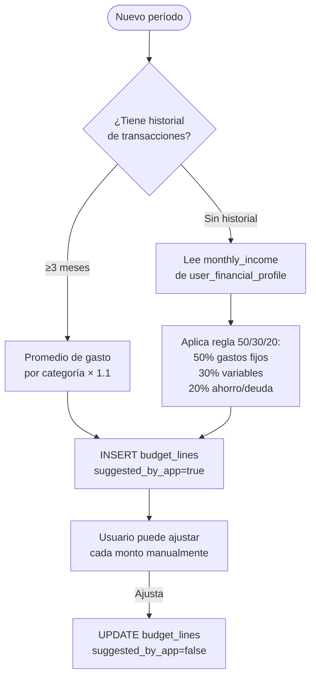
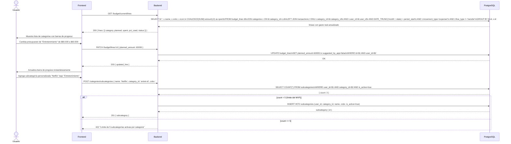
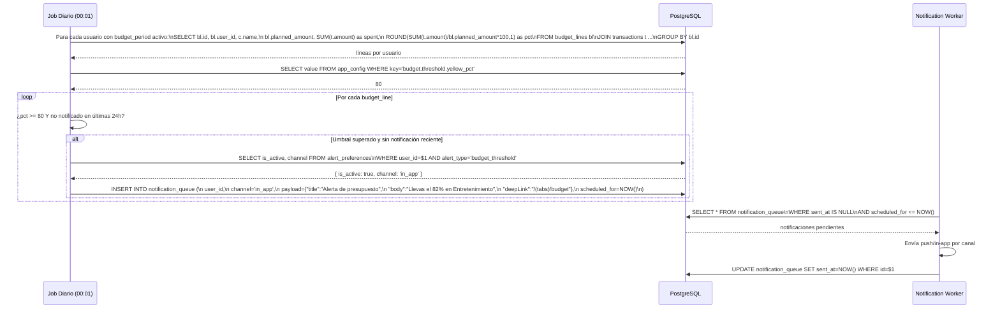
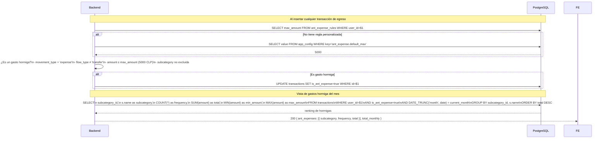
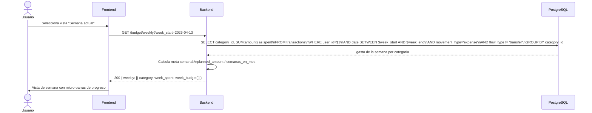
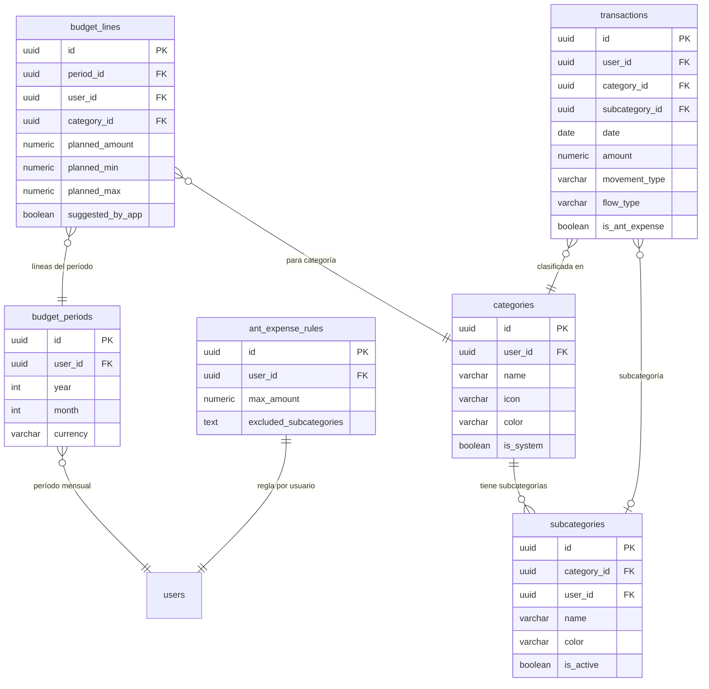

# Casos de Uso — Módulo 6: Presupuestos

**Tablas involucradas:** `budget_periods`, `budget_lines`, `categories`, `subcategories`, `ant_expense_rules`, `transactions`, `app_config`

---

## Actores

| Actor | Descripción |
|-------|-------------|
| **Usuario** | Crea y gestiona su presupuesto mensual |
| **Sistema (job diario)** | Recalcula cumplimiento y dispara alertas de sobreconsumo |
| **Sistema (M4)** | Sugiere presupuesto basado en cartola importada |

---

## UC-01: Crear período de presupuesto mensual

**Actor:** Usuario
**Precondición:** Usuario con perfil financiero configurado

### Lógica de sugerencia de presupuesto

---

## UC-02: Ajustar líneas de presupuesto

**Actor:** Usuario
**Precondición:** Período de presupuesto activo

---

## UC-03: Ver cumplimiento de presupuesto en tiempo real

**Actor:** Usuario
**Precondición:** Período activo con al menos 1 transacción

```mermaid
sequenceDiagram
    actor U as Usuario
    participant FE as Frontend
    participant BE as Backend
    participant DB as PostgreSQL

    U->>FE: Abre pantalla "Presupuesto → mes actual"
    FE->>BE: GET /budget/current/compliance
    BE->>DB: SELECT\n  bl.category_id,\n  c.name,\n  c.color,\n  bl.planned_amount,\n  COALESCE(SUM(t.amount),0) as spent,\n  ROUND(COALESCE(SUM(t.amount),0)/bl.planned_amount*100, 1) as pct_used\nFROM budget_lines bl\nJOIN categories c ON bl.category_id=c.id\nLEFT JOIN transactions t ON\n  t.category_id=bl.category_id\n  AND t.user_id=bl.user_id\n  AND DATE_TRUNC('month',t.date) = period_start\n  AND t.movement_type='expense'\n  AND t.flow_type != 'transfer'\nWHERE bl.user_id=$1 AND bl.period_id=$2\nGROUP BY bl.id, c.id\nORDER BY pct_used DESC
    DB-->>BE: compliance data
    BE->>DB: SELECT value FROM app_config\nWHERE key IN ('budget.threshold.yellow_pct', 'budget.threshold.red_pct')
    DB-->>BE: { yellow: 80, red: 100 }
    BE->>BE: Clasifica cada línea:\n- pct_used < 80 → 'green'\n- pct_used 80-100 → 'yellow'\n- pct_used > 100 → 'red'
    BE-->>FE: 200 { lines: [...], thresholds: { yellow: 80, red: 100 } }
    FE->>U: Muestra barras de progreso con colores\n🟢 Alimentación: 65% ($130k de $200k)\n🟡 Entretenimiento: 82% ($49k de $60k)\n🔴 Salud: 108% ($108k de $100k)
```

---

## UC-04: Recibir alerta de sobreconsumo

**Actor:** Sistema (job diario) + Usuario (recibe notificación)
**Precondición:** Una categoría supera el umbral configurado

---

## UC-05: Detectar y reportar gasto hormiga

**Actor:** Sistema (al insertar transacción) + Usuario (ve el reporte)
**Precondición:** `ant_expense_rules` configurada (default max: 5.000 CLP)

---

## UC-06: Navegar a semana / día del presupuesto

**Actor:** Usuario
**Precondición:** Período mensual activo

---

## Diagrama de relación entre tablas — M6

