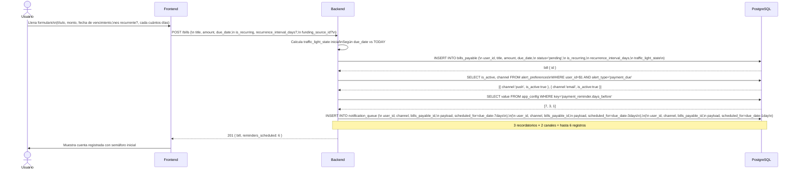
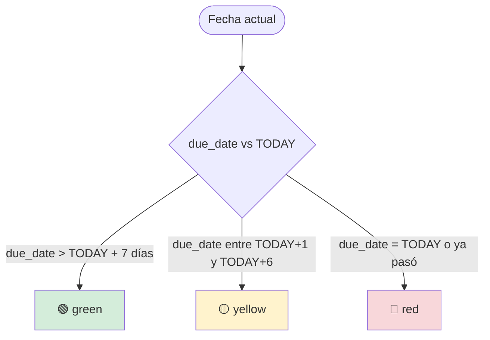
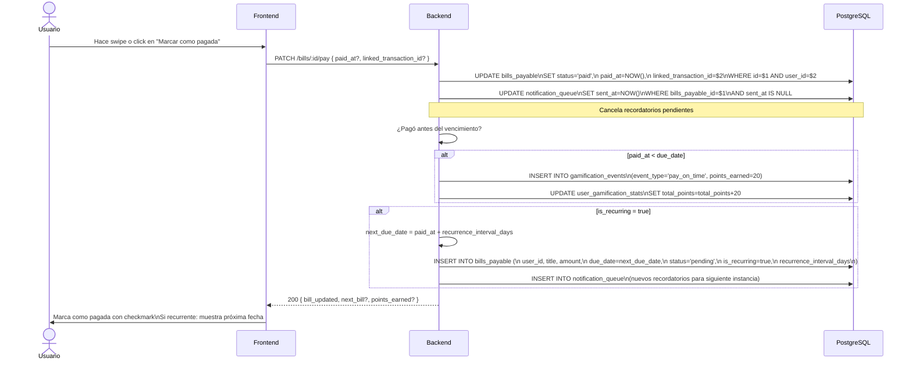
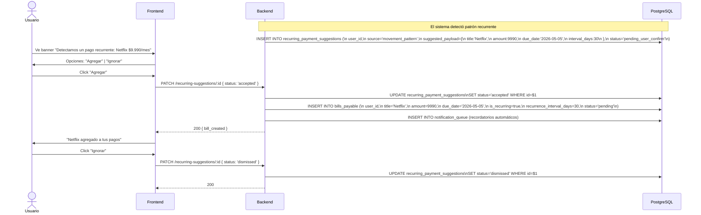
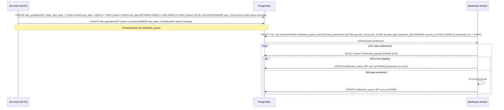
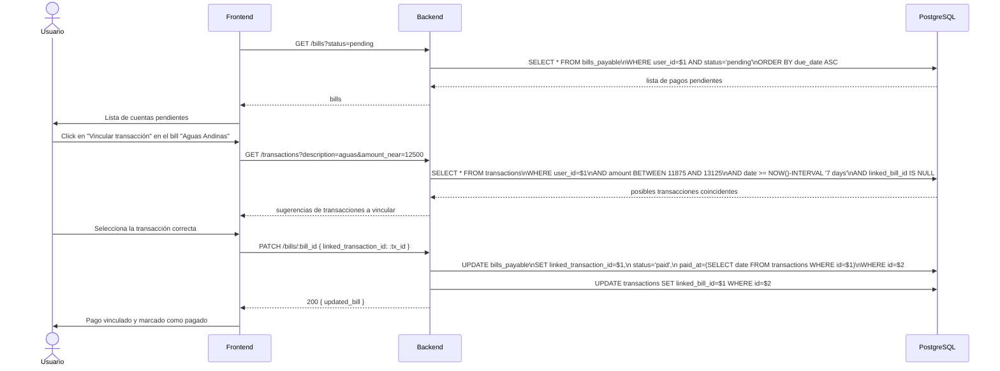
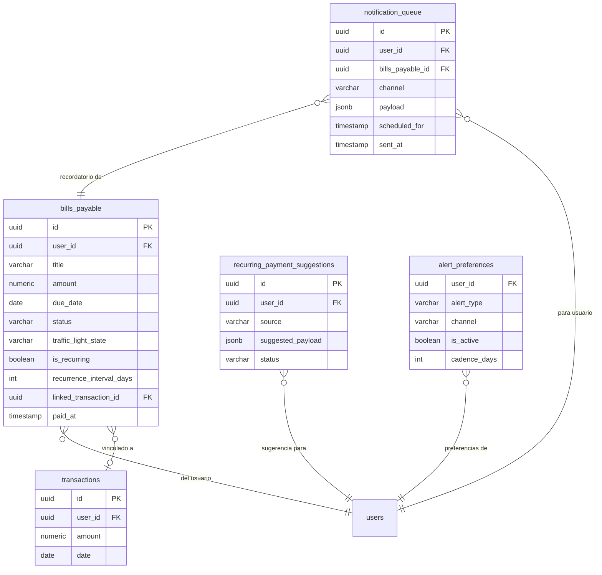

# Casos de Uso — Módulo 7: Pagos

**Tablas involucradas:** `bills_payable`, `recurring_payment_suggestions`, `notification_queue`, `transactions`, `alert_preferences`, `funding_sources`

---

## Actores

| Actor | Descripción |
|-------|-------------|
| **Usuario** | Registra y gestiona sus cuentas por pagar |
| **Sistema (job diario)** | Actualiza semáforos, genera recordatorios y detecta vencidos |
| **M4 (clasificación)** | Sugiere movimientos como cuentas por pagar |

---

## UC-01: Registrar cuenta por pagar

**Actor:** Usuario
**Precondición:** Usuario autenticado

### Cálculo del `traffic_light_state`

---

## UC-02: Marcar cuenta como pagada

**Actor:** Usuario
**Precondición:** `bills_payable.status = 'pending'`

---

## UC-03: Aceptar sugerencia de pago recurrente

**Actor:** Usuario
**Precondición:** El sistema detectó un pago recurrente (desde M4 clasificación o por patrón de transacciones)

---

## UC-04: Job diario — actualizar semáforos y marcar vencidos

**Actor:** Sistema (cron job — corre a las 00:01 diariamente)

---

## UC-05: Vincular pago con transacción importada

**Actor:** Usuario
**Precondición:** Existe `bills_payable` pendiente Y la cartola muestra el cargo correspondiente

---

## Diagrama de relación entre tablas — M7

