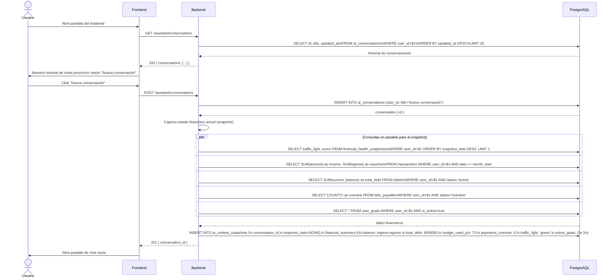
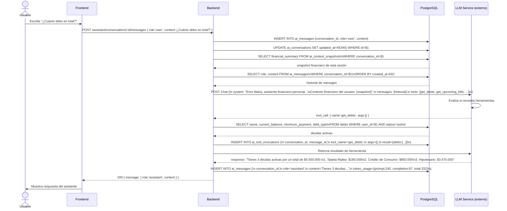
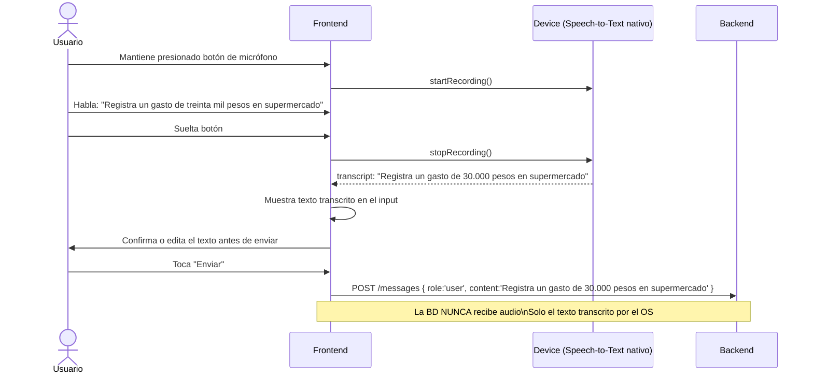
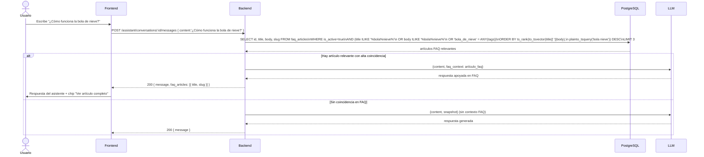
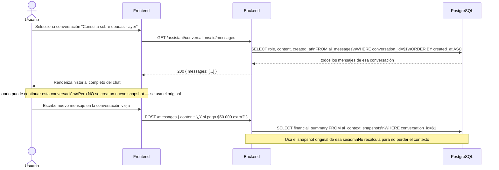
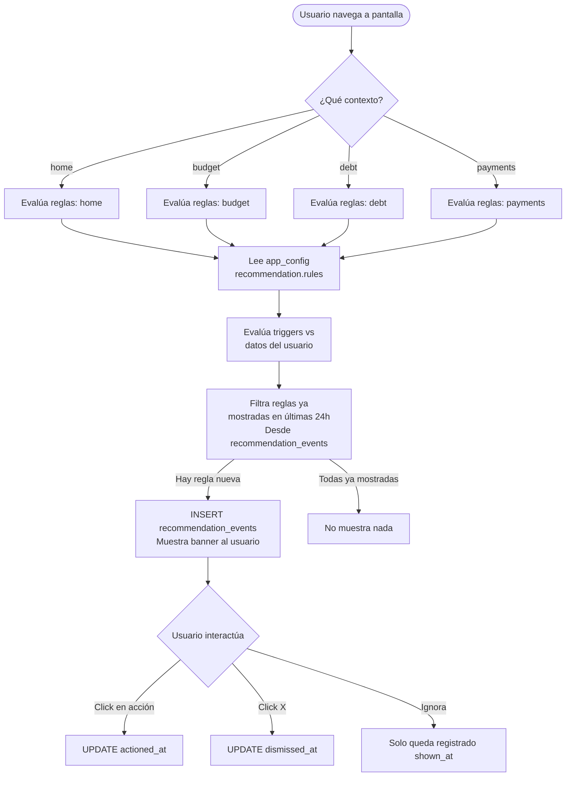
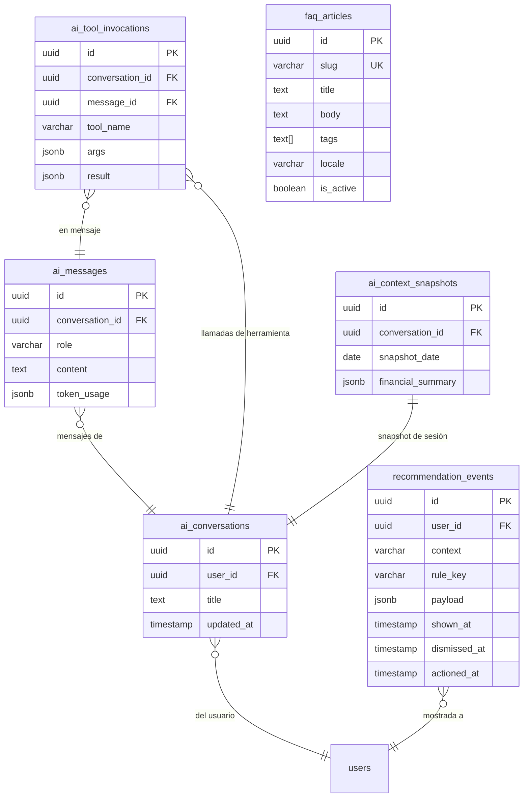

# Casos de Uso — Módulo 8: Asistente IA y Soporte

**Tablas involucradas:** `ai_conversations`, `ai_messages`, `ai_tool_invocations`, `ai_context_snapshots`, `recommendation_events`, `faq_articles`, `financial_health_snapshots`

---

## Actores

| Actor | Descripción |
|-------|-------------|
| **Usuario** | Inicia conversaciones, hace preguntas financieras |
| **LLM externo** | Genera respuestas basadas en contexto y herramientas |
| **Sistema** | Captura snapshot financiero al iniciar cada sesión |

---

## UC-01: Iniciar una nueva conversación

**Actor:** Usuario
**Precondición:** Usuario autenticado

---

## UC-02: Enviar mensaje de texto y recibir respuesta

**Actor:** Usuario
**Precondición:** Conversación activa con snapshot disponible

### Herramientas disponibles para el LLM

| Tool | Query ejecutada | Datos retornados |
|------|----------------|-----------------|
| `get_financial_summary` | `financial_health_snapshots` + cálculo del mes | balance, deuda total, budget_used_pct |
| `get_debts` | `debts` WHERE status='active' | nombre, saldo, mínimo, tipo |
| `get_upcoming_bills` | `bills_payable` WHERE status='pending' ORDER BY due_date | título, monto, fecha, semáforo |
| `get_budget_status` | `budget_lines` + `transactions` del mes | categoría, planificado, gastado, % |
| `get_goals_progress` | `user_goals` + datos cross-módulo | tipo, descripción, progreso % |

---

## UC-03: Enviar mensaje de voz

**Actor:** Usuario
**Precondición:** Dispositivo con micrófono, permiso concedido

---

## UC-04: Consultar FAQ

**Actor:** Usuario
**Precondición:** El chat detecta una pregunta frecuente

---

## UC-05: Ver historial de conversación previa

**Actor:** Usuario
**Precondición:** Al menos 1 conversación previa existente

---

## UC-06: Mostrar recomendación contextual en pantalla

**Actor:** Sistema (al navegar entre pantallas)

Este flujo cruza con M3. El motor de recomendaciones evalúa reglas y registra en `recommendation_events`.

---

## Diagrama de relación entre tablas — M8

