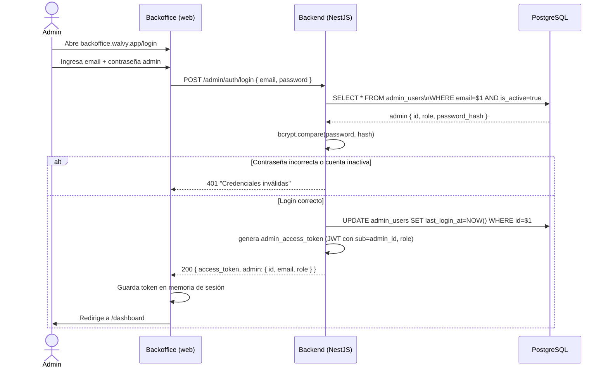
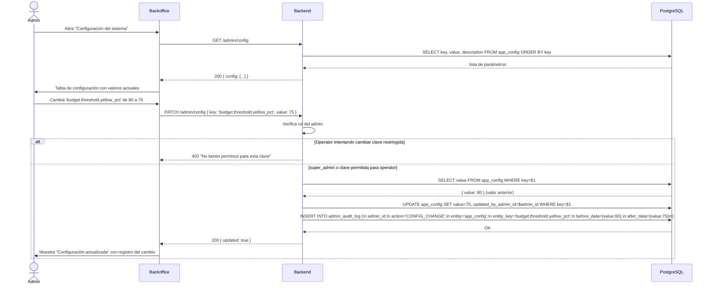
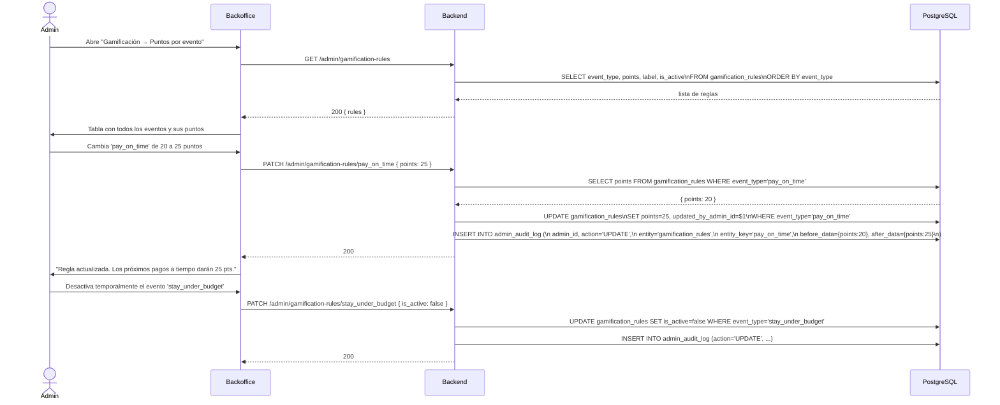
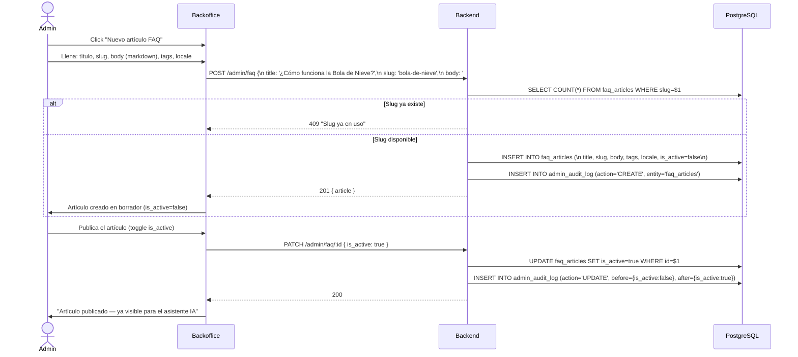
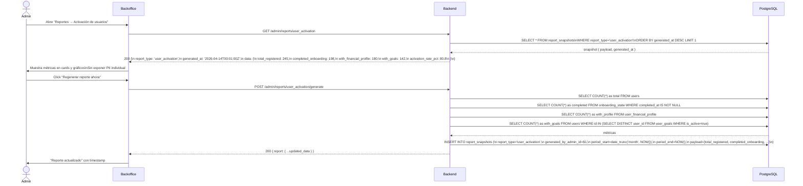
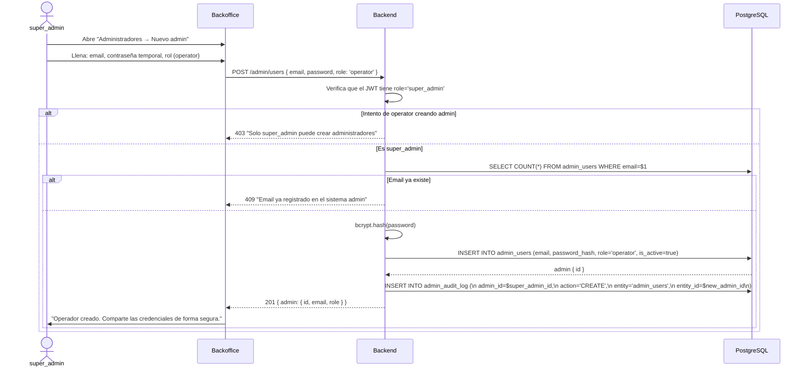
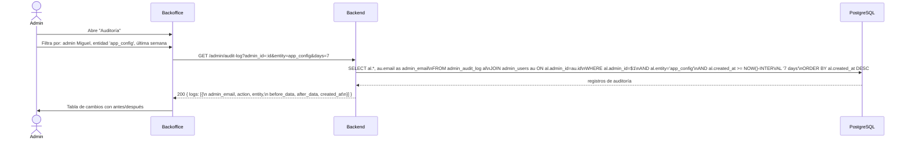
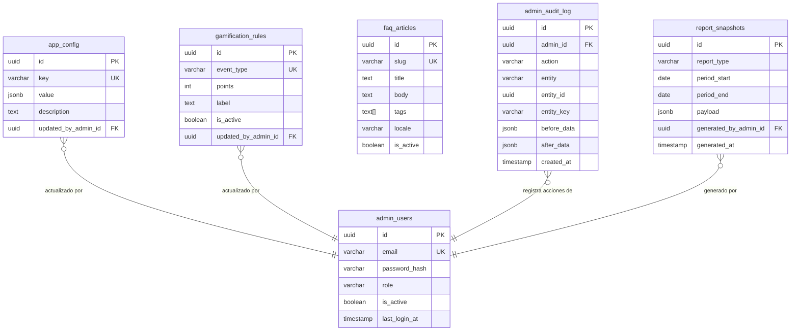

# Casos de Uso — Módulo 9: Administración (Backoffice)

**Tablas involucradas:** `admin_users`, `app_config`, `gamification_rules`, `faq_articles`, `admin_audit_log`, `report_snapshots`

---

## Actores

| Actor | Descripción |
|-------|-------------|
| **super_admin** | Acceso total al backoffice: gestiona admins, config, reportes |
| **operator** | Acceso limitado: edita config permitida, FAQ, gamificación |
| **Sistema (job)** | Genera reportes pre-computados periódicamente |

> El backoffice es una aplicación **completamente separada** del frontend de usuarios. Tiene su propio JWT y su propia ruta de autenticación. Los `admin_users` nunca comparten tabla con `users`.

---

## UC-01: Login de administrador

**Actor:** super_admin / operator
**Precondición:** Cuenta de admin creada por un super_admin

### Diferencia con el JWT de usuarios

| Aspecto | JWT usuario | JWT admin |
|---------|------------|-----------|
| `sub` | `users.id` | `admin_users.id` |
| `role` | no incluido | `super_admin` / `operator` |
| Guard | `JwtAuthGuard` | `AdminJwtGuard` |
| Expira en | 15 minutos | 8 horas (sesión de trabajo) |

---

## UC-02: Cambiar parámetro de configuración del sistema

**Actor:** super_admin o operator (solo claves permitidas)
**Precondición:** Admin autenticado

### Claves de `app_config` y permisos de rol

| Clave | super_admin | operator |
|-------|-------------|---------|
| `budget.threshold.yellow_pct` | ✅ | ✅ |
| `budget.threshold.red_pct` | ✅ | ✅ |
| `ant_expense.default_max` | ✅ | ✅ |
| `gamification.level_thresholds` | ✅ | ❌ |
| `gamification.enabled` | ✅ | ❌ |
| `recommendation.rules` | ✅ | ❌ |
| `payment_reminder.days_before` | ✅ | ✅ |
| `snowball.default_extra_payment` | ✅ | ✅ |

---

## UC-03: Editar reglas de gamificación

**Actor:** super_admin o operator
**Precondición:** Admin autenticado

---

## UC-04: Gestionar artículos FAQ

**Actor:** super_admin o operator
**Precondición:** Admin autenticado

---

## UC-05: Ver y generar reportes del sistema

**Actor:** super_admin o operator
**Precondición:** Admin autenticado

### Tipos de reportes disponibles

| `report_type` | Qué mide | Tablas de origen |
|---------------|---------|-----------------|
| `user_activation` | Funnel de onboarding: registro → perfil → metas | `users`, `onboarding_state`, `user_financial_profile`, `user_goals` |
| `usage_summary` | Transacciones, deudas y presupuestos del período | `transactions`, `debts`, `budget_periods` |
| `debt_overview` | Deuda total del sistema, distribución por tipo | `debts` |
| `budget_compliance` | % de usuarios dentro de presupuesto | `budget_lines`, `transactions` |

---

## UC-06: Crear nuevo admin (solo super_admin)

**Actor:** super_admin
**Precondición:** Autenticado como super_admin

---

## UC-07: Ver log de auditoría

**Actor:** super_admin o operator (solo lectura)

---

## Diagrama de relación entre tablas — M9

