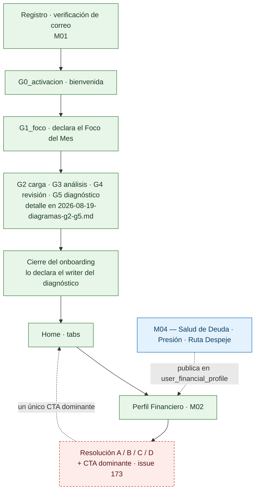
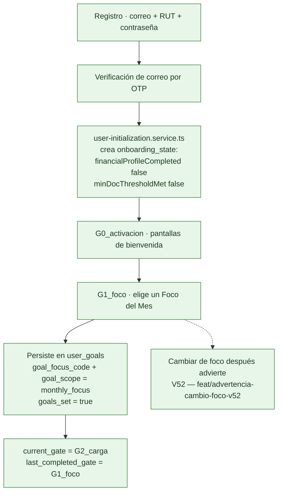
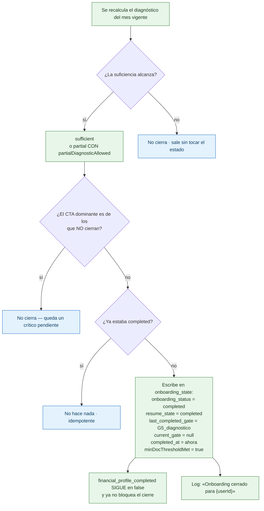
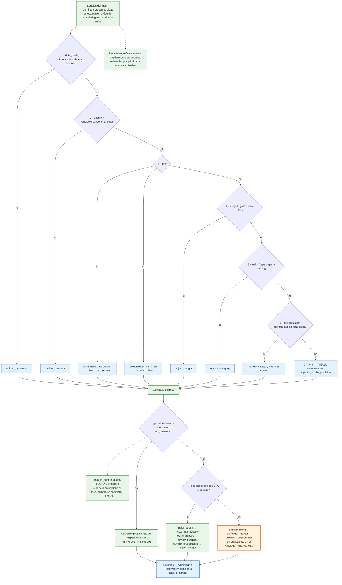
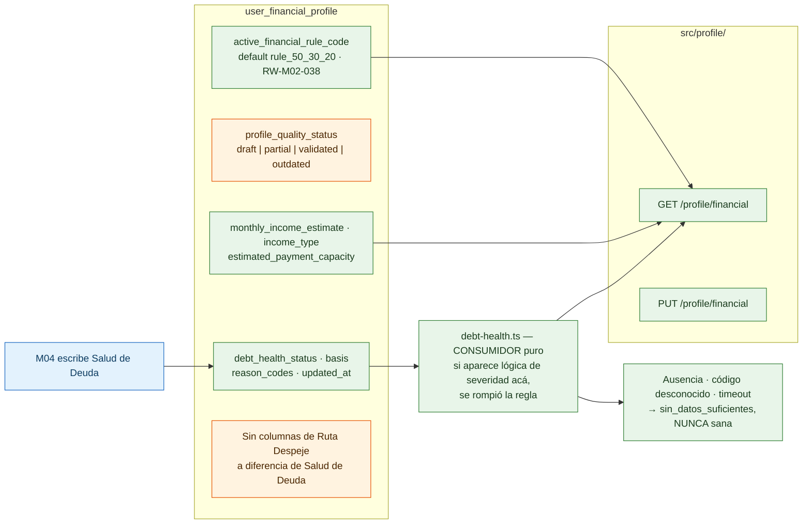
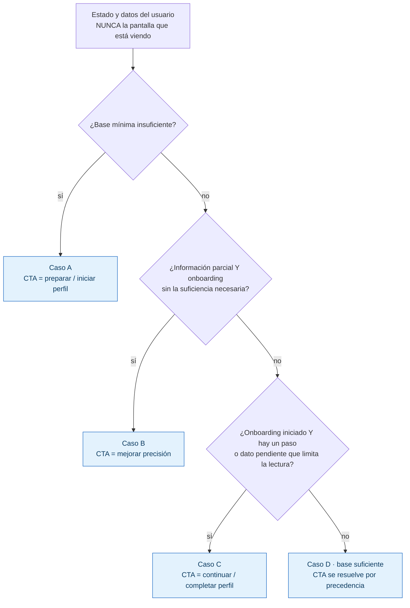
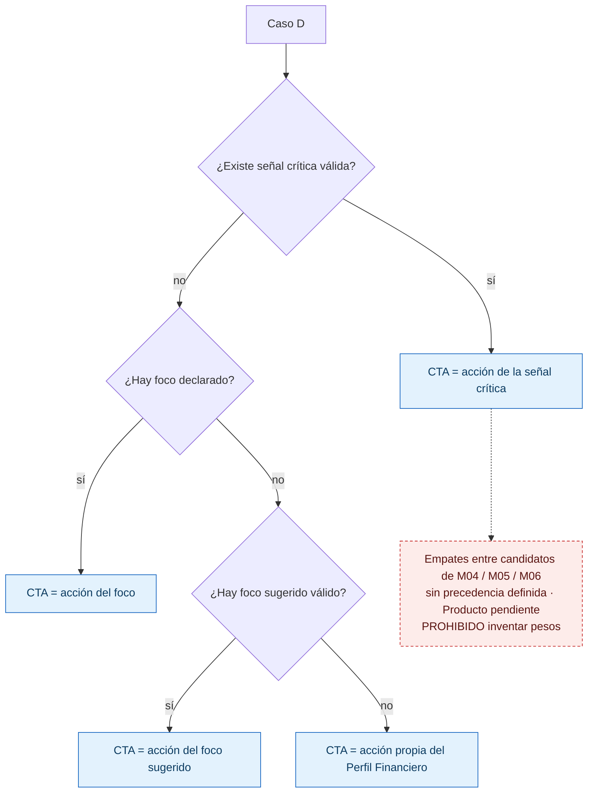

# De G0 al Perfil Financiero — el recorrido completo

**Fecha:** 2026-08-30 · **Base:** `back-walvy` `origin/qa` `4d6c9c4` · `front-walvy` `origin/qa` `299bda4`
**Cubre:** M01 puertas G0→G5 · cierre del onboarding · M02 Perfil Financiero

**Publicado como issue de referencia obligatoria:** [`back-walvy#183`](https://github.com/KabeliDev/back-walvy/issues/183) — versión autocontenida y difundida (equipo de desarrollo + PM). **Este archivo es el original; el issue es la copia.** Todo cambio se hace acá primero y se replica al issue en el mismo PR.

Este documento **continúa** [`2026-08-19-diagramas-g2-g5.md`](2026-08-19-diagramas-g2-g5.md), que arranca en «Foco guardado»
y termina en G5. Acá se agrega lo que falta a los dos lados: **G0 y G1 antes**, y **el cierre del onboarding
y el Perfil Financiero después**. Los tres diagramas del documento anterior no se repiten — se referencian.

Convención heredada: **verde** = implementado y conforme · **naranja** = brecha nuestra · **rojo punteado** = falta
decisión de Producto, no existe actor, o el insumo vive en otro módulo.

---

## 1. El mapa completo, de una sola mirada



El punto que hay que entender antes que cualquier otro: **el onboarding y el Perfil Financiero no son dos
funcionalidades separadas**. El onboarding produce la base de datos financieros; el Perfil la lee y decide
qué única acción proponerle al usuario. La lógica que elige esa acción ya existe — pero vive en G5, no en
el Perfil. Eso es exactamente lo que pide el issue #173.

---

## 2. G0 y G1 — lo que el documento anterior no cubre



Los seis focos posibles son un vocabulario cerrado, y no es decorativo: **el foco declarado desempata el
CTA dominante** cuando el mes no tiene ninguna señal de presión (sección 4).

```
bajar_deuda · ahorrar_monto · aumentar_margen
evitar_atrasos · cumplir_presupuesto · ordenar_compromisos
```

> **Para el que llega nuevo:** una puerta (`gate`) no es una pantalla, es un estado persistido en
> `onboarding_state`. La app puede cerrarse, el usuario puede volver tres días después, y el flujo retoma
> por `current_gate` / `resume_state`. Nunca se deduce de la pantalla que se está viendo — esa misma regla
> reaparece literal en el issue #173.

---

## 3. El cierre del onboarding — quién lo declara hoy

El documento del 19 de agosto dejaba esto como brecha roja: *«Nadie declara G5_diagnostico»* y
*«`financial_profile_completed` y `min_doc_threshold_met` sin actor → el onboarding no cierra · issue 68»*.
**Ya está cerrado.** El actor es `diagnosis-summary-writer.service.ts`.



Dos cosas que conviene no confundir:

- **`min_doc_threshold_met = true`** lo escribe el cierre. Significa «hubo documento suficiente», no «el perfil
  está completo».
- **`financial_profile_completed` no tiene actor y ya no lo necesita.** Se desacopló del cierre a propósito:
  antes exigía un perfil financiero declarado que nadie escribía, y por eso el onboarding no terminaba nunca
  (era la deuda `M1-DT-04`). Hoy queda como bandera informativa. **No es un bug que reportar.**
- Una vez cerrado, `PATCH /auth/onboarding/step` responde **409**. Declarar una puerta con el onboarding
  terminado es un error, no un no-op.
- **El cliente ya no puede declarar los checkpoints sensibles.** `UpdateOnboardingStepDto` solo admite
  `currentGate` (validado con `@IsIn(PUERTAS)`, ya no string libre), `resumeState`, `resumeContext`,
  `goalsSet` e `importAttempted`. `financialProfileCompleted`, `minDocThresholdMet` y `biometricPrompted`
  quedaron fuera del contrato — el último lo escribe el backend en `updateBiometric`.

---

## 4. El motor del CTA dominante — la pieza que une los dos mundos

Acá está el puente conceptual entre M01 y M02, y es lo que hay que entender antes de tocar el issue #173.

La regla de fondo la fija `M1-RN-ONB-010`: **la falta de datos nunca se lee como riesgo financiero.** Por eso
`data_quality` va primero en la precedencia — si falta base, la presión es del dato, no del dinero.



Lo que hay que retener:

1. **«Lo peor manda»** — se elige exactamente una señal dominante; las demás sobreviven como secundarias.
2. **El foco no compite con la evidencia.** `RB-FM-002` es tajante: una señal crítica siempre prevalece sobre
   el foco declarado. El foco solo actúa cuando no hubo ninguna presión. Es un desempate, no una señal más.
3. **Tres de los seis focos no tienen CTA.** No es un olvido: forzar la equivalencia sería inventar un destino
   que no existe. Cerrarlos depende del catálogo global de CTA de M04/M05/M06, que sigue diferido.
4. **La prioridad ya está ratificada** por el cliente vía `PD-M2-11` (`M2-V65`); el comentario del código que
   decía «pendiente de ratificación» estaba desactualizado.

---

## 5. El Perfil Financiero hoy — qué existe realmente



**La regla de oro de M02, y la que más se rompe por descuido:** el Perfil Financiero **no calcula** Salud de
Deuda, presión ni elegibilidad de Ruta Despeje. Los consume. M04 es el dueño (`back-walvy#169`,
`RW-M02-020`). Ya hubo un caso real de esto: cuando la salud se infería desde señales parciales, cualquiera
con una cartola cargada veía «Requiere atención», tuviera o no deuda.

---

## 6. Lo que pide el issue #173

### 6.1 · Resolución del caso



### 6.2 · El CTA dominante del Caso D



**Nótese la simetría con la sección 4:** `señal crítica > foco declarado > foco sugerido` es la misma
precedencia que G5 ya implementa. No hay que inventar el motor; hay que decidir si se reutiliza o se
replica — y esa es la primera pregunta técnica que el issue no responde.

### 6.3 · Guardrails — lo que el backend tiene prohibido

| # | Prohibición | Por qué existe |
|---|---|---|
| 1 | Recalcular Salud de Deuda o Presión desde M02 | M04 es el dueño; ya se rompió una vez |
| 2 | Inferir `route_state` o convertir Ruta elegible en Ruta activa | Elegible ≠ activa |
| 3 | Interpretar `missing` como `$0` | Un dato ausente no es un cero |
| 4 | Interpretar falta de deuda registrada como «sin deuda» | Silencio no es evidencia |
| 5 | Conclusión favorable con datos materiales faltantes | Mismo principio que `sin_datos_suficientes` |
| 6 | Hardcodear «Optimizar pagos recurrentes» como CTA del Caso D | `CA08` |
| 7 | Ponderar M04 vs M05 vs M06 sin definición de Producto | El catálogo global de CTA no existe todavía |
| 8 | Usar el «Disponible» de M02 como sustituto de *headroom* de M04/M05 | Son conceptos distintos |
| 9 | Timeout o error de M04 → estado favorable | `CA14` |

Los 15 criterios de aceptación (`CA01`–`CA15`) están en el issue. Los dos que más se olvidan:
**`CA09` — solo existe un CTA dominante** y **`CA13` — al volver del onboarding se reevalúa A/B/C/D**.

---

## 7. Dónde engancha con lo que ya existe

El issue pide un contrato lógico, no nombres físicos. Esta es la traducción a lo que hay hoy en `origin/qa`:

| Concepto de #173 | Estado | Dónde vive / qué falta |
|---|---|---|
| `profile_case` A/B/C/D | ❌ No existe | Ninguna implementación. Es el corazón del issue |
| `profile_quality` | ⚠️ Vocabulario distinto | La columna es `profile_quality_status` con `draft/partial/validated/outdated`; el issue pide `insufficient/partial/sufficient`. **Hay que decidir si se mapea o se migra el CHECK** |
| `onboarding.status` · `pending_step` | ✅ Existe | `onboarding_state`: `onboarding_status`, `current_gate`, `last_completed_gate`, `resume_state` |
| `financial_profile.income` · `commitments` · `instruments` | ⚠️ Parcial | Los cinco indicadores se evalúan en el gate de suficiencia de G4, no en el Perfil |
| `financial_profile.uncategorized_movements` | ✅ Existe | Ya es señal de presión (`categorization`, prioridad 6) |
| `m04_projection.debt_health` | ✅ Existe | Columnas `debt_health_*` + `debt-health.ts` como consumidor puro |
| `m04_projection.pressure` · `route_eligibility` · `route_state` | ❌ Falta el eslabón | El vocabulario existe (`debt.route_eligibility_status`), M02 sabe traducirlo — **nadie agrega ni publica el estado del usuario**, y `user_financial_profile` no tiene columnas donde recibirlo |
| `cta.dominant` · `secondary[]` · `reason` · `source_module` | ⚠️ Existe, en otro lado | `dominant-pressure.rule.ts` + `monthly-focus-cta.rule.ts` lo resuelven para G5. **No está expuesto desde `/profile/financial`** |
| Foco sugerido | ❌ No hay insumo | `RW-M02-010` pide consumir M04 → M06 → M05. No existe motor de sugerencia en ninguna capa |

---

## 8. Lo que este documento deja a la vista

| Punto | Sección | Estado |
|---|---|---|
| Cierre del onboarding sin actor (`#68`) | 3 | **Cerrado** — lo declara el writer del diagnóstico; el issue se cerró el 2026-08-30 |
| `financial_profile_completed` bloqueando el cierre (`M1-DT-04`) | 3 | **Cerrado** — desacoplado, queda informativo |
| Precedencia de las 7 señales | 4 | Cerrado y ratificado (`PD-M2-11` / `M2-V65`) |
| Desempate por Foco del Mes | 4 | Cerrado (`RB-FM-002` / `RB-FM-003`) |
| Tres focos sin CTA equivalente | 4 | Brecha de catálogo · `TEC-M2-012` diferido |
| Salud de Deuda como consumidor puro | 5 | Cerrado (`back-walvy#169`) |
| Resolución A/B/C/D | 6 | **No implementado** · `back-walvy#173` |
| Vocabulario de `profile_quality` | 7 | Brecha de contrato — decisión técnica pendiente |
| Publicación del estado agregado de Ruta Despeje | 7 | Falta el eslabón de M04 · `M2-V60`–`M2-V62` |
| Motor de foco sugerido | 7 | Sin insumo · `M2-V53`, `M2-V66` |
| Empates intermodulares de CTA | 6.2 | Decisión de Producto pendiente — no bloquea A, B ni C |
| Puntos 2 a 6 del issue #173 | — | **No están publicados en el issue**: van del 1 al 7. Viven en el Drive de M02 y en Figma `6745-6016` |

---

## 9. Orden de lectura sugerido

1. Este documento, secciones 1 a 3 — el recorrido y cómo cierra.
2. [`2026-08-19-diagramas-g2-g5.md`](2026-08-19-diagramas-g2-g5.md) — el detalle de la carga, el análisis y la suficiencia.
3. Este documento, secciones 4 a 7 — el motor de CTA y el Perfil.
4. [`front-walvy#70`](https://github.com/KabeliDev/front-walvy/issues/70) — como guion para recorrerlo a mano contra la base.
5. Carpeta de documentación M01/M02 en Drive y el issue [`back-walvy#173`](https://github.com/KabeliDev/back-walvy/issues/173).

**Tres cosas que no hay que asumir al leer el código:**

- La fuente de verdad del schema son las **entidades TypeORM**, no `context/db/modulo*.md`.
- Un valor `sin_datos_suficientes` casi nunca es un bug: es el guardrail funcionando.
- Que una regla esté escrita y probada no significa que esté conectada. Varias lo están a medias a propósito,
  porque el destino no existe todavía — y agregamos botones sin destino nunca.
