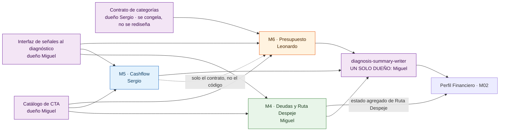
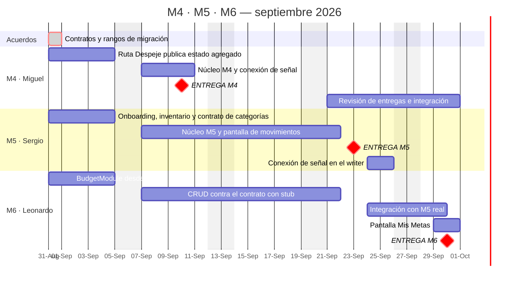

# Plan de coordinación M4 · M5 · M6 — septiembre 2026

**Fecha:** 2026-08-30 · **Base de código verificada:** `back-walvy` y `front-walvy` en `origin/qa`
**Para:** Miguel Herize, Sergio Vidal, Leonardo y la PM.

**Publicado como issue:** [`back-walvy#184`](https://github.com/KabeliDev/back-walvy/issues/184). **Este archivo es el original; el issue es la copia.**

Tres módulos en paralelo, tres entregas encadenadas y un mes con feriados en el medio. Este documento
define **quién construye qué, en qué semana, y cuál es el mecanismo para que nadie quede esperando a otro**.

---

## Reparto y fechas comprometidas

| Módulo | Responsable | Entrega | Documentación funcional |
|---|---|---|---|
| **M4** — Motor de Deudas / Ruta Despeje | Miguel Herize | jueves **10 de septiembre** | [Drive M4](https://drive.google.com/drive/folders/13nZ-H34VYwUjFva66anIOzBVr8tvsJ58) |
| **M5** — Cashflow | Sergio Vidal | miércoles **23 de septiembre** | [Drive M5](https://drive.google.com/drive/folders/14BkxJgwvv3l70lZdutUfhZn4KmLPRfHM) |
| **M6** — Presupuesto | Leonardo | miércoles **30 de septiembre** | [Drive M6](https://drive.google.com/drive/folders/1VbqsLzDRdHEJEUhPfENs6eXat14Pt-bl) |

> **Reparto confirmado el 30 de agosto.** M5 y M6 se intercambiaron respecto del borrador inicial: el módulo
> que ya está construido queda para quien recién entra, y el que hay que levantar de cero para quien conoce
> el proyecto. Las fechas no cambiaron por el intercambio.

El flujo funcional que los tres alimentan está en [`2026-08-30-flujo-g0-a-perfil-financiero.md`](2026-08-30-flujo-g0-a-perfil-financiero.md)
y publicado como [`back-walvy#183`](https://github.com/KabeliDev/back-walvy/issues/183).

**El orden de entrega es el correcto.** M6 consume M5: `budget_lines` referencia `category_id` y
`subcategory_id`, que son del árbol de categorías de M5, y la señal de presupuesto necesita movimientos
categorizados. 04 → 05 → 06 respeta la dirección real de las dependencias.

**Consecuencia del intercambio, y hay que tenerla presente:** el dev que recién entra quedó *aguas arriba*
del que tiene más contexto. Sergio es ahora dueño del contrato del árbol de categorías, que tiene **tres
consumidores** —M6, front-walvy y Kread—. Ese contrato **no se rediseña: se documenta y se congela** en la
semana 1. Cualquier cambio de forma se coordina con los tres.

---

## El principio: nadie espera código ajeno, solo interfaces

Cada módulo se parte en tres capas, y **solo la tercera puede bloquear**:

| Capa | Qué es | Cuándo |
|---|---|---|
| **0 · Contrato** | Se acuerda, no se construye | Semana 1, completa |
| **1 · Lo propio** | Se construye contra el contrato, con stub del vecino | Semanas 1 a 3, en paralelo |
| **2 · Integración** | Acá sí se necesita código ajeno | Ventana definida, dueño único |

Si la capa 0 se cierra la primera semana, la capa 1 de los tres corre en paralelo todo el mes y la capa 2
se reduce a días concretos.

---

## Semana 1 · 31 ago – 4 sep · los acuerdos

### Lunes 31, primera hora, los cuatro — 1 hora

Es la reunión que decide si el mes funciona. Salen cuatro cosas cerradas:

**1 · Catálogo completo de CTA.** Dueño: Miguel. `DominantCtaType` es una unión de strings con `CHECK` en
base, y los tres módulos quieren agregar tipos —incluidos los tres focos que hoy no tienen destino:
`ahorrar_monto`, `aumentar_margen`, `ordenar_compromisos`—. Se define el catálogo completo y entra en **una
sola migración**. Después de esta reunión nadie agrega tipos sueltos.

**2 · Contrato de categorías M5 → M6.** Dueño: Sergio. Consumidores: Leonardo, front-walvy y Kread.
El árbol ya existe y está sembrado: el trabajo es **documentarlo y congelarlo**, no rediseñarlo. Es lo
primero que Sergio entrega, y es lo que desbloquea a Leonardo desde el día uno.

**3 · Interfaz de las señales hacia el diagnóstico.** Cada módulo entrega un servicio con firma acordada.
El archivo `src/health/diagnosis-summary-writer.service.ts` tiene **un solo dueño: Miguel**, y nadie más lo
edita en todo septiembre.

**4 · Rangos de migración reservados.** Resuelve el problema de raíz: además de evitar la colisión de
números, deja el orden de ejecución determinista sin importar quién mergea primero.

| Módulo | Rango reservado |
|---|---|
| M4 | `1786000034000` – `1786000039000` |
| M5 | `1786000040000` – `1786000049000` |
| M6 | `1786000050000` – `1786000059000` |

> El número se toma **antes** de crear el archivo, avisando en el canal del equipo.

### El resto de la semana — en paralelo, sin tocarse

| Dev | Trabajo | Depende de |
|---|---|---|
| Miguel | Publicar el estado agregado de Ruta Despeje en `user_financial_profile` | Nadie |
| Sergio | Onboarding (5 días) + inventario de M5 y contrato de categorías congelado | Nadie |
| Leonardo | `BudgetModule` desde cero: servicio, controlador y DTOs | Solo el contrato de categorías |

---

## Semana 2 · 7 – 11 sep · **M4 entrega el jueves 10**

| Dev | Trabajo | Depende de |
|---|---|---|
| Miguel | Cierra M4 y **conecta él mismo** su señal de deuda en el writer | Nadie |
| Sergio | Wirear `CashflowModule` en `AppModule` y completar el núcleo de M5. **Arranca la pantalla de movimientos** | Nadie |
| Leonardo | CRUD de períodos y líneas de presupuesto | **Solo el contrato**, ya congelado el 4 |

**Acá está la clave de que no se bloquee:** Leonardo programa contra el contrato de categorías que tiene
desde la semana 1, con un stub. No necesita la entrega de Sergio del 23.

**Y acá está el riesgo a vigilar:** la pantalla de movimientos es la primera entrega móvil de Sergio.
Tiene que empezar en esta semana, no en la última. Si llega al 21 sin haberla tocado, la fecha del 23 no se
sostiene.

---

## Semana 3 · 14 – 18 sep · ⚠️ **semana corta**

**Fiestas Patrias.** El 18 es viernes y el 19 sábado. Con el jueves 17 que en la práctica se toma casi todo
el mundo, **la semana rinde tres días hábiles**. Está contemplado en las fechas, pero conviene no planificar
nada crítico para esos días.

| Dev | Trabajo |
|---|---|
| Sergio | Cierre del núcleo de M5 y de la pantalla de movimientos |
| Leonardo | Continúa M6 sobre el stub |

---

## Semana 4 · 21 – 25 sep · **M5 entrega el miércoles 23**

| Dev | Trabajo | Depende de |
|---|---|---|
| Sergio | Entrega M5 el 23; después conecta su señal en el writer | Miguel, como dueño del archivo |
| Leonardo | Con M5 entregado, cambia el stub por las categorías reales y arranca la integración | M5 entregado |
| Miguel | Revisa la entrega de M5 y la integración de M6 | — |

---

## Semana 5 · 28 – 30 sep · **M6 entrega el miércoles 30**

Leonardo cierra la integración con M5, conecta la señal de presupuesto y termina la pantalla «Mis Metas».

**Su ventana de integración son cinco días hábiles** —24, 25, 28, 29 y 30— y en ellos entra también su
pantalla. Es el tramo más ajustado del mes: si M5 se corre, se corre M6.

---

## Calendario

---

## Dónde se tocan de verdad — verificado en `origin/qa`

| # | Punto de colisión | Estado hoy | Mecanismo |
|---|---|---|---|
| 1 | Armado del input de `evaluateDominantPressure` en `diagnosis-summary-writer.service.ts` | Las señales de deuda, presupuesto y fugas están en `false` a propósito, esperando que existan los módulos | **Un dueño: Miguel.** Cada dev entrega un servicio con firma acordada |
| 2 | `DominantCtaType` + su `CHECK` | Unión de strings; los tres quieren agregar tipos | Catálogo cerrado el 31, **una** migración |
| 3 | Numeración de migraciones | Timestamp manual correlativo; el siguiente libre es `1786000034000` | Rangos reservados por módulo |
| 4 | `app.module.ts` | `CashflowModule` **existe pero no está wireado**; `BudgetModule` no existe | Cada uno agrega su línea en su PR; se resuelve a mano |
| 5 | `expo/app/(tabs)/_layout.tsx` | Las tabs de M5 y M6 **ya están declaradas** con pantallas stub | Sergio y Leonardo reemplazan el cuerpo de **su** archivo. Solo Miguel toca el layout, porque M4 no tiene tab y necesita rutas nuevas |

---

## Orden de importancia

El orden de prioridad **no** es el orden de las fechas:

1. **Los contratos de la semana 1.** Es lo único que, si no ocurre, rompe el mes entero. Y dentro de ellos,
   el de categorías es el más urgente: es lo que le permite a Leonardo arrancar sin esperar.
2. **Ruta Despeje publicando su estado agregado.** No es solo M4: es el eslabón que cierra `M2-V60`,
   `M2-V61` y `M2-V62`, hoy abiertas en la entrega de M2. Tiene valor con el cliente de inmediato.
3. **El núcleo propio de cada módulo.**
4. **Diferible sin culpa, no entra en septiembre:** el motor de foco sugerido (no existe el insumo en
   ninguna capa) y la resolución de empates de CTA entre módulos (falta decisión de Producto).

---

## Las cinco reglas que sostienen el «no bloqueante»

1. **Contrato antes que código.** Nadie espera una entrega; espera una interfaz. Contra ella se programa con stub.
2. **Un dueño por archivo compartido.** El writer del diagnóstico, el catálogo de CTA y `(tabs)/_layout.tsx`
   son de Miguel.
3. **Rangos de migración reservados**, con el número tomado antes de crear el archivo.
4. **PRs contra `main`, nunca apilados.** El repo es squash-only y la revisión es lenta: duplicar un fix de
   infraestructura es correcto acá.
5. **Si algo se atrasa se recorta alcance, no se mueve la fecha del siguiente.** Con tres entregas
   encadenadas, un corrimiento se propaga.

---

## Lo que queda por decidir

Una sola cosa, y es de Miguel como Tech Lead.

### La carga del Tech Lead en la semana del 7

Miguel es, al mismo tiempo: el único con entrega comprometida el 10, el dueño de los tres archivos
compartidos, el que revisa línea por línea los PR de Sergio las primeras tres semanas, y el que acompaña su
onboarding. **Esa suma no cierra en esa semana.**

O el acompañamiento de Sergio lo comparte Leonardo, o M4 se corre unos días. El intercambio de módulos hace
más viable lo primero: Leonardo entrega último y su trabajo de la semana 2 no tiene dependencias externas,
así que tiene margen para absorberlo.

### Ya resueltas

- **Fecha de M5:** miércoles 23 de septiembre. Queda fuera del fin de semana largo de Fiestas Patrias.
- **Reparto de M5 y M6:** intercambiados y confirmados el 30 de agosto.

---

## Cómo mantener este plan

- **Un cambio de fecha o de alcance se refleja acá el mismo día**, no en un mensaje suelto.
- La versión editable vive en `walvy-org/walvy-workspace`, en
  `context/bitacora/2026-08-30-plan-coordinacion-m4-m5-m6.md`. El issue es la copia difundida.
