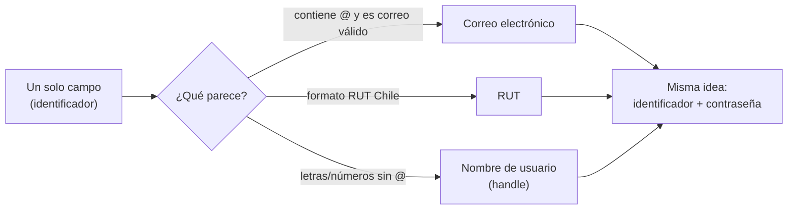
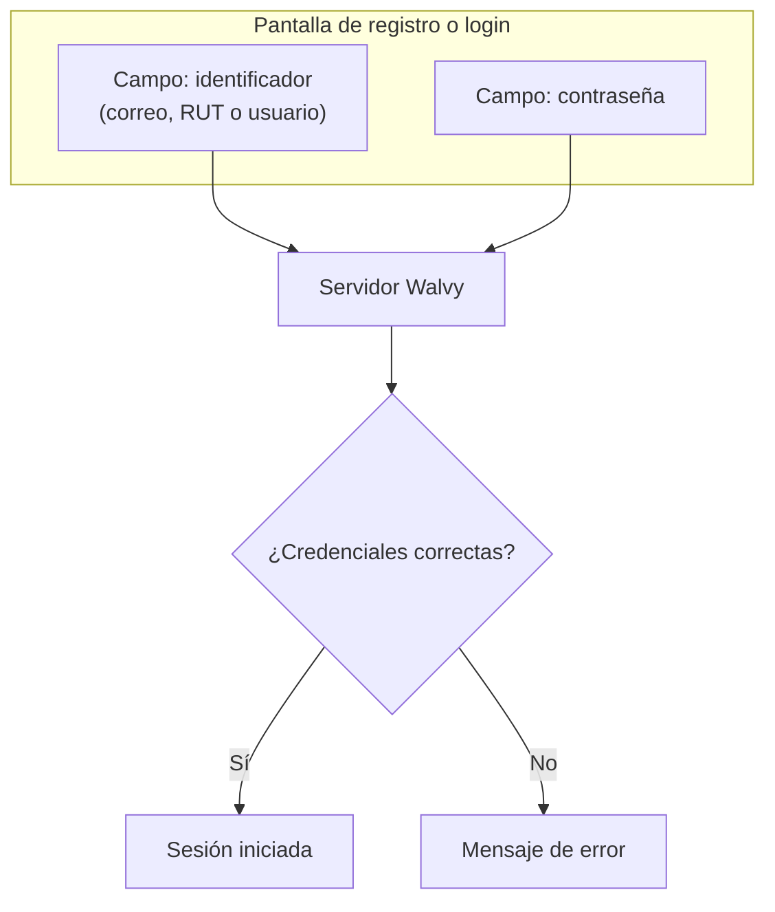

# Walvy — Cómo funciona el acceso (registro e inicio de sesión)

Documento orientado a **negocio y producto** (no es una guía técnica de integración con Gmail u otros proveedores).

---

## 1. Aclaración que suele generar dudas

**Pregunta del estilo:** *“¿Es integración con el correo, o usar el correo como usuario?”*

| Qué **no** es | Qué **sí** es |
|----------------|---------------|
| No es “entrar con Google” ni conectar la bandeja de Gmail dentro de la app. | Es un **usuario y contraseña clásicos**: tú eliges **un identificador** (en un solo campo) y una **contraseña**. |
| No dependemos de que el correo “mande” algo para poder iniciar sesión cada día. | Si tu identificador **es** un correo (`ana@empresa.cl`), entonces **ese correo es tu “nombre de usuario” para entrar** (junto con tu clave). |

En resumen: **correo + clave** y **nombre de usuario + clave** no son dos sistemas distintos. Son **dos formas válidas de rellenar el mismo concepto**: “lo que me identifica ante Walvy”, más la contraseña.

---

## 2. Los tres caminos (un solo campo en pantalla)

En Walvy el usuario escribe en **un único campo** (etiquetado en producto como algo como *“Correo, RUT o nombre de usuario”*). El sistema **reconoce automáticamente** qué formato es:

- **Correo:** si escribes algo con `@` y es un correo válido, Walvy lo trata como **identificador tipo correo**.
- **RUT:** si el texto coincide con el patrón de RUT chileno, Walvy lo trata como **identificador tipo RUT**.
- **Nombre de usuario:** si no es correo ni RUT, puede ser un **usuario corto** (handle), con reglas de formato (longitud y caracteres permitidos).

**Contraseña:** siempre es el segundo campo. No cambia según el tipo de identificador.

---

## 3. Diagrama del viaje del usuario (alto nivel)

No hay un “tercer paso mágico” del correo solo para entrar: el correo, si lo usas como identificador, entra por la **misma puerta** que el RUT o el nombre de usuario.

---

## 4. Después del registro: dos “sub-flujos” de completar datos (no de login)

Según **qué** usaste como identificador al registrarte, el producto puede guiarte de forma distinta para **completar** la cuenta (por ejemplo verificación de correo u onboarding). Eso **no** cambia la idea de “un identificador + contraseña” para entrar.

| Si te registraste con… | Idea simple |
|-------------------------|-------------|
| **Correo** | Suele encajar bien con flujos que envían un **código al mismo correo** que ya diste. |
| **RUT o nombre de usuario** | A menudo el producto pide **después** un correo para verificar o notificaciones, porque no había correo en el primer paso. |

Eso es **completar perfil / verificar contacto**, no “otro tipo de login”.

---

## 5. Lo que pidió el cliente: “que lo principal sea user + pass, y si pongo correo que cuente como user_id”

Eso es **compatible** con cómo está pensado Walvy:

- **Un campo** = “tu `user_id` en la práctica” (puede ser correo, RUT o handle).
- **En UX** se puede enfatizar en la interfaz: *“Usuario y contraseña”* como mensaje principal, y en letra más pequeña o en el placeholder: *“También puedes usar tu correo o RUT”*.
- **Si el usuario escribe un correo**, el sistema ya lo puede tratar como **ese mismo identificador** (no hace falta duplicar campos “correo de login” y “usuario de login”).

No obliga a elegir “solo correo” o “solo usuario”: es **un solo canal de entrada** con tres formatos reconocibles.

---

## 6. Frases cortas para explicarlo en una reunión

1. **“No conectamos tu Gmail para entrar; tú escribes identificador y clave como en cualquier servicio.”**
2. **“El identificador puede ser tu correo, tu RUT o un nombre de usuario; es un solo campo inteligente.”**
3. **“Correo + clave no es integración con el proveedor de correo: es usar el correo como tu nombre de usuario ante Walvy.”**
4. **“Después del registro a veces pedimos correo o código solo para verificar o completar el perfil, no para reemplazar usuario y clave.”**

---

## 7. Glosario mínimo

| Término | Significado aquí |
|---------|-------------------|
| **Identificador** | Lo que el usuario escribe en el primer campo (correo, RUT o handle). |
| **Nombre de usuario / handle** | Texto corto sin `@`, único en el sistema, alternativa al correo o al RUT. |
| **RUT** | Identificador nacional; formato reconocido por el sistema. |
| **Contraseña** | Segundo factor de acceso; siempre requerida en login/registro estándar. |

---

## 8. Preguntas para alinear con ustedes (respuesta breve)

1. **Mensaje principal en pantalla:** ¿Les encaja que el copy principal diga algo como *«Usuario y contraseña»* (o *«Identificador y contraseña»*), dejando en texto secundario o en el placeholder que *también* se puede usar correo o RUT en el mismo campo, o prefieren que el titular mencione explícitamente *«Correo, RUT o usuario»* como hoy?

2. **Prioridad de uso:** Para su público objetivo, ¿esperan que la mayoría entre con **correo**, con **RUT**, o con **nombre de usuario**? (Nos ayuda a ordenar tutoriales, FAQs y mensajes de error sin cambiar la lógica técnica.)

3. **Futuro cercano:** ¿Descartan por ahora un *«Iniciar sesión con Google / Apple»* aparte de usuario+contraseña, o lo quieren contemplar en la hoja de ruta? Si lo contemplan, ¿sería *adicional* al acceso actual o reemplazaría algo?

---

*Documento generado para alinear negocio y producto Walvy. La implementación concreta de pantallas y textos puede ajustarse sin cambiar esta lógica de negocio.*
