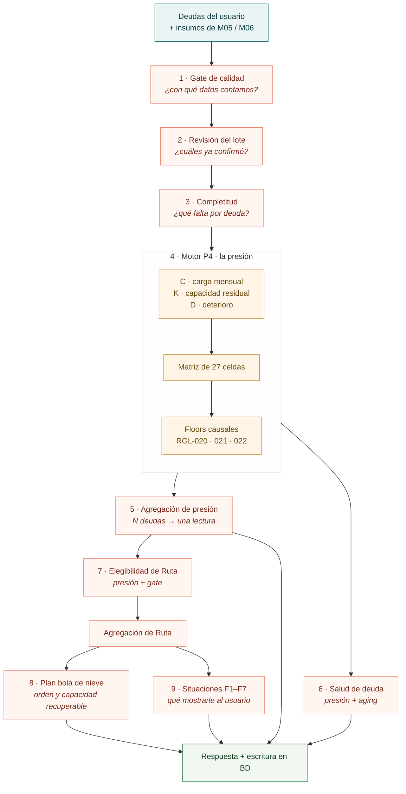
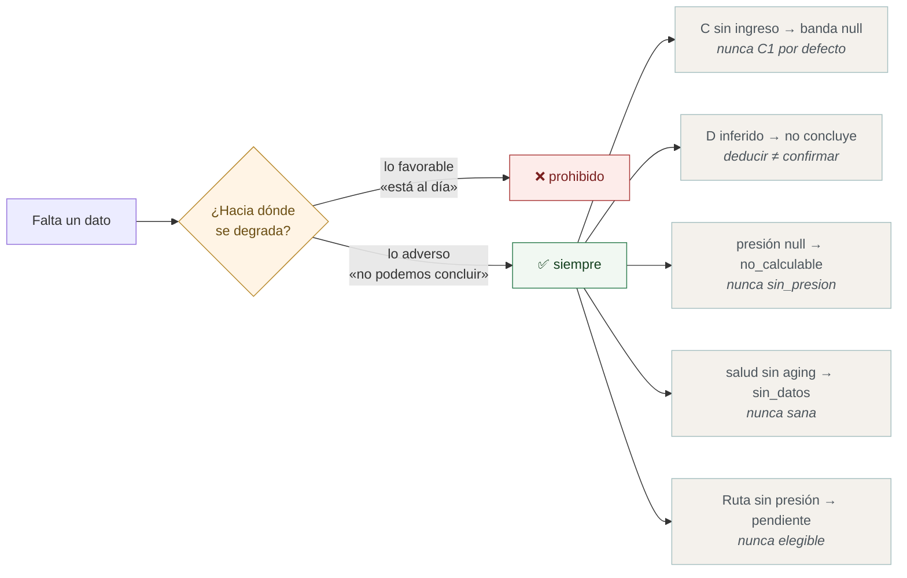
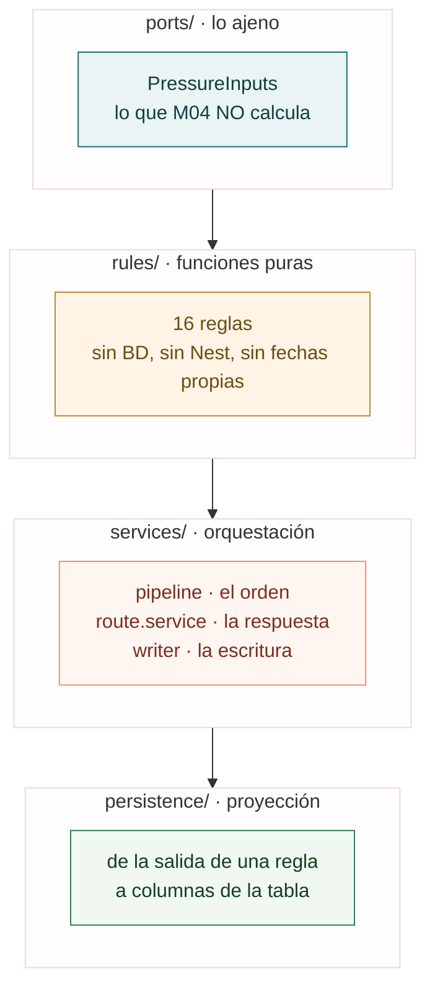
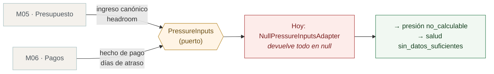
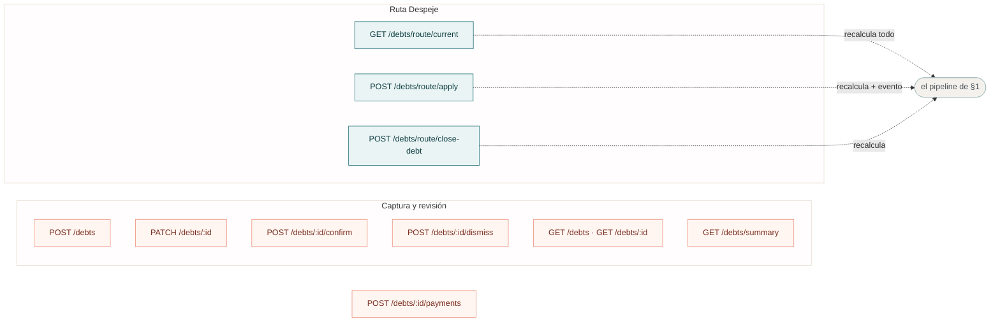
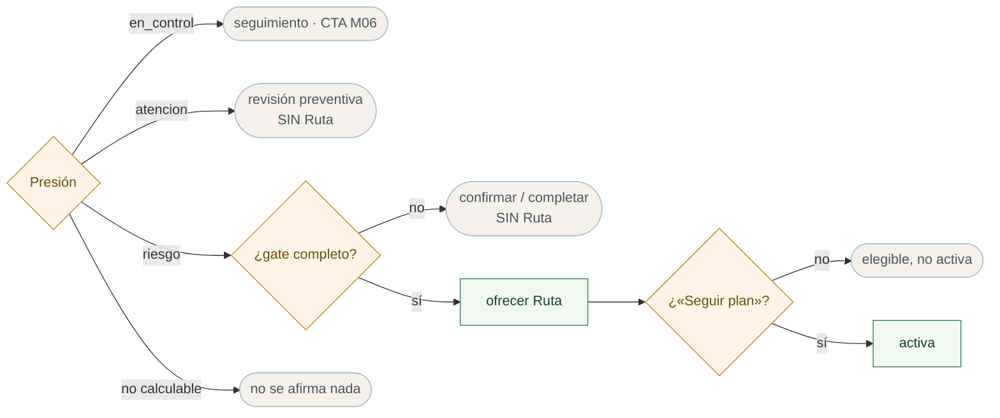

# El motor de M04 · cómo piensa el backend de deudas

Complemento de `[integracion-modulos.md](../wiki-codigo/integracion-modulos.md)` —que muestra **las pantallas**— y de `[paso-3-resultado-en-detalle.md](paso-3-resultado-en-detalle.md)`
—que hace zoom en una—. Este muestra **el motor**: qué decide el backend, en qué orden y con qué se queda corto.

La idea en una frase: **una sola evaluación determinista, recalculada entera en cada
lectura, que nunca afirma lo favorable sin evidencia.**

---

## 1 · El pipeline · una pasada, nueve decisiones

Cada llamada a `GET /debts/route/current` corre esto de punta a punta. No hay caché ni
snapshot: la lectura nunca viene de un estado viejo.




**El orden importa y no es casual.** La calidad se evalúa **antes** que C×K×D: sin saber
con qué datos se cuenta no se puede concluir nada. Y la elegibilidad va **después** de la
presión, porque el gate necesita el resultado del motor, no al revés.

---


## 2 · El guardrail que aparece en todas partes

Si el equipo se lleva una sola idea de M04, que sea esta. Está escrita en el contrato y
repetida en el código en cinco lugares distintos:

> «No convertir missing en cero ni fabricar En Control por falta de evidencia.»
> «Evidencia adversa suficientemente sólida puede sostener Atención/Riesgo aunque otros
> datos estén incompletos; **un faltante material bloquea En Control**.» — §10.1




**La asimetría es deliberada.** Riesgo y Atención ganan con **una sola** deuda que los
sostenga, aunque otras no concluyan. Pero En Control exige que **todas** hayan concluido:
un solo `null` degrada a `no_calculable`. Lo mismo con `sana` en Salud.

---


## 3 · Las cuatro capas · dónde vive cada cosa




Las reglas son **funciones puras**: reciben todo lo que necesitan por parámetro —incluido
el `now`, para que los tests sean deterministas— y no tocan la base. Por eso se pueden
probar sin levantar Nest, y por eso cada una tiene su `.spec.ts` al lado.

Cada regla lleva su `RULE_VERSION`, que se persiste junto al resultado: se puede saber
con qué versión de la lógica se evaluó una deuda.

---


## 4 · Lo que M04 no calcula · el puerto

M04 depende de módulos que todavía no existen. En vez de inventar los datos, los pide por un puerto y **declara el faltante.**




**El malentendido más común del módulo:** «falta el motor P4». **No falta.** El motor está
completo —las 27 celdas transcritas, los tres floors, sus tests— y corre en cada
evaluación. Lo que falta es **el adaptador que le da de comer**. Es un archivo, no un
módulo, y es lo único que separa a QA de poder reproducir los escenarios.

---


## 5 · Qué está cableado y qué no

De las 16 reglas, **14 corren en cada evaluación**. Dos están escritas, probadas y sin
ningún camino que las llame:


| Regla                 | Estado         | Por qué                                                                          |
| --------------------- | -------------- | -------------------------------------------------------------------------------- |
| `sustainability-gate` | 🔵 sin cablear | Necesita el outcome prudencial de **M05**, y la pantalla de simulación de aporte |
| `selected-plan`       | 🔵 sin cablear | Aceptar simulación y rollback: la superficie no existe todavía                   |


Las dos son **inversión adelantada**: se escribieron con el contrato en la mano para que
enchufarlas sea trivial.

Hubo una tercera, `debt-severity` —un semáforo de deudas por vencimiento—, y **se borró**:
nunca se cableó, y el contrato dejó el aging en manos de Salud de Deuda (owner operativo
M06) sin un color propio. Su única función viva, `hasMoraConfirmada` —el override
`M1-DP-006`/`M1-V55` del semáforo de G5—, se movió a
`src/imports/rules/mora-confirmada.rule.ts`, que es donde vive su consumidor.

---


## 6 · Los endpoints




`apply` **es el único que activa.** Ver el plan, navegarlo o simular un aporte **no**
activan la Ruta: §7.2 del contrato prohíbe «usar un CTA visible como sustituto del
evento». Un segundo «Seguir plan» tampoco reactiva — conserva estado y `activatedAt`.

---


## 7 · Dos distinciones que se confunden seguido

**Elegible ≠ activa.** Elegible es «corresponde ofrecerte la Ruta». Activa es «la
empezaste». Entre las dos hay un evento explícito del usuario.

**Presión ≠ elegibilidad.** La presión dice *cuánto aprieta la deuda*; la elegibilidad
dice *si toca ofrecer Ruta*. Riesgo con el gate incompleto **no** abre Ruta: manda a
confirmar o completar. Colapsar las dos fue el bug de
[front-walvy#159](https://github.com/KabeliDev/front-walvy/issues/159).




---


## 8 · Cómo verificarlo

```bash
cd back-walvy && npx jest src/debts
```

**451 tests en 28 suites.** Cada regla tiene su spec al lado, con los casos borde del
contrato como casos de prueba nombrados. Para entender una regla, leer su `.spec.ts`
antes que su implementación: los nombres de los tests son la especificación en prosa.

El contrato vivo está en `back-walvy/docs/api/debts/route.md`, con el ejemplo de respuesta
y la tabla de los cinco escenarios de OD-03.