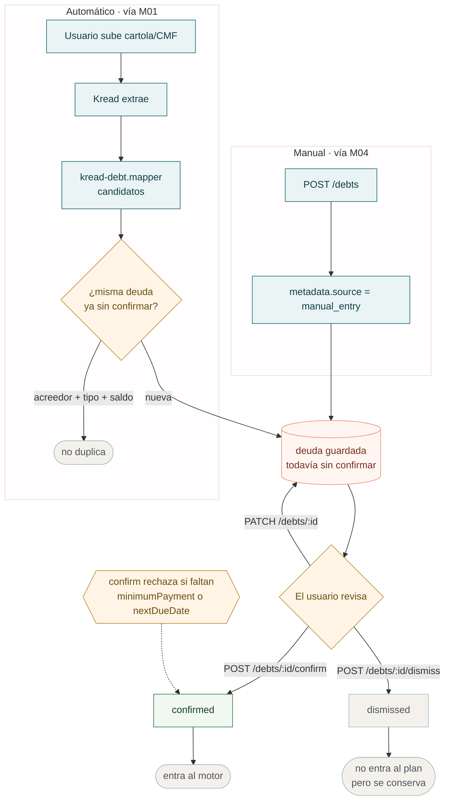
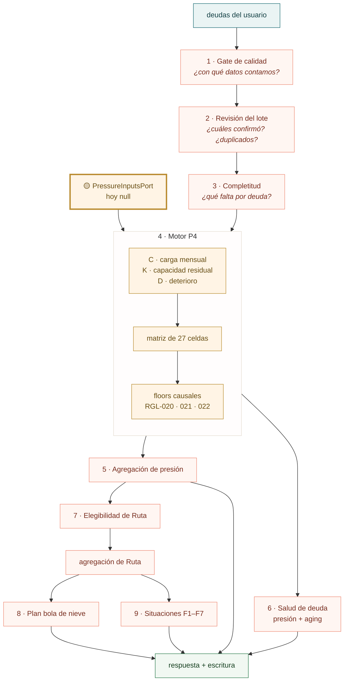
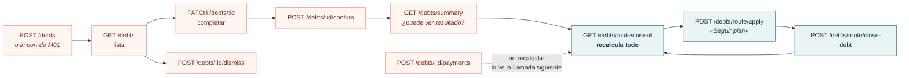
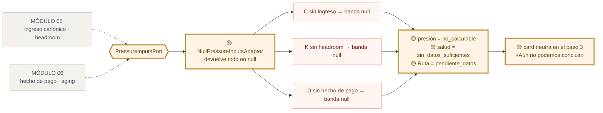
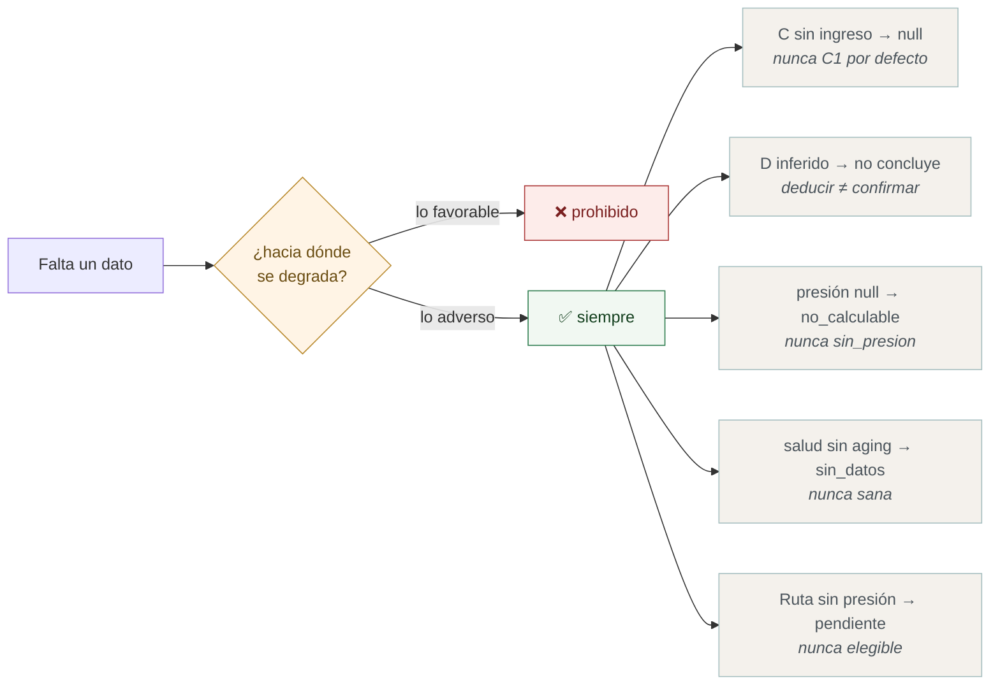
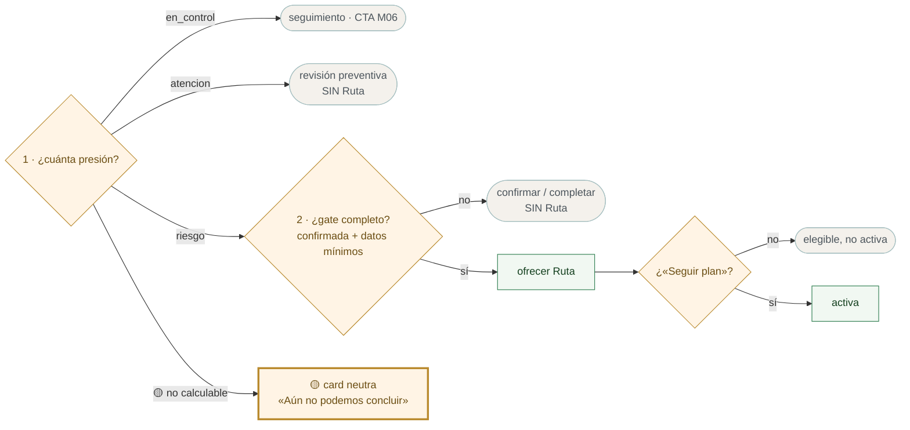

# El motor de M04 · del documento a la Ruta

Contraparte backend de [integracion-modulos.md](../wiki-codigo/integracion-modulos.md). Ese muestra cómo se conectan los módulos; este sigue **una deuda** desde que entra a la base hasta que sale como decisión.

Levantado del código en `origin/qa`

> 🟡 **En amarillo, todo lo provisional** — lo que existe así porque M05 y M06  todavía no entregan.

---

## 1 · Cómo entra una deuda

Dos caminos. Ambos crean la fila `unconfirmed`: nada entra al motor sin que el usuario la mire.




|            | Automático                                        | Manual                 |
| ---------- | ------------------------------------------------- | ---------------------- |
| Lo escribe | `statement-import.service`                        | `debts.service.create` |
| `metadata` | `importId` · `kreadJobId`                         | `source: manual_entry` |
| Dedupe     | acreedor + tipo + saldo, sólo entre `unconfirmed` | ninguno                |
| Nace       | `unconfirmed`                                     | `unconfirmed`          |


---


## 2 · El pipeline · una pasada, nueve decisiones

`GET /debts/route/current` corre esto **entero en cada llamada**. Sin caché: la lectura
nunca viene de un estado viejo.




El orden no es casual: la **calidad va antes** que C×K×D —sin saber con qué datos se cuenta no se concluye nada— y la **elegibilidad va después** de la presión, porque el gate necesita su resultado.

---


## 3 · Los endpoints, uno tras otro




| Endpoint                       | Qué hace de verdad                                                                  |
| ------------------------------ | ----------------------------------------------------------------------------------- |
| `GET /debts/route/current`     | **Recalcula el pipeline entero** y publica presión, salud, gate, plan y situaciones |
| `POST /debts/route/apply`      | Lo mismo, más el evento `seguir_plan_rd02`. **El único que activa**                 |
| `POST /debts/route/close-debt` | Confirma un cierre que ya alcanzó la condición previa, y recalcula                  |
| `GET /debts/summary`           | Sólo cuenta confirmadas y pendientes. No evalúa                                     |
| `POST /debts/:id/payments`     | Inserta el abono y baja el saldo. **No recalcula** y **no mueve D**                 |


**Ver el plan, navegarlo o simular no activan.** §7.2: «no usar un CTA visible como
sustituto del evento». Un segundo «Seguir plan» tampoco reactiva.

**El pago se registra, pero no entra al motor.** `POST /debts/:id/payments` escribe
`debt_payments` y descuenta `current_balance` en transacción; devuelve el pago, no
el estado. Como `route/current` no cachea, la llamada siguiente ve el saldo nuevo
—pero el eje **D** no se mueve: la presión y la Salud se alimentan sólo del
`PressureInputsPort`, y `debt_payments` no lo alimenta. Eso llega con M06.

---


## 4 · 🟡 Lo provisional · por qué falta M05 y M06




**Esto es lo correcto, no una falla.** La alternativa sería afirmarle al usuario algo que nadie calculó — que es justo lo que el contrato prohíbe.


| 🟡 Provisional                    | Se cae solo cuando…                                                        |
| --------------------------------- | -------------------------------------------------------------------------- |
| `NullPressureInputsAdapter`       | se escribe el adaptador real. **Cambia una clase, el pipeline no se toca** |
| Card neutra del paso 3            | haya presión que mostrar, y frames para Atención y Riesgo-sin-gate         |
| `sustainability-gate` sin cablear | M05 entregue el outcome prudencial                                         |
| `selected-plan` sin cablear       | exista la pantalla de simulación                                           |
| Escenarios irreproducibles en QA  | exista un adaptador de fixtures tras un flag                               |


---


## 5 · El guardrail que aparece en todas partes

Si el equipo se lleva una sola idea, que sea esta.




**La asimetría es deliberada.** Riesgo y Atención ganan con **una** deuda que los sostenga. En Control exige que **todas** hayan concluido: un solo `null` degrada a `no_calculable`. Igual con `sana` en Salud.

---


## 6 · De la presión a la pantalla

Lo que el paso 3 pinta. Dos preguntas encadenadas, no una.




**Riesgo con el gate incompleto no abre Ruta.** Manda a confirmar o completar. Es la distinción que el Figma todavía no refleja — ver [req-resultado-onboarding-semaforo.md](req-resultado-onboarding-semaforo.md).

---


## 7 · Las cuatro capas


| Capa           | Qué vive ahí                      | Regla                                            |
| -------------- | --------------------------------- | ------------------------------------------------ |
| `rules/`       | 16 funciones **puras**            | Sin BD, sin Nest. Reciben el `now` por parámetro |
| `services/`    | pipeline · route.service · writer | El orden y la respuesta                          |
| `persistence/` | proyección regla → columnas       | Una regla no sabe de tablas                      |
| `ports/`       | 🟡 `PressureInputs`               | Lo que M04 **no** calcula                        |


Cada regla lleva su `RULE_VERSION`, que se persiste con el resultado: se puede saber con qué versión de la lógica se evaluó una deuda.

---


## 8 · Cómo verificarlo

```bash
cd back-walvy && npx jest src/debts
```

**438 tests en 27 suites.** Para entender una regla, leer su `.spec.ts` antes que su implementación: los nombres de los tests son la especificación en prosa.

Contrato vivo: `back-walvy/docs/api/debts/route.md` ·
Deuda abierta: [deuda-tecnica/README.md](deuda-tecnica/README.md)

---


## Glosario

- `unknownMinimumPayment` — booleano en `debt.metadata`. `true` = no se confirma (sigue `unconfirmed`). `false` = se puede `confirm`.
- `PressureInputsPort` — [`back-walvy/src/debts/ports/pressure-inputs.port.ts`](../../../../back-walvy/src/debts/ports/pressure-inputs.port.ts). La puerta por la que M04 pide lo que no calcula: ingreso y headroom (M05), hecho de pago y atraso (M06). Hoy está el `NullPressureInputsAdapter`: devuelve todo `null`. Por eso presión = `no_calculable` y la card del paso 3 es neutra. No es un bug. Se cambia el adaptador cuando M05/M06 entreguen; el pipeline no se toca.

