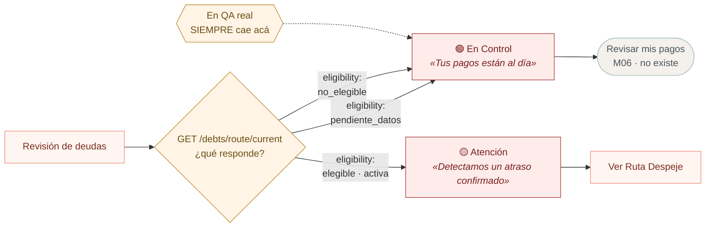
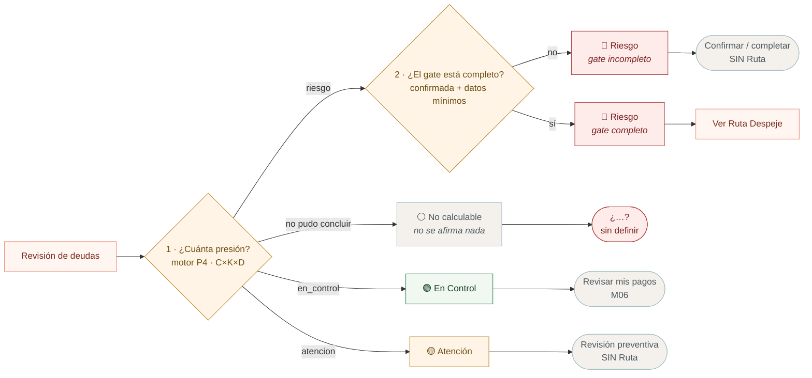
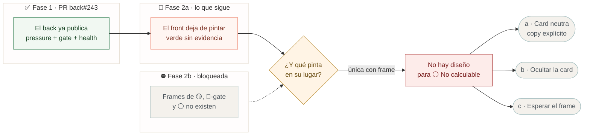

# El paso 3 en detalle · qué decide el color del Resultado

Zoom sobre el nodo `RESULT` de [`recorrido-de-pantallas.md`](../wiki-codigo/recorrido-de-pantallas.md),
donde el recorrido lo resume como una sola pregunta binaria: *«¿se habilita la Ruta?»*.
No es binaria. Son cinco lecturas, y hoy la app solo sabe pintar dos.

---

## 1 · Lo que pasa hoy (el defecto)

**El problema:** `pendiente_datos` significa *«el motor no pudo evaluar»*, y la app
lo pinta como *«tus pagos están al día»*. Son cosas opuestas. Y es el único camino
que ocurre hoy, porque faltan los insumos de M05 y M06.

---

## 2 · Lo que dice el contrato (OD-03)

El color no sale de la elegibilidad. Sale de **dos preguntas separadas**.

**Los dos hallazgos que esto revela:**

1. **El rojo se parte en dos.** Mismo color, distinto CTA. *«Riesgo con gate
   bloqueado ≠ CTA Ruta»* — Anexo BDD §19.5.
2. **Amarillo no abre Ruta.** Figma lo dibujó como si sí. *«No fabricar Ruta desde
   Atención o datos insuficientes.»*

---

## 3 · Dónde estamos parados

**La ironía:** de los cinco escenarios, el único que ocurre hoy en la app real
—⚪️ No calculable— es justamente el que **no tiene frame en Figma**. Diseño nunca
lo dibujó porque nadie lo previó: se asumió que siempre habría presión que mostrar.

---

## 4 · Corrección al recorrido

La línea del recorrido general:

> `RESULT -->|"sí: Ver Ruta Despeje"| RUTA`
> `RESULT -->|"no: Revisar mis pagos"| PAGOS`

Queda como histórica. El binario describe el **CTA**, no la pantalla: hay tres
lecturas distintas que llevan a «no Ruta» (🟢 En Control, 🟡 Atención, 🔴 gate
incompleto) y cada una dice algo diferente al usuario.
