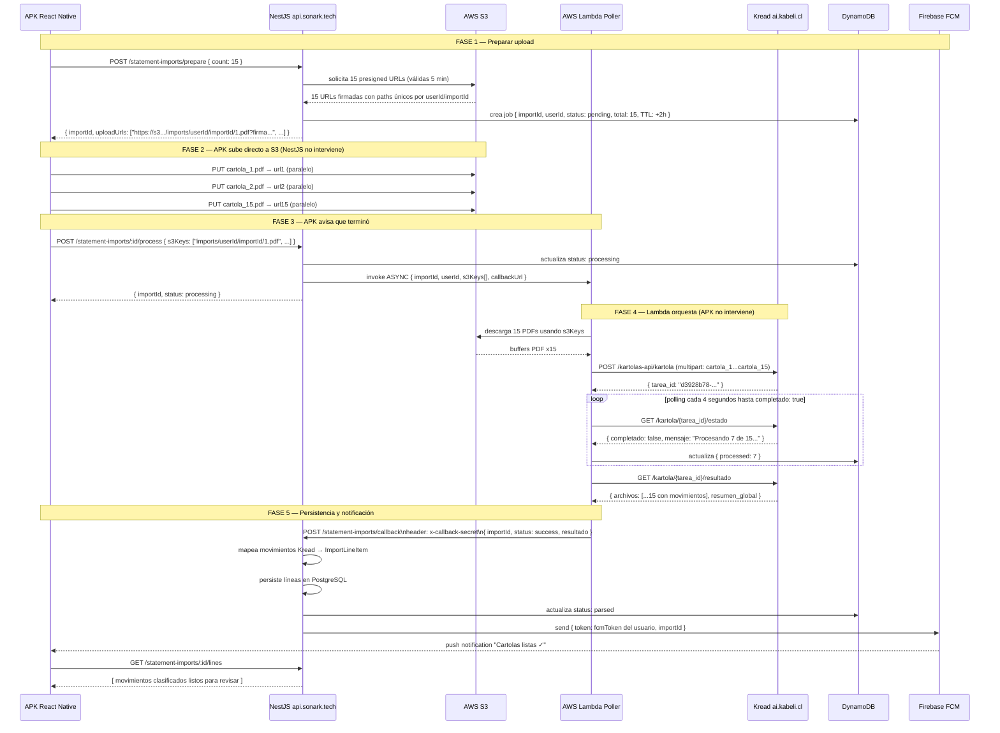

# Extracción de Cartolas — Arquitectura y Flujo

**Servicio de extracción:** Kread v2.0.0 (`https://ai.kabeli.cl/kartolas-api`) — servicio FastAPI de Kabeli, código propietario  
**Motor IA:** Google Gemini 2.5 Flash + reglas deterministas  
**Docs Kread:** `Kread-Kartolas/kread-kartolas-docs.html` (local) · `https://ai.kabeli.cl/kartolas-api/docs`  
**Backend de aplicación:** NestJS (`https://api.sonark.tech/api`)  
**Cliente:** APK React Native  
**Versión actual:** V1 implementada · V2 diseñada (pendiente)

---

## Kread v2.0.0 — Contrato de API actual

> Versión activa desde 2026-06. Migra todos los campos de ES → EN. Los **valores** de respuesta (categorías, bancos, tipos de transacción) permanecen en español.

### Bancos y formatos soportados

| Banco | Formatos aceptados |
|---|---|
| **BancoEstado** | PDF, Excel (.xlsx/.xls), CSV, imágenes (JPG, PNG, TIFF, WEBP) |
| **Banco Santander** | Solo PDF |

### Endpoints

```
POST   /kartolas-api/kartola
GET    /kartolas-api/kartola/{job_id}/status
GET    /kartolas-api/kartola/{job_id}/result
```

#### POST /kartolas-api/kartola
```
Content-Type: multipart/form-data
Campo:        archivos  (array — entre 1 y 15 archivos)
Tamaño total: máx 100 MB
Formatos:     PDF, JPG, PNG, TIFF, WEBP, XLSX, XLS, CSV
```
```json
// 202 Accepted
{ "job_id": "b3f1a2c4-...", "message": "Files received, processing in background." }

// 422 — menos de 1 o más de 15 archivos, formato no soportado, tamaño > 100 MB
// 500 — GEMINI_API_KEY no configurada
```

#### GET /kartolas-api/kartola/{job_id}/status
```json
{
  "job_id":    "b3f1a2c4-...",
  "progress":  60,
  "message":   "Completed 3 of 5 file(s).",
  "completed": false,
  "has_errors": false
}
```
- `progress` — porcentaje 0→100
- `completed` — false mientras procesa, true al terminar
- `has_errors` — true si al menos un archivo tuvo error (el batch igualmente continúa)

#### GET /kartolas-api/kartola/{job_id}/result
```json
{
  "files": [
    {
      "filename": "cartola_enero.pdf",
      "error": null,
      "metadata": {
        "bank": "BancoEstado",
        "account_type": "Cuenta RUT",
        "account_number": "12345678",
        "statement_number": "202401",
        "issued_at": "2024-01-31",
        "extracted_at": "2024-06-08T14:30:00",
        "source_format": "pdf",
        "detection_confidence": 0.98
      },
      "account_holder": { "name": "Juan Andrés Pérez González", "rut": "12.345.678-9" },
      "summary": {
        "period": { "start_date": "2024-01-02", "end_date": "2024-01-31" },
        "opening_balance": 850000,
        "closing_balance": 1120500,
        "total_credits": 1500000,
        "total_debits": 1229500,
        "total_withdrawals": 0,
        "total_deposits": 0,
        "transaction_count": 3
      },
      "transactions": [
        {
          "id": 1,
          "global_id": "12345678_202401_1",
          "date": "2024-01-05",
          "operation_number": "98765432",
          "raw_description": "REMUNERACION ENERO 2024",
          "type": "abono",
          "amount": 1500000,
          "balance_after": 2350000,
          "branch": null,
          "category": "Empleador",
          "subcategory": "Sueldo",
          "category_confidence": 0.99
        }
      ],
      "metrics": {
        "pages_processed": 3,
        "time_per_page_s": [0.82, 0.74, 0.69],
        "extraction_time_s": 2.25,
        "categorization_time_s": 4.11,
        "total_time_s": 6.36,
        "transactions_extracted": 3
      }
    }
  ],
  "global_summary": {
    "total_files_processed": 1,
    "total_files_successful": 1,
    "total_files_failed": 0,
    "has_errors": false,
    "total_transactions": 3,
    "total_time_s": 6.36
  }
}
```

Cuando un archivo falla (error por archivo, no global):
```json
{
  "filename": "cartola_ilegible.pdf",
  "error": {
    "code": "BANK_NOT_IDENTIFIED",
    "message": "Could not identify the bank for file 'cartola_ilegible.pdf'.",
    "detected_bank": null,
    "detection_confidence": 0.0
  },
  "metadata": null, "account_holder": null, "summary": null, "transactions": null
}
```

Códigos de error por archivo: `BANK_NOT_IDENTIFIED` · `FORMAT_NOT_SUPPORTED` · `PARSE_FAILED`

Códigos HTTP del result: `404` job_id no encontrado · `409` job aún no completó · `422` error global del job

### Categorías (14 categorías · 89 subcategorías)

| Categoría | Subcategorías destacadas |
|---|---|
| Empleador | Sueldo · Bono · Honorarios · Aguinaldos · Ingresos por ventas |
| Transferencias | Enviada a persona · Recibida de persona · Recibida de empresa · Enviada a empresa |
| Alimentación | Supermercado · Restaurantes · Comida a domicilio · Almacén · Feria |
| Salud | Farmacia · Clínica · Consulta médica · Óptica/dentista · Isapre |
| Hogar | Agua · Luz · Gas · Internet · Arriendo · GGCC · Streaming · Servipag |
| Familia | Esposa · Pareja · Hijos · Padres · Hermanos |
| Entretenimiento | Cine · Deporte/fitness · Alcohol · Vacaciones · Música |
| Inversiones | Acciones/fondos · Divisas · Inmobiliario · Negocio propio |
| Créditos | Tarjeta crédito · Consumo · Hipotecario · Línea de crédito · Intereses |
| Gastos Personales | Ropa · Educación · Imposiciones · Impuestos · Comisiones bancarias |
| Movilización | BIP · Bencina · TAG/peajes · Estacionamiento · Revisión técnica |
| Efectivo | Giro cajero · Depósito en efectivo |
| Otros | Movimiento interno · No conciliado · No reconocido |

### Reglas deterministas (11 reglas, confidence 0.99 — sin llamada a Gemini)

| Patrón | Tipo | Categoría / Subcategoría |
|---|---|---|
| `GETNET`, `TRANSBANK VENTAS` | abono | Empleador / Ingresos por ventas |
| `COMISION TEF TERCEROS`, `COMISION TRANSACC` | cargo | Gastos Personales / Comisiones bancarias |
| `REGULARIZA (COMPRA\|TARJETA\|DEBITO)` | abono | Créditos / Nota de crédito |
| `TRANSFERENCIA DESDE MIS CUENTAS`, `TRASPASO ENTRE CUENTAS` | abono | Otros / Movimiento interno |
| `FINTUAL` | cualquiera | Inversiones / Acciones y fondos mutuos |
| `GIRO CAJERO`, `GIRO ATM`, `GIRO EFECTIVO` | giro | Efectivo / Giro cajero automático |
| `DEPOSITO EFECTIVO`, `DEPOSITO EN CUENTA` | abono | Efectivo / Depósito en efectivo |
| `BIP`, `METRO BIP`, `RED METROPOLITANA` | cargo | Movilización / BIP |
| `AUTOPISTA`, `GLOBALVIA`, `COSTANERA NORTE`, `TAG AX` | cargo | Movilización / TAG y peajes |
| `TEF A [nombre]` | cargo | Transferencias / Enviada a persona (conf. 0.85) |
| `TEF DE [nombre]` | abono | Transferencias / Recibida de persona (conf. 0.85) |

### Normalización de valores

| Campo | Comportamiento |
|---|---|
| `amount` | Entero CLP (sin decimales) |
| `operation_number` | `null` si no está en el PDF o es todo ceros |
| `global_id` | `{numero_cuenta}_{numero_cartola}_{indice}` — clave de deduplicación cross-cartola |
| `balance_after` | Del PDF si existe; calculado acumulativamente si no |
| `*_confidence` | Float 0.0–1.0. Reglas deterministas → 0.99. Gemini → 0.70–0.95. Fallback → 0.0 |
| Timeout Gemini | 30s → fallback `Otros / No conciliado` con confidence 0.0 |
| Timeout parseo | 120s → `PARSE_FAILED` |
| Error en un archivo | No interrumpe el resto del batch |

### Migración ES → EN (v1 → v2)

Los endpoints cambiaron de nombre:
- `GET /kartola/{tarea_id}/estado` → `GET /kartola/{job_id}/status`
- `GET /kartola/{tarea_id}/resultado` → `GET /kartola/{job_id}/result`
- `tarea_id` → `job_id` · `completado` → `completed` · `tiene_errores` → `has_errors`
- `estado` (int 0-100) → `progress` (int 0-100)

---

---

## Contexto del problema

El usuario sube hasta 15 cartolas bancarias en PDF. El sistema debe extraer los movimientos, categorizarlos automáticamente y notificar al usuario cuando esté listo — **sin que el APK tenga que preguntar el estado**.

El proceso completo tarda ~90 segundos para 15 cartolas. Esto hace imposible un flujo sincrónico HTTP.

---

## Servicio Kread — cómo funciona

Kread es un servicio externo de Kabeli que no comparte código. Se integra exclusivamente por API REST.

Acepta hasta **15 PDFs por request** vía `multipart/form-data`, procesa en background y expone 3 endpoints:

### Endpoint 1 — Enviar cartolas
```bash
POST https://ai.kabeli.cl/kartolas-api/kartola
Content-Type: multipart/form-data

cartola_1=@archivo1.pdf
cartola_2=@archivo2.pdf
# ...hasta cartola_15
```
```json
{
  "tarea_id": "d3928b78-27fe-4a4f-beac-7db47f991298",
  "mensaje": "Archivos recibidos, procesando en background."
}
```

> **Cambio en curso en Kread:** el contrato pasa de 3 slots fijos a recepción dinámica de N archivos (hasta 15) en una sola petición. Esto **no altera la arquitectura** — Lambda sigue haciendo una única llamada con todos los PDFs; solo limpia el armado del multipart (sin slots vacíos). El polling, el callback y el resto del flujo son idénticos.

### Endpoint 2 — Consultar estado (requiere polling)
```bash
GET /kartolas-api/kartola/{tarea_id}/estado
```
```json
{
  "tarea_id": "d3928b78-...",
  "estado": 0,
  "mensaje": "Procesando archivo 7 de 15: 'cartola.pdf'",
  "completado": false,
  "tiene_errores": false
}
```

> Kread **no tiene webhooks**. El caller debe hacer polling hasta `completado: true`.

### Endpoint 3 — Obtener resultado
```bash
GET /kartolas-api/kartola/{tarea_id}/resultado
```
```json
{
  "archivos": [
    {
      "nombre_archivo": "cartola.pdf",
      "metadata": {
        "banco": "Santander",
        "tipo_cuenta": "Cuenta Corriente",
        "numero_cuenta": "000083115181",
        "fecha_emision": "2026-04-16",
        "formato_origen": "pdf"
      },
      "titular": {
        "nombre": "Juan Pérez",
        "rut": "12.345.678-9"
      },
      "resumen": {
        "periodo": { "fecha_inicio": "2026-01-01", "fecha_fin": "2026-03-31" },
        "saldo_anterior": 500000,
        "saldo_final": 320000,
        "total_abonos": 1200000,
        "total_cargos": 1380000,
        "numero_movimientos": 87
      },
      "movimientos": [
        {
          "id": 1,
          "fecha": "2026-01-15",
          "descripcion_raw": "COMPRA SUPERMERCADO LIDER",
          "tipo": "cargo",
          "monto": 45000,
          "saldo_despues": 455000,
          "sucursal": "Santiago Centro",
          "categoria": "Hogar",
          "subcategoria": "Supermercado",
          "confianza_categoria": 0.87
        }
      ],
      "metricas": {
        "paginas_procesadas": 4,
        "tiempo_total_s": 6.2,
        "total_datos_extraidos": 87
      }
    }
  ],
  "resumen_global": {
    "total_archivos_procesados": 15,
    "total_archivos_exitosos": 14,
    "total_archivos_fallidos": 1,
    "tiene_errores": true,
    "tiempo_total_s": 87.3
  }
}
```

> **Clave:** Kread ya categoriza los movimientos (`categoria`, `subcategoria`, `confianza_categoria`). No se usa el clasificador interno de NestJS para movimientos extraídos por Kread.

---

## Aislamiento de usuarios — cómo el sistema sabe a quién pertenece cada cartola

Con múltiples usuarios enviando cartolas simultáneamente (ej. 10 usuarios × 15 cartolas), el aislamiento se garantiza mediante el `importId`.

### El importId es el hilo que conecta todo

```
Usuario Ana  → JWT → NestJS crea importId: "aaa-111" → atado a userId de Ana
Usuario Juan → JWT → NestJS crea importId: "bbb-222" → atado a userId de Juan
```

| Capa | Mecanismo de aislamiento |
|------|--------------------------|
| **PostgreSQL** | `statement_imports.user_id` — cada registro tiene el userId desde el primer momento |
| **S3** | Path incluye userId e importId: `imports/{userId}/{importId}/cartola_1.pdf` |
| **Lambda** | Cada invocación recibe su propio `importId` y `s3Keys` con paths únicos |
| **Kread** | Cada llamada genera un `tarea_id` independiente |
| **Callback** | `importId` → lookup en PostgreSQL → `userId` → FCM token del usuario correcto |

El `importId` actúa como identificador de sesión de procesamiento — se genera autenticado y viaja por toda la cadena sin posibilidad de colisión entre usuarios.

---

## V1 — Arquitectura implementada

### Limitación de diseño

En V1 los PDFs pasan por NestJS antes de llegar a Lambda. NestJS actúa como proxy de archivos binarios — consume RAM y ancho de banda innecesariamente.

### Flujo V1

```
APK
 │ POST /statement-imports/upload
 │ multipart: hasta 15 PDFs + JWT
 ▼
NestJS
 │ autentica usuario (JWT)
 │ crea { importId, userId, status: pending } en PostgreSQL
 │ retorna { importId } ← respuesta inmediata al APK
 │ invoca Lambda de forma ASYNC (fire and forget)
 ▼
Lambda Poller
 │ recibe { importId, pdfBuffers[], callbackUrl }
 │ arma multipart y llama Kread
 │   POST /kartolas-api/kartola → { tarea_id }
 │
 │ polling cada 4 segundos:
 │   GET /kartola/{tarea_id}/estado
 │   hasta completado: true (~90s para 15 cartolas)
 │
 │ GET /kartola/{tarea_id}/resultado
 │
 │ POST api.sonark.tech/statement-imports/callback
 │   header: x-callback-secret
 │   body: { importId, status: success, resultado }
 ▼
NestJS /callback
 │ valida x-callback-secret
 │ busca importId → obtiene userId
 │ mapea movimientos Kread → ImportLineItem
 │ persiste líneas en PostgreSQL
 │ actualiza status → parsed
 │ obtiene fcmToken del usuario
 │ envía push notification via FCM
 ▼
APK recibe notificación push
 │ navega a pantalla de revisión
 │ GET /statement-imports/{importId}/lines
 ▼
Usuario revisa y confirma movimientos
```

### Endpoints V1

| Endpoint | Auth | Descripción |
|----------|------|-------------|
| `POST /statement-imports/upload` | JWT | Recibe PDFs, crea import PENDING, dispara Lambda |
| `POST /statement-imports/callback` | x-callback-secret | Recibe resultado de Lambda/Kread, persiste, notifica |
| `GET /statement-imports` | JWT | Lista todos los imports del usuario autenticado |
| `GET /statement-imports/:id` | JWT | Estado actual de un import específico |
| `GET /statement-imports/:id/lines` | JWT | Movimientos clasificados de un import |
| `GET /statement-imports/:id/lines/pending` | JWT | Solo movimientos pendientes de revisión |
| `PATCH /statement-imports/:id/lines/:lineId/reclassify` | JWT | El usuario corrige categoría manualmente |
| `DELETE /statement-imports/:id` | JWT | Cancelar import en curso |

### Seguridad del callback en V1

El endpoint `/callback` es llamado por Lambda — no por un usuario. No usa JWT sino un shared secret:

```
Lambda → POST /statement-imports/callback
         Header: x-callback-secret: <CALLBACK_SECRET>
```

- `CALLBACK_SECRET` se configura en `.env` del backend y en las variables de entorno de Lambda
- Si el secret no coincide → NestJS responde 401 y descarta el resultado
- Si el `importId` ya está en estado `parsed` o `cancelled` → se ignora silenciosamente (idempotencia)

---

## V2 — Presigned URL (diseñada, pendiente de implementar)

### Problema que resuelve

| | V1 | V2 |
|--|----|----|
| ¿Quién recibe los PDFs? | NestJS | S3 directamente |
| Carga en NestJS | Alta (RAM + ancho de banda por cada PDF) | Mínima (solo genera URLs) |
| PDFs en memoria del servidor | Sí | No |
| Escalabilidad con muchos usuarios | Cuello de botella en NestJS | S3 escala infinito |

### Concepto — Presigned URL

Una presigned URL es un permiso temporal firmado por AWS que permite a un cliente subir un archivo **directo a S3** sin pasar por el servidor.

```
SIN presigned URL (V1):
APK ──[15 PDFs ~50MB]──► NestJS ──[15 PDFs]──► S3 ──► Lambda

CON presigned URL (V2):
APK ──pide permiso──► NestJS ──genera URLs──► APK
APK ──[15 PDFs ~50MB]────────────────────────► S3  (NestJS no interviene)
APK ──"ya subí todo"──► NestJS ──────────────────► Lambda
```

NestJS nunca carga los PDFs en memoria.

### Diagrama de secuencia V2



### Fases explicadas

| Fase | Actor | Qué hace | Resultado |
|------|-------|----------|-----------|
| **1 — Prepare** | APK → NestJS → S3 | Solicita permisos de upload | APK recibe 15 URLs temporales |
| **2 — Upload** | APK → S3 | Sube los 15 PDFs en paralelo directo a S3 | PDFs almacenados, NestJS no interviene |
| **3 — Process** | APK → NestJS → Lambda | Avisa que terminó, dispara el procesamiento | Lambda invocada de forma async |
| **4 — Poll** | Lambda → Kread | Llama Kread, hace polling ~90s, obtiene resultado | Movimientos extraídos y categorizados |
| **5 — Notify** | Lambda → NestJS → FCM → APK | Persiste en PostgreSQL, notifica al usuario | APK recibe push, navega a revisión |

### Endpoints nuevos en NestJS para V2

| Endpoint | Auth | Descripción |
|----------|------|-------------|
| `POST /statement-imports/prepare` | JWT | Genera N presigned URLs en S3, crea import PENDING en PostgreSQL y DynamoDB |
| `POST /statement-imports/:id/process` | JWT | APK confirma que terminó de subir → NestJS invoca Lambda async con los s3Keys |

Los demás endpoints (callback, lines, reclassify, cancel) se mantienen idénticos a V1.

### Infraestructura AWS requerida para V2

| Servicio | Rol | Configuración clave |
|----------|-----|---------------------|
| **S3** | Almacenamiento de PDFs | Bucket privado · CORS habilitado para PUT desde el APK · Lifecycle rule: eliminar archivos en imports/ después de 7 días |
| **Lambda** | Orquestador del proceso | Runtime: Node.js 20 · Timeout: **3 minutos** · Memoria: 512MB · IAM: acceso a S3 |
| **FCM (Firebase)** | Notificación push al APK | Gratis hasta 1M mensajes/mes · Requiere guardar `fcmToken` por usuario |
| **IAM Roles** | Permisos entre servicios | Lambda asume rol con acceso mínimo necesario — sin credenciales hardcodeadas |
| **DynamoDB** | Estado efímero del job | **Decisión abierta — ver sección siguiente** |

---

### 🔶 Decisión abierta para la reunión: ¿DynamoDB sí o no?

El estado del import (`importId`, `userId`, `status`) **ya vive en PostgreSQL** (`statement_imports`). Lo único que DynamoDB aportaría es el **progreso granular en tiempo real** (`processed: 7/15`). La pregunta de producto y arquitectura es si ese progreso justifica un segundo datastore.

#### Opción A — Sin DynamoDB (recomendada para el MVP)

```
Lambda hace todo el polling a Kread → llama /callback UNA sola vez al final
NestJS actualiza PostgreSQL una vez → envía push FCM
```

- **UX:** el APK muestra un spinner *"Procesando tus cartolas..."* y recibe el push al terminar (~90s)
- **Estado:** solo PostgreSQL, una sola fuente de verdad
- **Lambda → solo S3** (descarga PDFs). No toca ninguna DB durante el proceso
- ✅ Cero estado duplicado · cero infra extra · menos superficie de error
- ❌ No hay barra de progreso "7/15", solo "procesando / listo"

#### Opción B — Con DynamoDB (progreso en tiempo real)

```
Lambda actualiza DynamoDB { processed: N } en cada iteración del polling
APK lee progreso vía GET /statement-imports/:id (NestJS lee DynamoDB)
Al final → /callback persiste en PostgreSQL → push FCM
```

- **UX:** el APK muestra *"7 de 15 procesadas..."* actualizándose
- ✅ Progreso granular en vivo
- ✅ **Razón técnica clave:** evita que Lambda escriba directo a PostgreSQL/RDS. Lambda + RDS es un anti-patrón conocido (agota el connection pool, requiere VPC/RDS Proxy). DynamoDB es IAM puro, sin conexiones persistentes — diseñado para escrituras frecuentes desde serverless
- ❌ Estado duplicado (PostgreSQL + DynamoDB) · infra y SDK adicionales · TTL para limpieza

#### Trade-off resumido

| Criterio | Opción A (sin Dynamo) | Opción B (con Dynamo) |
|----------|----------------------|----------------------|
| Progreso "7/15" en vivo | ❌ | ✅ |
| Fuentes de verdad | 1 (PostgreSQL) | 2 (PostgreSQL + Dynamo) |
| Lambda toca DB durante proceso | No | Solo Dynamo (no RDS) |
| Infra adicional | Ninguna | Tabla Dynamo + IAM + TTL |
| Complejidad | Baja | Media |

**Recomendación del equipo backend:** arrancar con **Opción A**. El push FCM al terminar cubre la necesidad real para una espera de ~90s. Migrar a Opción B solo si producto define el progreso granular como requisito — y en ese caso DynamoDB es la elección correcta (no Lambda→RDS).

#### Schema DynamoDB (solo si se elige Opción B)

```json
{
  "importId":    "uuid",                              // PK
  "userId":      "uuid",                              // para trazabilidad
  "status":      "pending|processing|parsed|failed",
  "total":       15,                                  // archivos enviados
  "processed":   0,                                   // se actualiza en cada poll
  "failed":      0,
  "kreadTareaId": "d3928b78-...",                    // se guarda al iniciar
  "createdAt":   1700000000,
  "ttl":         1700007200                           // Unix timestamp +2h
}
```

### FCM — cómo funciona la notificación push

FCM (Firebase Cloud Messaging) es el servicio de Google para enviar notificaciones push a dispositivos móviles. Llega aunque la app esté cerrada.

**Flujo de registro:**
1. APK obtiene un `fcmToken` único del dispositivo al instalar la app
2. APK lo envía al backend al hacer login
3. NestJS lo guarda en la tabla `app_user`

**Flujo de notificación:**
```
NestJS (en /callback) → busca fcmToken del usuario → llama FCM API → FCM → APK
```

```
Resultado en el teléfono:
┌─────────────────────────────────┐
│ 🏦 Walvy                        │
│ Cartolas procesadas ✓           │
│ Se encontraron 234 movimientos  │
└─────────────────────────────────┘
```

Al tocar la notificación → el APK navega directamente a la pantalla de revisión de movimientos.

---

## Mapeo Kread → ImportLineItem (NestJS)

```typescript
// Movimiento que llega de Kread
{
  fecha:              "2026-01-15",
  descripcion_raw:    "COMPRA SUPERMERCADO LIDER",
  tipo:               "cargo",           // "cargo" | "abono"
  monto:              45000,
  saldo_despues:      455000,
  sucursal:           "Santiago Centro",
  categoria:          "Hogar",
  subcategoria:       "Supermercado",
  confianza_categoria: 0.87
}

// Se guarda en import_line_items.normalized
{
  occurredOn:            "2026-01-15",
  description:           "COMPRA SUPERMERCADO LIDER",
  amount:                45000,
  flowType:              "expense",        // "cargo" → "expense" | "abono" → "income"
  category:              "Hogar",
  subcategory:           "Supermercado",
  classificationStatus:  "auto_classified",
  confidence:            0.87,
  balance:               455000,
  branch:                "Santiago Centro",
  currency:              "CLP"
}
```

---

## Decisiones de diseño

| Decisión | Alternativa descartada | Razón |
|----------|----------------------|-------|
| **Lambda hace polling a Kread** | APK hace polling | El APK no debe gastar batería ni datos esperando ~90s. Lambda corre en la nube sin costo para el usuario |
| **FCM para notificar al APK** | AppSync WebSocket | FCM llega aunque la app esté cerrada. AppSync requiere que la app esté activa |
| **DynamoDB para progreso** | PostgreSQL / nada | 🔶 **Decisión abierta** — solo aporta progreso "7/15" en vivo. Recomendación: Opción A sin Dynamo para el MVP. Ver sección "Decisión abierta" |
| **Shared secret en callback** | JWT | Lambda no tiene sesión de usuario. El secret interno es suficiente para comunicación server-to-server |
| **Presigned URL en V2** | NestJS recibe PDFs | NestJS no debería ser proxy de archivos binarios. S3 está diseñado para eso y escala infinito |
| **Polling cada 4 segundos** | Polling cada 1 segundo | Balance entre latencia de notificación y carga en Kread. 4s × 22 iteraciones = 88s máximo |
| **Kread dinámico (N archivos)** | Slots fijos cartola_1..15 | Una sola petición sin slots vacíos. No cambia la arquitectura, solo el armado del multipart en Lambda |
