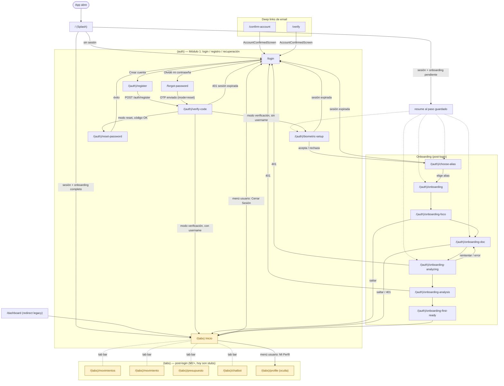

# Mapa de rutas — front-walvy (expo-router)

**Última actualización:** 2026-07-08
**Fuente:** lectura directa de `front-walvy/expo/app/**` y de los `router.push/replace` en `features/auth`, `features/home`, `features/splash`.
**Complementa a:** [`auth-navigation-flows.md`](auth-navigation-flows.md) (detalle narrativo de condiciones de login/onboarding). Este doc es el grafo completo, incluyendo `(tabs)`.

---

## Grafo de navegación

**Leyenda**
- 🟨 Amarillo (`stub`) — ruta registrada y alcanzable, pero la pantalla es un placeholder "Próximamente" (funcionalidad de un módulo futuro, no M1).

---

## Rutas no cubiertas en el grafo (infraestructura, no flujo de usuario)

| Ruta | Qué hace |
|---|---|
| `+not-found` | 404 genérico de Expo Router (template, sin tocar) |
| `+native-intent` | Handler de deep links nativos (pass-through) |

---

## Tabla de referencia rápida

| Ruta | Grupo | Estado | Pantalla real |
|---|---|---|---|
| `/` | raíz | ✅ funcional | `SplashScreen` |
| `/dashboard` | raíz | ✅ funcional (redirect) | → `/(tabs)` (sin screen propia) |
| `/confirm-account` | raíz | ✅ funcional | `AccountConfirmedScreen` |
| `/verify` | raíz | ✅ funcional | `AccountConfirmedScreen` |
| `/login` | `(auth)` | ✅ funcional | `LoginScreen` |
| `/register` | `(auth)` | ✅ funcional | `RegisterScreen` |
| `/forgot-password` | `(auth)` | ✅ funcional | `ForgotPasswordScreen` |
| `/(auth)/verify-code` | `(auth)` | ✅ funcional | `VerifyCodeScreen` |
| `/(auth)/reset-password` | `(auth)` | ✅ funcional | `ResetPasswordScreen` |
| `/(auth)/biometric-setup` | `(auth)` | ✅ funcional | `BiometricPromptScreen` |
| `/(auth)/choose-alias` | `(auth)` | ✅ funcional | `ChooseAliasScreen` |
| `/(auth)/onboarding` | `(auth)` | ✅ funcional | `OnboardingScreen` |
| `/(auth)/onboarding-foco` | `(auth)` | ✅ funcional | `OnboardingFocoScreen` |
| `/(auth)/onboarding-doc` | `(auth)` | ✅ funcional | `OnboardingDocScreen` |
| `/(auth)/onboarding-analyzing` | `(auth)` | ✅ funcional | `OnboardingAnalyzingScreen` |
| `/(auth)/onboarding-analysis` | `(auth)` | ✅ funcional | `OnboardingAnalysisScreen` |
| `/(auth)/onboarding-first-ready` | `(auth)` | ✅ funcional | `OnboardingFirstReadyScreen` |
| `/(tabs)` (index) | `(tabs)` | 🚧 stub "Próximamente" | `HomeTabScreen` |
| `/(tabs)/movimientos` | `(tabs)` | 🚧 stub "Próximamente" | `MovimientosTabScreen` |
| `/(tabs)/movimiento` | `(tabs)` | 🚧 stub "Próximamente" | `MovimientoTabScreen` |
| `/(tabs)/presupuesto` | `(tabs)` | 🚧 stub "Próximamente" | `PresupuestoTabScreen` |
| `/(tabs)/chatbot` | `(tabs)` | 🚧 stub "Próximamente" | `ChatbotTabScreen` |
| `/(tabs)/profile` (oculta) | `(tabs)` | 🚧 stub "Próximamente" | `ProfileTabScreen` |
