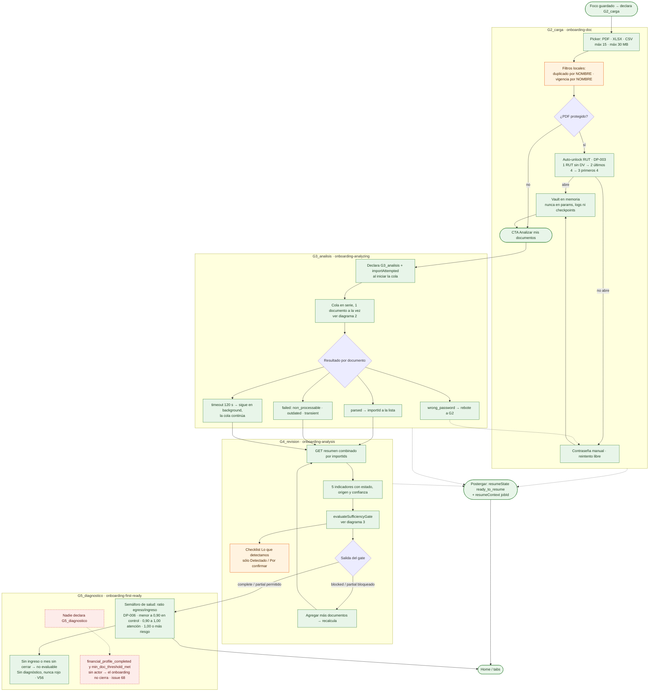
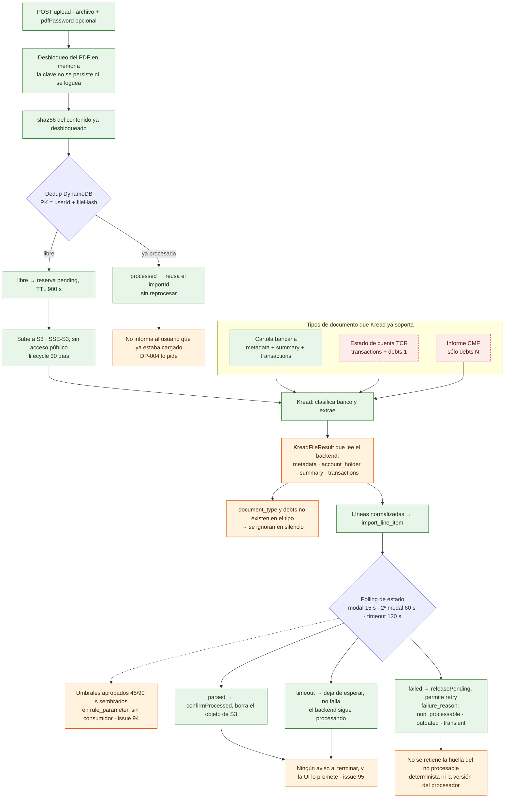
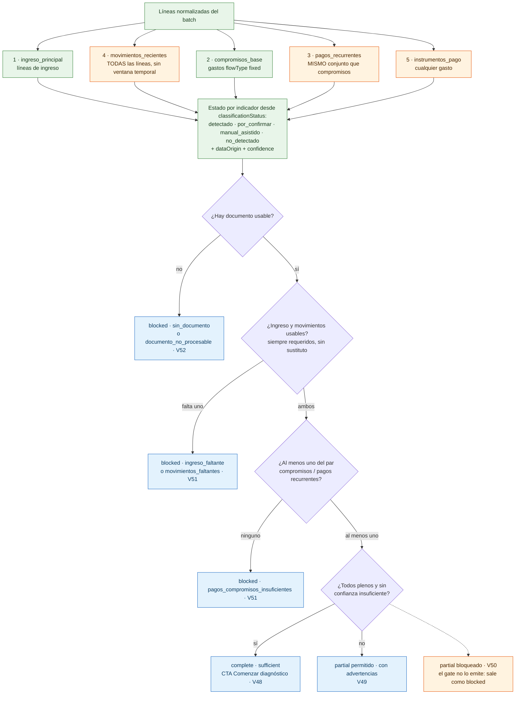

# Onboarding G2 → G5 — diagramas del flujo real

Convención: **verde** = implementado y conforme · **naranja** = brecha nuestra · **rojo punteado** = falta decisión de Producto o no existe actor.

---

## 1. Recorrido completo G2 → G5

---

## 2. Procesamiento de un documento dentro de G3

---

## 3. El gate de suficiencia de G4

**Instrumentos de pago no aparece en ninguna decisión**: es importante pero nunca crítico, sólo suma advertencia. Y el par «basta uno» hoy es degenerado, porque sus dos indicadores salen del mismo conjunto de líneas.

---

## 4. Lo que estos diagramas dejan a la vista

| Punto | Diagrama | Estado |
|---|---|---|
| Contraseñas fuera de params y logs (`DP-003`) | 1 | Cerrado |
| Dedup por huella de contenido por usuario (`DP-004`) | 2 | Cerrado, salvo avisar al usuario y el retén del determinista |
| Umbrales 45/90 s configurables (`ONB-013`) | 2 | Brecha · #94 |
| Aviso al terminar el análisis | 2 | Brecha · #95 |
| `document_type` y `debts` de Kread | 2 | Brecha de contrato: el tipo del backend no los lee |
| Estado, origen y confianza por indicador (`RGL-013`) | 3 | Backend cerrado; la UI muestra 2 de 6 estados |
| Par compromisos / pagos recurrentes separable | 3 | Brecha: sin esto `V49` vs `V50` no es validable |
| `partial_bloqueado` como etiqueta | 3 | Brecha de vocabulario, no de comportamiento |
| Cierre del onboarding | 1 | Sin actor · #68 |
