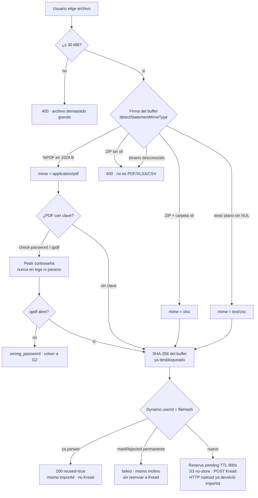
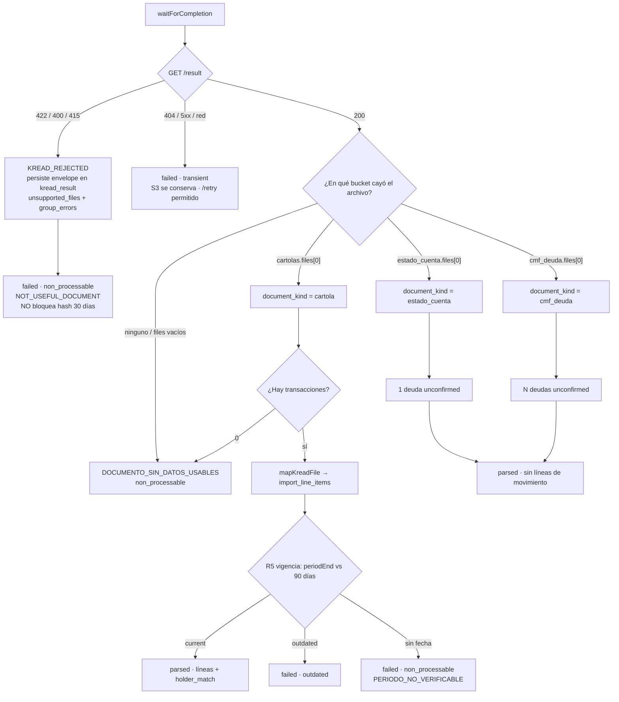
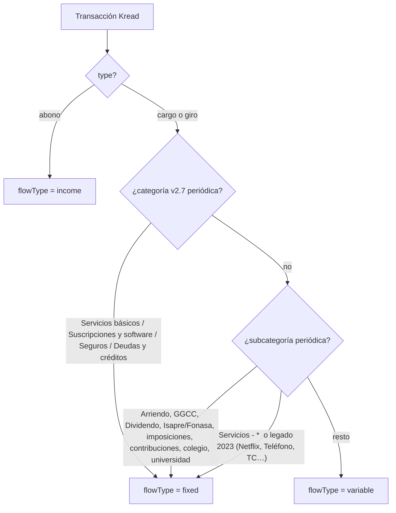
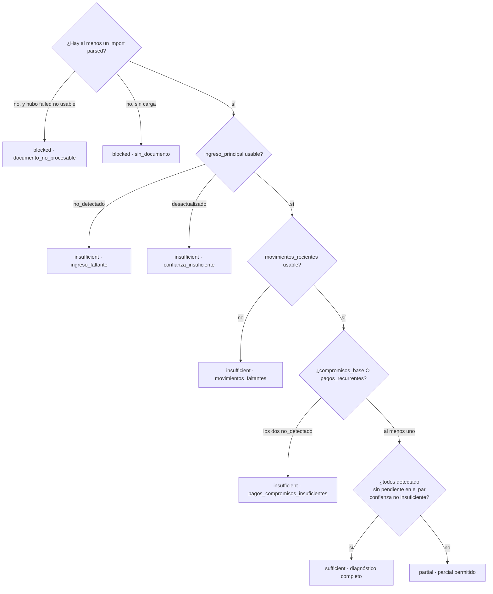
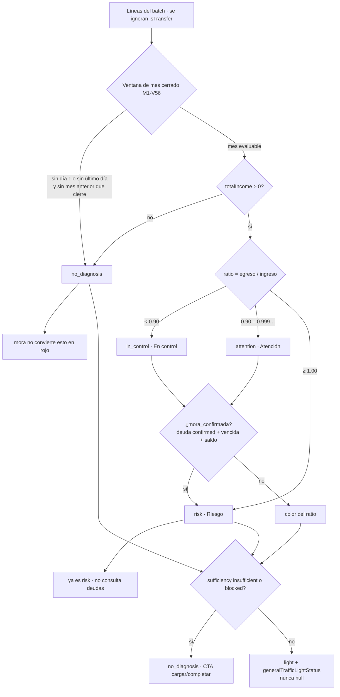

# Flujo de un documento: carga → Kread → G4 → G5

Qué hace el código **hoy** cuando alguien sube un archivo (el mismo pipeline que inspecciona `GET /dev/qa`). Contrasta la wiki por puerta y los HTML de PM (`requerimientos_PM/`), pero la numeración canónica es esta carpeta: **G3 = análisis, G4 = suficiencia, G5 = diagnóstico**.

Fuentes de código: `statement-import.service.ts`, `statement-file-type.ts`, `kread.mapper.ts`, `kread-flow-type.ts`, `semaforo-g5.ts`, `sufficiency-gate.rule.ts`.

---

## 1. Carga y validación (G2 → G3)

El front acepta PDF / XLSX / CSV, tope **30 MB**. El backend no confía en el `Content-Type` del cliente: decide el tipo por **contenido**.

| Formato | Qué se valida | Qué no corre |
|---|---|---|
| **PDF** | Firma `%PDF`, tamaño, qpdf si hay clave, hash **post-unlock** | XLSX/CSV no pasan por qpdf aunque alguien mande `pdfPassword` |
| **XLSX** | Magic ZIP `PK` **y** entrada `xl/` (un `.zip` o `.docx` se rechaza) | Contraseña PDF |
| **CSV** | Texto (sin NUL, pocos bytes de control). Windows a veces declara `ms-excel`: se ignora el header | Contraseña PDF |

Tras `/upload` el front polea `GET /statement-imports/:id/status`. El trabajo pesado (S3 + Kread) va en background.

---

## 2. Vuelta de Kread: tres buckets

Kread `POST /process-document` → poll `/status` → `GET /result` (Kread **borra** el result al leerlo; Walvy lo copia a `kread_result`).

**Qué mapea una cartola** (`NormalizedLine`):

| Campo | Origen |
|---|---|
| `occurredOn`, `amount`, `description` | transacción Kread |
| `movementType` | `abono` → `income`; `cargo`/`giro` → `expense` |
| `flowType` | ver §3 — **no** es el sentido entra/sale |
| `category` / `subcategory` | taxonomía Kread M5 v2.7 (tal cual) |
| `isTransfer` | la glosa contiene el RUT del titular → se excluye del ratio G5 |
| `classificationStatus` | `category_confidence ≥ 0.7` → `categorized`; si no `pending_review` |

Estado de cuenta e informe CMF **no** generan `import_line_items`. Crean filas `debts` (`unconfirmed`). G4 las cuenta como avance (`documentsIncluded`), no como movimientos del mes.

---

## 3. `flowType` y categorías (qué es “fijo”)

`movementType` = entra o sale. `flowType` = naturaleza del flujo.

Ejemplos **variable** (no pintan `hasFixedExpenses`): supermercado, bencina, farmacia, transferencias, ATM.

`hasFixedExpenses` y `hasRecurringPayments` en el summary **comparten la misma regla** (`flowType === fixed`) hasta que Producto los separe.

Ingreso principal para prellenar sueldo: subcategorías **Sueldo** y **Honorarios** (no Bono ni Aguinaldos).

---

## 4. G4 — ¿hay base para diagnosticar?

G4 corre en `GET /statement-imports/summary-batch` (`evaluateSufficiencyGate`). Vocabulario persistido: `sufficient | partial | insufficient | blocked` (más angosto que los 5 nombres de Fase 3).

- `instrumentos_pago` **nunca bloquea**.
- `insufficient` / `blocked` en G5 se fuerzan a `no_diagnosis` (no rojo).
- `partial` **sí** deja pasar a G5 (cards de Figma si el mes cierra).

---

## 5. G5 — semáforo (lo que pinta `/dev/qa`)

Figma tiene **3 cards**. El API tiene **4 valores**. `no_diagnosis` no es una cuarta luz.

Orden en `finalizeG5Semaforo`:

1. Ratio del **mes cerrado** (M1-DP-006).
2. Mora confirmada solo **sube** `in_control` / `attention` → `risk` (no pisa `no_diagnosis`).
3. Suficiencia `insufficient`/`blocked` → `no_diagnosis`.
4. Si quedó `no_diagnosis` pero G4 ya pasó: CTA `no_dominant_cta` (no decir “en control”).

**Mes cerrado** (ambos bordes, con `occurredOn` reales, no el título del PDF ni `kread.period`):

- Fin: `maxDate` es el último día calendario de ese mes, **o** existe un mes posterior con datos (entonces el anterior cerró al final).
- Inicio: `minDate` global ≤ `YYYY-MM-01` del mes elegido.
- Si el mes vigente no cumple, se intenta **solo** el mes anterior. Si tampoco, `no_diagnosis`.

Por eso una cartola 3–28 jul o 7–31 jul (falta el 1) no pinta color aunque G4 esté en *Base suficiente*.

| Color | Condición en código |
|---|---|
| Verde `in_control` | Mes cerrado + ingreso > 0 + ratio < 0.90 + G4 no bloquea + sin mora que suba |
| Amarillo `attention` | Igual, ratio ∈ [0.90, 1.00) |
| Rojo `risk` | Ratio ≥ 1.00 **o** mora confirmada sobre un color ya evaluable |
| Sin diagnóstico `no_diagnosis` | Mes no cerrado, sin ingreso en la ventana, G4 insuficiente/bloqueado, o Kread sin datos usables. **Nunca** por “faltan datos” se pinta rojo |

---

## 6. Cómo se ve en `/dev/qa`

El panel llama, en orden: login → `users/me` + onboarding → lista de imports → `summary-batch` (G5 + G4) → `kread-result` + `/lines` del archivo seleccionado → deudas.

El recuadro amarillo de “mes no evaluable” replica la regla M1-V56 sobre las fechas de las líneas, no sobre el período que Kread puso en el PDF.
