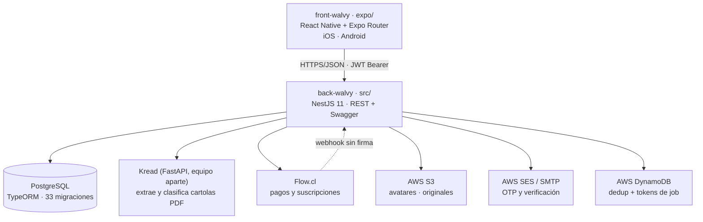

# Wiki de código — Walvy

Cómo está construido el código hoy y cómo trabajamos sobre él. Pensado para leerse **de arriba a abajo el primer día** y volver a consultarse después.

| Documento | Qué cubre |
|---|---|
| [`backend.md`](backend.md) | `back-walvy` — NestJS + PostgreSQL: arranque, capas, módulos, reglas de negocio, migraciones, el flujo de la cartola |
| [`frontend.md`](frontend.md) | `front-walvy` — Expo / React Native: routing, Feature-First, capa `api/`, tema, tests |
| [`integracion-modulos.md`](integracion-modulos.md) | Cómo se conectan M01, M02 y M04, y dónde enchufan M05 y M06 |
| [`reglas-financieras.md`](reglas-financieras.md) | La arquitectura del motor de reglas: capas, puertos, proyecciones e invariantes |

**Foto de referencia:** `origin/qa` — back `4d6c9c4`, front `299bda4`, ambos del 2026-08-28.
Los dos documentos de módulos son posteriores y se levantaron de
`back-walvy` en `feature/m4-ruta-despeje`, que todavía no llega a `qa`.

> Estos dos documentos **reemplazan** a `context/architecture.md` y `context/stack.md` en todo lo que se contradigan: esos dos están congelados en junio y describen NestJS 10, npm y un proyecto sin migraciones. Nada de eso es cierto hoy.

---

## 1. El sistema de una mirada



Un solo backend, un solo cliente. No hay BFF, no hay GraphQL, no hay colas de mensajes. Todo lo asíncrono que existe hoy es el job de Kread, resuelto con polling y un token.

### Dónde vive qué

| Repo | Remote donde van los PR | Espejo del cliente |
|---|---|---|
| `back-walvy` | `origin` → `KabeliDev/back-walvy` | `walvy` → `walvy-org/walvy-app-backend` |
| `front-walvy` | `origin` → `KabeliDev/front-walvy` | `walvy` → `walvy-org/walvy-app-frontend` |
| `walvy-workspace` | conocimiento transversal, specs, bitácora — no se despliega | — |

> ⚠️ **Los dos remotes son el error más caro que se puede cometer.** Los PR siempre van a `origin` (KabeliDev). `walvy-org` es el espejo que ve el cliente.

---

## 2. Cómo trabajamos

### Ramas

```
feature/<algo>  ó  fix/<algo>  ó  docs/<algo>
        │
        └── PR ──► qa ──► main ──► tag release-<entorno>-v<semver> ──► deploy
```

- **`qa`** es la rama de integración y **hoy está en revisión del cliente**. No se le mete nada sin acordarlo.
- **`main`** es la base de release. Hoy `qa` va 21–23 commits adelante.
- `develop` y `release` son **residuo**: no se usan, no te guíes por ellas.
- El repo de front es **squash-only** y la review es lenta: **los PR salen de `main` y son independientes, nunca apilados.** Duplicar un fix de infraestructura en dos ramas es lo correcto acá.
- **Merge no despliega.** El deploy se dispara publicando un GitHub Release con tag.

### Commits

Conventional commits, **en español**, con el ID de la regla del cliente entre paréntesis cuando aplica:

```
feat(health): el Foco del Mes desempata el CTA sin señal crítica (M2-V65)
fix(users): agrega throttling a PATCH /users/me/password (M2-V44)
docs(perfil): documenta el contrato Ruta Despeje M02 ↔ M04
```

**Se cita la regla de la matriz de impacto (`M1-RN-*`, `M1-DP-006`, `M2-V65`), no el número de issue.** El cliente audita la entrega contra su matriz; un commit que dice `#179` no es auditable. El `(#NNN)` que aparece al final lo agrega GitHub al hacer squash — no lo escribas tú.

### Qué se espera de un PR

1. Título con el mismo formato del commit.
2. Lint, build, typecheck y tests **verdes** — el CI comenta la cobertura del área que tocaste.
3. Los e2e de backend se corren **en local** antes de pedir review (el CI no los corre).
4. Si tocaste una regla de negocio, el `.spec.ts` de esa regla se actualiza en el mismo PR.
5. Si cambiaste un contrato de endpoint, se actualiza `back-walvy/docs/api/...` en el mismo PR.

Referencias de "así se ve un PR aceptable acá": `back-walvy` **#178, #179, #180**.

### Comentarios en el código

Regla estricta: **el comentario explica el *porqué*, nunca el *qué*.** Nada de comentarios que un test al fallar ya diría. Los comentarios que sí valen —y que verás por todas partes— son los que dejan constancia de una decisión no obvia: por qué una entidad está registrada dos veces, por qué un umbral es 0.90, por qué un endpoint público no lleva token. Varios citan la regla del cliente que los respalda.

### Documentación

- La **fuente de verdad del esquema son las entidades TypeORM**, no los `.md` de `context/db/`.
- Los `COMMENT ON COLUMN` del esquema documentan el modelo previsto: se leen antes de proponer una migración.
- `context/specs/` es el contrato de producto por módulo; `back-walvy/docs/api/` es el contrato técnico por endpoint.

---

## 3. Los dos stacks, lado a lado

| | Backend | Frontend |
|---|---|---|
| Dónde está el código | `back-walvy/src/` | `front-walvy/**expo/**` |
| Package manager | **pnpm 10** | **Bun** |
| Node | 22 | 20 local / 22 CI |
| Unidad de organización | módulo Nest (`src/<modulo>/`) | feature (`features/<nombre>/`) |
| Capas | controller → service → rules/repository | ui → hooks → data → api |
| Dónde va la lógica | **service** y `rules/*.rule.ts` | **hooks** y módulos de dominio de la feature |
| Qué NO lleva lógica | controllers | `app/` (delegates de 2 líneas) |
| Dónde viven los tests | `.spec.ts` al lado del archivo + `test/` para e2e | `__tests__/` junto a la carpeta |
| Arranque | `pnpm run start:dev` | `cd expo && bun run start` |

**La simetría importante:** en los dos lados la lógica de negocio está en **funciones puras separadas y testeadas** (`src/health/rules/`, `features/profile/rutaDespeje.ts`), y en los dos lados la capa de entrada —controller o `app/`— es deliberadamente tonta.

**La asimetría importante:** el backend **decide**, el frontend **traduce**. El semáforo, la suficiencia, la elegibilidad de la Ruta Despeje y la prioridad de las señales se calculan en `back-walvy`. El front mapea ese estado a una etiqueta y un color, y no inventa estados nuevos.

---

## 4. Antes de escribir tu primera línea

- [ ] `pnpm` en back, `bun` en front. Nunca `npm`.
- [ ] Confirmar que tu `origin` es **KabeliDev** en los dos repos (`git remote -v`).
- [ ] `DEV_TOOLS_ENABLED=true` en tu `.env` de backend, o no vas a poder repetir el onboarding.
- [ ] `KREAD_BASE_URL` apuntando a una instancia real, o medio flujo no se puede probar.
- [ ] Leer la matriz de impacto de tu módulo antes de tocar una regla.
- [ ] **Trabado más de 45 minutos → pregunta.**
