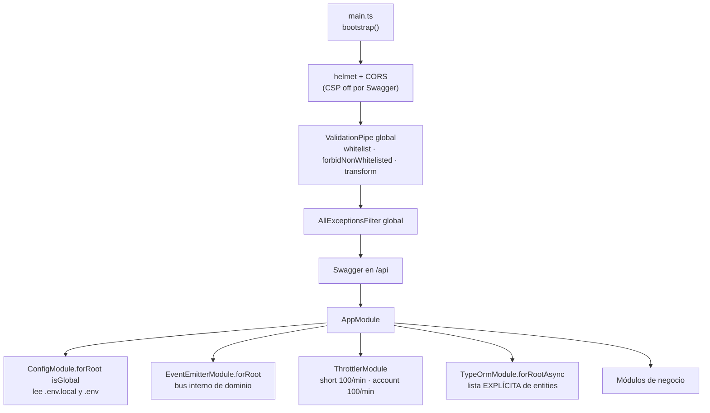
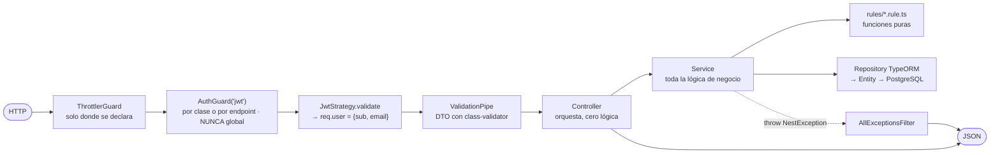
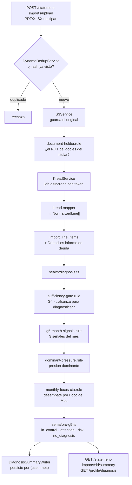

# Wiki de código — Backend (`back-walvy`)

> **Foto tomada de `origin/qa` @ `4d6c9c4` (2026-08-28).**
> `qa` es hoy la rama de integración en revisión del cliente: `main` no tiene nada que `qa` no tenga, y `qa` va **21 commits adelante** de `main`.
> Cuando este documento y `context/architecture.md` / `context/stack.md` se contradigan, **gana este** — los otros dos están congelados en junio y hablan de NestJS 10, npm y "sin carpeta migrations".

---

## 1. Qué es

Una API REST en **NestJS 11** sobre **PostgreSQL** con **TypeORM**, que expone toda la app móvil. No hay BFF, no hay GraphQL, no hay colas: el front le pega directo por HTTPS/JSON.

| Pieza | Versión real en `qa` |
|---|---|
| NestJS | 11.1.29 |
| TypeORM | 0.3.31 (driver `pg` 8.23) |
| Node | 22 (`.nvmrc`) |
| Package manager | **pnpm 10.0.0** (declarado en `packageManager`) |
| TypeScript | 5.9.3 |
| Tests | Jest 30 |
| Auth | Passport-JWT + bcrypt |
| Docs | Swagger en `/api`, contrato en `/api-json` |

> ⚠️ **`npm install` acá es un error.** El lockfile es `pnpm-lock.yaml` y el CI corre `pnpm install --frozen-lockfile`. Si `context/stack.md` dice npm, `stack.md` está mal.

### Servicios externos de los que depende

| Servicio | Para qué | Variable |
|---|---|---|
| **Kread** (FastAPI, equipo aparte) | Extrae y clasifica las líneas de una cartola/informe PDF | `KREAD_BASE_URL`, `WALVY_KREAD_SHARED_SECRET` |
| **Flow.cl** | Pagos y suscripciones (sandbox y prod) | `FLOW_API_KEY`, `FLOW_SECRET_KEY`, `FLOW_CONFIRM_URL`, `FLOW_RETURN_URL` |
| **AWS S3** | Avatares y originales de cartolas | `S3_*` (credenciales por rol IAM, no por access key) |
| **AWS SES / SMTP** | Correos transaccionales (OTP, verificación) | `MAIL_TRANSPORT`, `SES_REGION`, `SMTP_*` |
| **AWS DynamoDB** | Deduplicación de cartolas y tokens de job de Kread | `DYNAMO_ENABLED`, `DYNAMO_*` |

---

## 2. Cómo arranca



Dos cosas que sorprenden y hay que saber desde el día 1:

1. **La lista de entidades de `TypeOrmModule.forRootAsync` en `src/app.module.ts` es explícita, no un glob.** Si creas una entidad nueva y no la agregas a ese arreglo, TypeORM no tiene metadata y **el módulo que la inyecte revienta al arrancar**. Los comentarios del archivo documentan tres veces que este error ya pasó (`Debt`, `DebtPayment`, `SubscriptionPlan`).
2. **`src/data-source.ts` es un DataSource aparte, solo para la CLI de TypeORM** (`migration:generate/run/revert`). Ese sí usa glob de entidades y `synchronize: false` siempre. Son dos inventarios distintos apuntando a la misma base — a propósito, porque la CLI no levanta Nest.

`DB_SYNC=true` deja que TypeORM cree el esquema desde las entidades. Sirve para resetear en local; **no es la estrategia de producción** — ahí manda `migration:run`.

---

## 3. Anatomía de un request

Es el mismo camino para todos los endpoints. Si entiendes este diagrama entiendes el 90% del backend.



Reglas que no se negocian:

- **No hay guard JWT global.** Se declara con `@UseGuards(AuthGuard('jwt'))` a nivel de **clase** (`TransactionsController`, `DebtsController`, `StatementImportController`, …) o, cuando el controlador mezcla rutas públicas y privadas, **endpoint por endpoint** (`AuthController`, `UsersController`, `SubscriptionsController`). Si se te olvida, el endpoint queda **público sin ninguna advertencia**: es el error de seguridad más fácil de cometer acá. Lo público es público **a propósito y comentado** — `/legal/documents` lo es porque el registro debe mostrar los documentos antes de que exista la cuenta.
- El usuario autenticado se lee con `@CurrentUser()` (`src/common/decorators/current-user.decorator.ts`), que devuelve el `JwtPayload` (`{ sub, email }`) — **no** la entidad `User`.
- Nunca `throw new Error(...)`: se usan las excepciones de Nest (`NotFoundException`, `ConflictException`, `UnauthorizedException`, `BadRequestException`).
- `forbidNonWhitelisted: true` significa que **un campo de más en el body es un 400**. El front no puede mandar basura extra.

---

## 4. Cómo se distribuye el código

`src/` son 413 archivos repartidos así (`origin/qa`):

```
src/
├── main.ts                  arranque, pipes/filtros globales, Swagger
├── app.module.ts            EL archivo de wiring — entidades + módulos montados
├── data-source.ts           DataSource de la CLI de migraciones
├── health.controller.ts     /, /health, /health/ready (liveness + readiness)
│
├── auth/          (31)  registro, login, JWT+refresh, OTP, biometría, onboarding
├── users/         (18)  /users/me, avatar, contraseña, ciclo de vida de cuenta
├── legal/          (6)  documentos legales versionados y aceptaciones
├── catalog/       (15)  catálogos de sistema + parámetros de reglas
├── profile/       (13)  perfil financiero declarado, metas, foco del mes
├── health/        (21)  MOTOR DE DIAGNÓSTICO — semáforo, señales, suficiencia
├── imports/       (32)  cartolas: upload, Kread, líneas, dedup
├── debts/         (14)  deudas, severidad, confirmación/descarte
├── subscriptions/ (15)  planes, checkout Flow, webhook, estado de suscripción
├── notifications/  (8)  preferencias de alerta y cola de notificaciones
├── cashflow/      (26)  categorías, funding sources, transacciones  ⚠️ NO MONTADO
├── mail/           (9)  plantillas HTML y envío (SES o SMTP)
├── storage/        (3)  S3Service
├── common/        (16)  decorators, filtros, throttler, validadores (RUT), utils
├── dev/            (9)  herramientas de QA — solo si DEV_TOOLS_ENABLED
├── migrations/    (33)  migraciones TypeORM, orden por timestamp
└── ai/ admin/ gamification/ payments/ budget/   solo entidades, sin lógica aún
```

### Módulos montados en `AppModule` y su superficie HTTP

| Módulo | Prefijo | Estado |
|---|---|---|
| `HealthController` | `/`, `/health`, `/health/ready` | ✅ sin auth (probes de ECS) |
| `AuthModule` | `/auth` | ✅ |
| `UsersModule` | `/users` | ✅ |
| `LegalModule` | `/legal` | ✅ `/legal/documents` es público |
| `CatalogModule` | `/catalog` | ✅ |
| `ProfileModule` | `/profile/financial`, `/profile/goals` | ✅ |
| `HealthModule` | `/profile/diagnosis` | ✅ read-model del diagnóstico mensual |
| `StatementImportModule` | `/statement-imports` | ✅ el módulo más grande |
| `DebtsModule` | `/debts` | ✅ |
| `SubscriptionsModule` | `/subscriptions` | ✅ |
| `NotificationModule` | `/notifications` | ✅ |
| `DevModule` | `/dev` | ⚙️ solo con `DEV_TOOLS_ENABLED=true` |
| **`CashflowModule`** | `/categories`, `/funding-sources`, `/transactions` | ❌ **existe pero NO está en `AppModule`** → hoy todo responde 404 |

> El caso `CashflowModule` no es un descuido aislado: `DebtsModule` y `SubscriptionsModule` estuvieron exactamente igual y los comentarios en `app.module.ts` lo documentan. **Módulo escrito ≠ módulo montado.** Antes de decir "el endpoint no existe", revisa el arreglo `imports`.

---

## 5. Los archivos que hay que conocer sí o sí

| Archivo | Por qué importa |
|---|---|
| `src/app.module.ts` | Único lugar donde se monta un módulo y se registra una entidad. Todo arranque roto empieza acá. |
| `src/main.ts` | Pipes, filtros, CORS, Swagger. |
| `src/data-source.ts` | Lo que ve la CLI de migraciones. |
| `src/auth/auth.service.ts` | Registro, login, rotación de refresh tokens. |
| `src/auth/services/user-onboarding.service.ts` | Estado de las puertas G0→G6. |
| `src/health/diagnosis.ts` | **Cómputo puro del diagnóstico.** Compartido a propósito entre el writer que persiste y el endpoint que responde, para que no diverjan. |
| `src/health/rules/*.rule.ts` | Suficiencia (G4), presión dominante, señales G5, desempate del foco. |
| `src/imports/semaforo-g5.ts` | Umbrales del semáforo: `<0.90` en control · `0.90–1.00` atención · `≥1.00` riesgo. |
| `src/imports/services/statement-import.service.ts` | Orquesta todo el ciclo de una cartola. |
| `src/imports/kread/kread.service.ts` + `kread.mapper.ts` | Contrato con el servicio externo y normalización de sus líneas. |
| `src/subscriptions/services/flow.service.ts` | Integración con Flow. |
| `src/common/filters/http-exception.filter.ts` | Forma de todos los errores que ve el front. |
| `src/common/validators/document/rut.validator.ts` | Validación de RUT chileno. |
| `docs/README.md` | Índice de contratos de endpoint. Se actualiza junto con el código. |
| `DB/schema/walvy-full.dbml` | Mapa del esquema completo. |

---

## 6. El patrón `rules/` — dónde vive la regla de negocio

Walvy no es un CRUD. Buena parte del valor está en reglas que el cliente escribió y auditará. Por eso las reglas **no viven dentro de los services**: viven en funciones puras, testeadas aparte, con el ID de la regla en el comentario de cabecera.

```
src/health/rules/sufficiency-gate.rule.ts     ¿hay datos suficientes para diagnosticar?
src/health/rules/dominant-pressure.rule.ts    ¿cuál es la presión dominante del mes?
src/health/rules/g5-month-signals.rule.ts     las 3 tarjetas de señal del mes
src/health/rules/monthly-focus-cta.rule.ts    desempate del CTA por Foco del Mes
src/debts/rules/debt-severity.rule.ts         severidad de una deuda
src/imports/rules/document-holder.rule.ts     ¿el documento es del titular?
src/imports/semaforo-g5.ts                    umbrales del semáforo
src/profile/debt-health.ts                    estado de Salud de Deuda
src/users/account-access.ts                   ¿esta cuenta tiene acceso?
```

Cada uno tiene su `.spec.ts` al lado. **Si vas a tocar un umbral o una prioridad, se toca acá y se cita la regla del cliente en el commit** (`M1-DP-006`, `M2-V65`, …), nunca el número de issue.

---

## 7. Datos

- **Entidades TypeORM = fuente de verdad del esquema.** Los `.md` de `context/db/` están desactualizados en varios nombres de tabla. Ante la duda, gana la entidad.
- Columnas en `snake_case` vía `@Column({ name: '...' })`; clases en `PascalCase`.
- **33 migraciones** en `src/migrations/`, ordenadas por timestamp en el nombre. Las `1786000001000`–`1786000014000` son el *baseline* (esquema completo + seed de catálogos); de ahí en adelante son cambios incrementales.
- Los `COMMENT ON COLUMN` del esquema **documentan el modelo previsto**: léelos antes de proponer una migración. Un `CHECK` que estorba se migra como último recurso, no como primero.
- **Seeds:** `catalog-seed.service.ts`, `cashflow-seed.service.ts`, `subscription-seed.service.ts`. Implementan `OnModuleInit`, usan `upsert` con `conflictPaths` (idempotentes) y **solo cargan catálogos de sistema, nunca datos de usuario**.
- Datos de prueba: `pnpm seed:test-data` (y `seed:test-data:undo`).

```bash
pnpm migration:run          # aplica pendientes
pnpm migration:show         # cuáles corrieron
pnpm migration:generate     # genera desde el diff entidades ↔ base
pnpm migration:revert       # deshace la última
```

---

## 8. El flujo estrella: de un PDF al semáforo

Es el recorrido que atraviesa más módulos y el que hay que poder explicar en la daily.



El disparador de la escritura es un evento de dominio (`user-financial-data.changed`) sobre `EventEmitterModule`, para que el writer del diagnóstico no se acople a quién modificó los datos.

**Para probar esto en local necesitas `KREAD_BASE_URL` apuntando a una instancia real de Kread.** Sin eso, medio flujo no se puede ejercitar. Y para repetir el onboarding N veces: `DEV_TOOLS_ENABLED=true` + `POST /dev/reset-user`.

---

## 9. Tests

- **55 archivos `.spec.ts`** conviviendo con el código (`auth.service.spec.ts` al lado de `auth.service.ts`). Es la convención: el test vive pegado a lo que prueba, no en una carpeta espejo.
- **16 archivos e2e** en `test/`, con Supertest sobre la app real y Postgres.
- Las reglas puras (`rules/`, `semaforo-g5`, `diagnosis`, `account-access`) tienen cobertura densa porque son auditables contra el requerimiento del cliente.

```bash
pnpm test                      # unitarios
pnpm test:cov                  # con cobertura
pnpm test:e2e -- --runInBand   # e2e (requiere Postgres y .env)
```

> **El CI no corre los e2e** — necesitan Postgres y el juego completo de variables, y se decidió que eso hace el check frágil y lento. Los e2e se corren en local antes de pedir review.

---

## 10. CI y entrega

`pr-check.yml` corre en cada PR contra `main` o `qa`: `pnpm install --frozen-lockfile` → **lint** → **build** → **tests unitarios con cobertura** → comentario sticky de cobertura en el PR. Falla el lint con un solo warning (`--max-warnings=0`).

Los demás workflows (`repository-checker`, `container-image-check`, `release-deploy`) delegan en `walvy-org/infra-tools` y son territorio de la arquitecta: no se tocan desde acá.

**Merge a `main` no despliega.** El despliegue se dispara publicando un GitHub Release con tag `release-<entorno>-v<semver>`, que construye el commit tagueado para ARM64, publica en ECR, escanea con Trivy, actualiza ECS y valida `/health/ready` y `/api-json`. Un despliegue fallido restaura la task definition anterior.

---

## 11. Trampas conocidas (léelas antes de perder una tarde)

1. **pnpm, no npm.** Y `pnpm install --frozen-lockfile` si el lock ya existe.
2. **Entidad nueva → agrégala a `app.module.ts`**, o el arranque revienta con un error de metadata que no dice eso.
3. **Módulo nuevo → agrégalo a `imports` de `AppModule`**, o todos sus endpoints dan 404 sin ninguna advertencia (`CashflowModule` está así hoy).
4. **Guard JWT olvidado = endpoint público.** No hay red de seguridad global.
5. **Dos remotes.** `origin` = `KabeliDev/back-walvy` (ahí van los PR) · `walvy` = `walvy-org/walvy-app-backend` (espejo del cliente). Empujar al remote equivocado es el error más caro posible.
6. **En los commits se cita la regla del cliente** (`M1-RN-*`, `M2-V65`), nunca `#NN`.
7. **La documentación miente en los nombres de tabla.** `context/db/modulo5.md` dice `financial_movement`, `file_upload`, `user_financial_instrument`; el código usa `transactions`, `statement_imports`, `funding_sources`. Gana el código.
8. **`DB_SYNC=true` solo en local.** En cualquier otro lado, migraciones.
9. **Sin DELETE físico** de `app_user`, movimientos ni deudas: soft delete y supresión de cuenta por fases.
10. **Nunca loguear** `accessToken`, `refreshToken` ni `passwordHash` — hay un `log-redaction.util.ts` para eso.
11. **Los webhooks de Flow no traen firma.** No intentes validar el body: se confía en `getStatus`.
