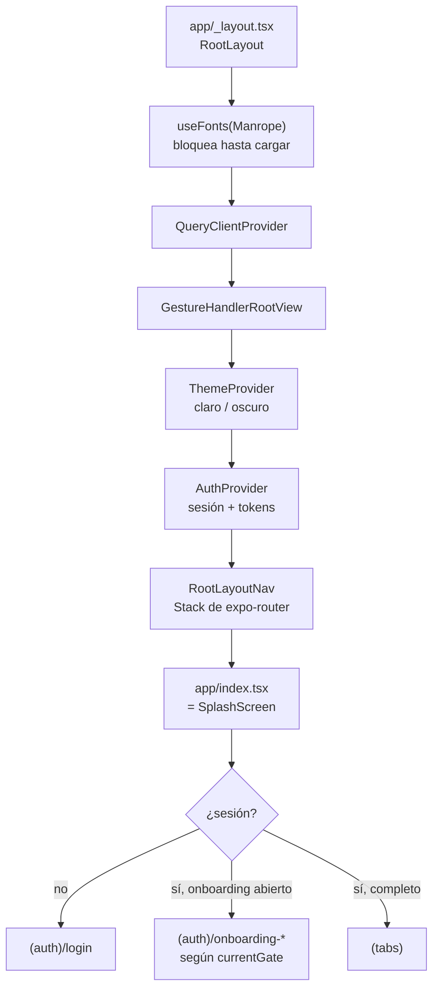
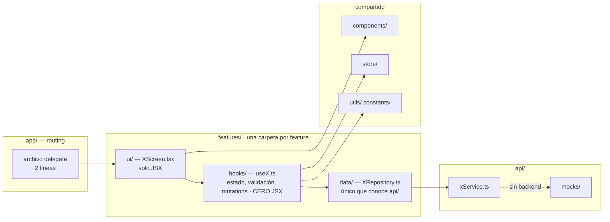
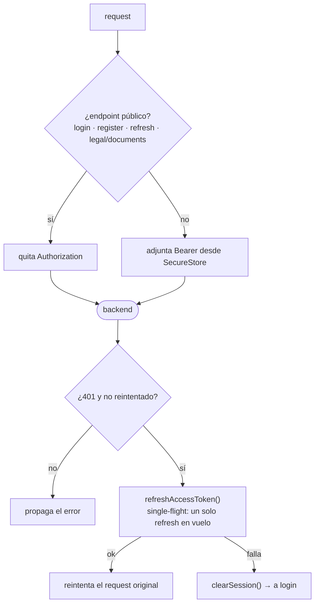

# Wiki de código — Frontend (`front-walvy`)

> **Foto tomada de `origin/qa` @ `299bda4` (2026-08-28).**
> `qa` va **23 commits adelante** de `main`; `main` no tiene nada que `qa` no tenga.
> Si vienes de backend: esto no es una SPA. Es una app nativa compilada. No hay DOM, no hay CSS, no hay `window`. `View` y `Text` en vez de `div` y `span`, y estilos como objetos JS.

---

## 1. Qué es

App móvil (iOS + Android) en **React Native con Expo**, con **Expo Router** (navegación por sistema de archivos) y **TanStack Query** para todo lo que toca el servidor. Corre además en web, pero **solo como conveniencia de desarrollo** — no hay deploy web.

| Pieza | Versión real en `qa` |
|---|---|
| Expo SDK | 54.0.36 (`newArchEnabled: true`) |
| React Native | 0.81.5 · React 19.1 |
| Expo Router | 6.0.24 |
| TanStack React Query | 5.101 |
| Axios | 1.18 |
| Zod | 4.x |
| Zustand | 5.x |
| **Package manager** | **Bun** (CI fija 1.3.13) |
| Node | 20 en `.nvmrc`, 22 en CI |
| Tests | Jest 29 + `jest-expo` + React Native Testing Library |
| Tipografía | **Manrope** vía `@expo-google-fonts/manrope` |

> ⚠️ **`npm install` acá es un error.** El lockfile es `bun.lock` y el CI corre `bun install --frozen-lockfile`.

### El código no está en la raíz

```
front-walvy/
├── .github/workflows/     CI
├── MANIFEST.yaml
├── README.md
└── expo/                  ← TODO el código vive acá. Todos los comandos se corren desde acá.
```

```bash
cd expo
bun i
bun run start-web     # lo más rápido para el primer arranque
bun run start         # Metro + QR para dispositivo real
bun run lint
bun run typecheck
bun run test
```

**El backend no es obligatorio para desarrollar UI.** Si el probe a `/health` falla, la app entra sola en **modo mock** con datos de prueba. Se puede forzar con `EXPO_PUBLIC_USE_MOCK_MODE=true` (o `false` para exigir API real).

---

## 2. Cómo arranca



`RootLayoutNav` además engancha `useDeepLinkHandler` (links `walvy://`, verificación de correo, retorno de pago) y `useNotificationSetup`.

---

## 3. La arquitectura: Feature-First + capas

Esto es lo único que hay que interiorizar de verdad.



**Las dependencias solo van hacia abajo.** `api/` no sabe que existe `features/`. Dos features **no se importan entre sí**: se comunican por `@/store` o `@/utils`.

```ts
// ✅
import { useAuth } from "@/store/AuthProvider";
// ❌ prohibido
import { algo } from "../../profile/hooks/useProfileForm";
```

Cada feature expone un `index.ts` que es **su contrato público**: desde fuera se importa `@/features/profile`, nunca una ruta interna.

### `app/` es routing y nada más

Un archivo de ruta tiene **dos líneas**. Literalmente:

```tsx
// app/(tabs)/profile.tsx
import { ProfileScreen } from "@/features/profile";
export default ProfileScreen;
```

Si te encuentras escribiendo lógica en `app/`, está en el lugar equivocado.

---

## 4. Cómo se distribuye el código

348 archivos en `expo/`:

```
expo/
├── app/          (46)  RUTAS. Delegates de 2 líneas + los _layout.
│   ├── _layout.tsx           providers + Stack raíz
│   ├── index.tsx             gate de sesión (= SplashScreen)
│   ├── (auth)/               14 pantallas sin sesión: login, registro, onboarding G0→G5
│   ├── (tabs)/               13 pantallas con sesión
│   └── verify · confirm-account · subscriptions/result · +not-found
│
├── features/    (104) TODA la lógica
│   ├── auth/         (60)  registro, login, OTP, biometría, onboarding completo
│   ├── profile/      (25)  perfil financiero, Salud de Deuda, Ruta Despeje, ajustes
│   ├── subscription/ (10)  planes, cancelación, resultado de pago
│   ├── home/          (7)  header de la app y menú de usuario
│   └── splash/        (2)
│
├── api/          (30)  capa HTTP: client, endpoints, services, types, mocks
├── components/   (20)  primitivas compartidas (AppButton, AppInput, iconos SVG)
├── constants/     (6)  theme, colors, fonts, media
├── store/         (2)  AuthProvider, ThemeProvider
├── services/      (2)  secureStorage, biometrics
├── hooks/         (4)  deep links, conectividad, notificaciones
├── utils/         (4)  validación y helpers
└── docs/          (3)  architecture · testing-strategy · deployment
```

Las tabs visibles hoy (`app/(tabs)/_layout.tsx`): **Inicio · Movimientos · Añadir · Mis Metas · Asistente IA**, con `profile` montada pero oculta de la barra. La barra es `components/WalvyTabBar.tsx`, custom — no la de React Navigation.

---

## 5. La capa `api/`

```
api/
├── config.ts        BACKEND_BASE_URL por plataforma, timeout, flag de mock
├── endpoints.ts     TODAS las rutas del backend en un solo objeto congelado
├── client.ts        instancia Axios + interceptores
├── xService.ts      un service por dominio (auth, profile, diagnosis, statementImport…)
├── types/           tipos del contrato con el backend
└── mocks/           respuestas falsas para trabajar sin backend
```

`endpoints.ts` es la **única lista de rutas** del proyecto. Si el backend agrega un endpoint, entra ahí primero.

**Base URL por defecto** cuando no defines `EXPO_PUBLIC_BACKEND_BASE_URL`: web → `localhost:3000`; **emulador Android → `10.0.2.2:3000`**; simulador iOS → `localhost:3000`. En dispositivo físico tienes que poner la IP de tu LAN a mano.

### Los interceptores (`client.ts`)



Dos detalles que ahorran horas de debugging:

- **A los endpoints públicos se les quita el `Authorization` a propósito.** Un JWT viejo en SecureStore hacía fallar el registro, que pide los documentos legales antes de que exista la cuenta.
- El refresh es **single-flight**: si cinco requests se caen con 401 a la vez, se dispara **un** refresh y los cinco esperan al mismo.

---

## 6. Los archivos que hay que conocer sí o sí

| Archivo | Por qué importa |
|---|---|
| `app/_layout.tsx` | Orden de providers y fuentes. Todo arranque roto pasa por acá. |
| `app/(tabs)/_layout.tsx` | Qué tabs existen y cuáles están ocultas. |
| `store/AuthProvider.tsx` | Sesión, tokens, logout. Lo consume media app. |
| `store/ThemeProvider.tsx` | Claro/oscuro. Los colores salen de acá, nunca hardcodeados. |
| `api/client.ts` | Interceptores y refresh. |
| `api/endpoints.ts` | Contrato de rutas con el backend. |
| `api/config.ts` | Base URL y modo mock. |
| `services/secureStorage.ts` | Único lugar donde se guardan tokens. |
| `constants/theme.ts` · `colors.ts` · `fonts.ts` | Design tokens. |
| `components/AppButton.tsx` · `AppInput.tsx` | Primitivas — se reutilizan, no se reinventan. |
| `features/auth/utils/onboardingGates.ts` | Mapa puerta → pantalla del onboarding. |
| `features/profile/rutaDespeje.ts` · `saludDeuda.ts` · `senalCritica.ts` · `precision.ts` | Traducción de estados del backend a lo que se ve. |

---

## 7. Lógica de dominio en el front: traduce, no calcula

Hay archivos de dominio puro dentro de `features/` (fuera de `ui/`, `hooks/` y `data/`). Tienen una regla explícita: **el front no recalcula el negocio, lo traduce.**

| Archivo | Qué hace |
|---|---|
| `features/auth/utils/onboardingGates.ts` | `G0_activacion … G6_retoma` → ruta. Decide dónde retomas al volver a entrar. |
| `features/auth/utils/onboardingDiagnosis.ts` | Lee el diagnóstico que emitió el backend. |
| `features/profile/rutaDespeje.ts` | Traduce `debt.route_eligibility_status` (que gobierna M04) a la etiqueta visible. **No agrega deudas ni decide elegibilidad.** |
| `features/profile/saludDeuda.ts` | Estado de Salud de Deuda → color y copy. |
| `features/profile/senalCritica.ts` | Cuál señal manda cuando hay varias. |
| `features/profile/precision.ts` | Precisión de la lectura (casos A–D). |

Cada uno abre con un comentario que cita la regla del cliente (`RW-M02-020`, `PD-M2-10`, …) y la migración de donde sale el vocabulario. **Ese comentario es parte del contrato: si cambias el mapeo, cambia también la cita.** Un estado nuevo se inventa en el backend, nunca acá.

---

## 8. UI, tema y las dos trampas visuales

- **Sin CSS.** `StyleSheet.create({...})` con objetos JS. Sin cascada, sin `%` para todo, sin media queries.
- **Colores desde `useTheme()`**, nunca literales hex en la pantalla.
- **Tipografía Manrope.** El `fontWeight` de RN solo funciona si la clave de `useFonts` corresponde a una familia multi-cara; por eso se cargan `Manrope_400Regular`, `600SemiBold` y `700Bold` por separado. `lineHeight` mínimo **1.5× el `fontSize`** o se recortan los descendentes.
  > Que Figma siga en Aptos **no es una divergencia**: la migración a Manrope fue por licencia y está cerrada.
- **Safe area.** Toda pantalla **fuera de `(tabs)`** aplica los insets a mano:
  ```tsx
  const insets = useSafeAreaInsets();
  <View style={[styles.body, { paddingBottom: insets.bottom + 36 }]} />
  ```
  Dentro de la tab bar es distinto: ahí el inset **reemplaza** al padding del diseño, no se suma. Figma no documenta esto.
- Iconos: `lucide-react-native` y los SVG propios de `components/icons/`. No se mezclan librerías de iconos.

---

## 9. Tests

**42 archivos de test.** Dos ubicaciones conviviendo: `__tests__/` junto a la carpeta que prueban (`app/__tests__/login.test.tsx`, `features/profile/__tests__/saludDeuda.test.ts`) y algunos sueltos al lado del archivo. `test/test-utils.tsx` trae el render con providers ya montados — úsalo siempre en vez de armar el árbol a mano.

Qué se prueba, en orden de valor:

1. **Módulos de dominio puro** (`rutaDespeje`, `saludDeuda`, `senalCritica`, `onboardingGates`) — baratos y son los que el cliente audita.
2. **Hooks de formulario** (`useLoginForm`, `useProfileForm`) — validaciones y estados de error.
3. **Pantallas** con RNTL, sobre comportamiento observable, no sobre implementación.

```bash
bun run test
bun run test --coverage
```

---

## 10. CI y entrega

`pr-check.yml` corre en cada PR contra `main` o `qa`: `bun install --frozen-lockfile` → **lint** → **typecheck** → `expo install --check` (no bloqueante) → **tests con cobertura** → comentario sticky de cobertura por área impactada + artefacto de coverage.

> `repository-checker.yml` delega en `walvy-org/infra-tools`, organización a la que **este repo no tiene acceso**: sus runs mueren con 0 jobs. `pr-check.yml` es la ruta operativa real mientras eso no se resuelva. No borres el checker.

Builds móviles: `build-mobile.yml` (manual) y `release-mobile.yml` vía EAS. Distribución iOS ad hoc documentada en `context/ios-adhoc-testing.md`.

---

## 11. Trampas conocidas

1. **Bun, no npm.** Y todos los comandos desde `expo/`, no desde la raíz.
2. **PR contra `origin` = `KabeliDev/front-walvy`.** El remote `walvy` es el espejo del cliente.
3. **PRs independientes, nunca apilados.** El repo es squash-only y la review es lenta: cada PR sale de `main`. Duplicar un fix de infra en dos ramas es correcto acá, no es descuido.
4. **Tokens solo en `expo-secure-store`.** Nunca `AsyncStorage`. El storage web existe solo para desarrollo.
5. **Nada de imports cross-feature.** Si dos features necesitan lo mismo, sube a `@/store` o `@/utils`.
6. **`app/` no lleva lógica.** Delegate de dos líneas y punto.
7. **Emulador Android → `10.0.2.2`**, no `localhost`. En dispositivo físico, la IP de tu LAN.
8. **Modo mock activo sin avisar.** Si el backend se cayó, la app sigue funcionando con datos falsos y puedes pasar media hora "arreglando" un bug que no existe. Revisa la consola antes.
9. **`expo/docs/architecture.md` está desactualizado** — habla de "Sprints" y de 4 tabs. Sirven los diagramas de capas; ignora el mapa de sprints.
