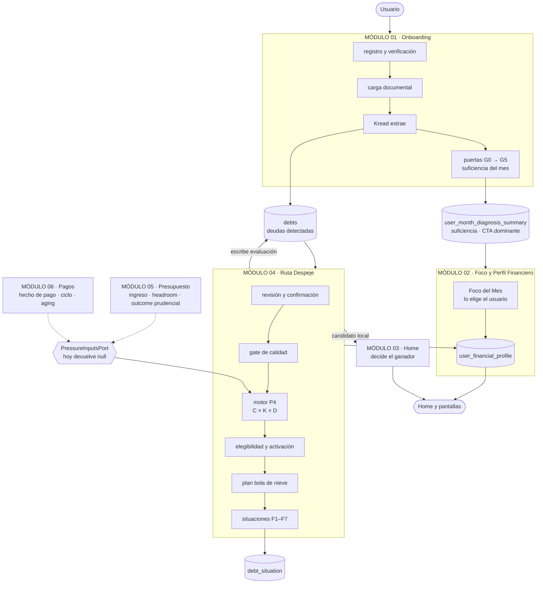

# Integración entre módulos

Cómo se conectan M01, M02 y M04 hoy, y dónde enchufan M05 y M06 cuando lleguen. Levantado del código de `back-walvy/qa`.

## El recorrido completo

Las flechas punteadas son integraciones futuras. Las llenas existen y están probadas contra base real.

> ⚠️ **La flecha de M05 al puerto no está respaldada por el paquete de M05.** Sale de la
> entrega de **M04**, que declara a M05 «productor upstream» del ingreso canónico y el
> headroom (`TEC-M4-007/008`). La entrega de M05 no menciona ninguno de los dos: define
> su frontera con M04 al revés —deriva al usuario a Ruta Despeje con datos prellenados—.
> Mientras eso no se resuelva, el motor de M04 no concluye aunque M05 entregue a tiempo.
> Detalle en
> [`../modulo05-presupuesto-vivo/deuda-tecnica/README.md`](../modulo05-presupuesto-vivo/deuda-tecnica/README.md).

## Las tres costuras

Casi todo el acoplamiento entre módulos pasa por tres lugares. Si algo se rompe entre módulos, empezar por acá.

| Costura             | Qué la sostiene                                                                                                                                |
| ------------------- | ---------------------------------------------------------------------------------------------------------------------------------------------- |
| **M01 → M02**       | M01 deja la suficiencia del mes y el CTA dominante en `user_month_diagnosis_summary`. M02 lo lee, no lo recalcula                              |
| **M04 → M02**       | M04 escribe `route_`* y `debt_health_*` en `user_financial_profile`. La fila es de M02, las columnas las creó M04, y M02 sólo lee y representa |
| **M05 · M06 → M04** | Por `PressureInputsPort` — [`back-walvy/src/debts/ports/pressure-inputs.port.ts`](../../../../back-walvy/src/debts/ports/pressure-inputs.port.ts). M04 consume ingreso, headroom, hecho de pago y aging; no los recalcula |

## Qué escribe cada módulo

| Tabla                          | La escribe    | La lee    | Qué lleva                                  |
| ------------------------------ | ------------- | --------- | ------------------------------------------ |
| `onboarding_state`             | M01           | M01       | puerta actual y última completada, G0 a G5 |
| `statement_imports`            | M01           | M01 · M04 | estado del documento, resultado de Kread   |
| `user_month_diagnosis_summary` | M01           | M02 · M03 | suficiencia del mes, señal y CTA dominante |
| `debts`                        | M01 · M04     | M04       | la deuda, su evaluación y su provenance    |
| `debt_situation`               | M04           | M04 · M03 | situaciones F1–F7 con su lifecycle         |
| `user_financial_profile`       | M02 · **M04** | M02       | perfil, más los bloques de Ruta y Salud    |

La única escritura de M04 fuera de su frontera es el perfil, y está ahí porque las columnas las creó su propia migración. Es el punto a revisar primero si M02 endurece esa tabla.

## Qué funciona hoy de punta a punta

Verificado contra base real con `scripts/e2e-con-base.sh`: registro, verificación, alta de deuda, evaluación completa persistida con su provenance, situaciones escritas con su huella, reevaluación sin rebirth, y el cierre por pago con su condición previa.

**Lo que todavía no concluye.** Sin M05 ni M06 el motor P4 corre pero no puede cerrar ningún eje: la presión queda en `no_calculable` y la Ruta degrada a`pendiente_datos`. Eso *es* el comportamiento correcto, no una falla — la alternativa sería afirmarle al usuario algo que nadie calculó.

## El día que entreguen M05 y M06

Cambia **una sola clase**. `NullPressureInputsAdapter` se reemplaza por un adaptador que lea sus contratos, y el pipeline no se toca.

| Módulo | Qué habilita                                                          |
| ------ | --------------------------------------------------------------------- |
| M05    | ejes C y K de la presión, y el gate prudencial de la simulación       |
| M06    | eje D, el aging de la Salud de Deuda y el avance con pagos consumidos |

La traducción desde `debt_cycle` —la tabla de M06— al hecho de pago que el puerto pide ya está escrita como referencia en `src/debts/ports/debt-cycle.mapper.ts`, para que ese equipo no tenga que deducirla leyendo los CHECK.