# Recorrido de pantallas · M01 → M02 → M04

Por dónde pasa el usuario y **quién decide** cada salto: qué pantalla, qué ruta
de `expo-router` y qué regla la eligió.

Es la vista de navegación. La de datos —qué tabla escribe cada módulo, qué motor
consume qué— está en [integracion-modulos.md](integracion-modulos.md). Se leen
juntas: ahí está el *qué* se calcula, acá el *dónde aparece*.

Levantado del código de `front-walvy` en `qa`, no del diseño.

## El recorrido

```mermaid
flowchart LR
    LOGIN(["Login · biometría"]) --> GATE{"GET /auth/onboarding<br/>routeForPendingOnboardingGate"}

    subgraph M1["MÓDULO 01 · Onboarding"]
        G0["G0 activación<br/>/onboarding"] --> G1["G1 foco<br/>/onboarding-foco"]
        G1 --> G2["G2 carga<br/>/onboarding-doc"]
        G2 --> G3["G3 análisis<br/>/onboarding-analyzing"]
        G3 --> G4["G4 revisión<br/>/onboarding-analysis"]
        G4 --> G5["G5 diagnóstico<br/>/onboarding-first-ready"]
    end

    GATE -->|"currentGate"| G0
    GATE -->|completed| HOME
    GATE -->|"G6 · sin pantalla"| HOME

    G5 --> CTA{"diagnosis.dominantCta<br/>ROUTE_BY_CTA"}
    CTA -->|"upload_document"| G2
    CTA -->|"improve_profile_precision<br/>no_dominant_cta"| PERFIL
    CTA -->|"confirm_debt<br/>view_ruta_despeje"| ENTRY
    CTA -.->|"review_payment · adjust_budget<br/>review_category · sin pantalla"| HOME

    HOME["Inicio · /"] --> TABS{"Barra inferior"}
    TABS -->|"Ruta despeje"| ENTRY
    TABS -->|"Presupuesto vivo · Añadir documento<br/>Asistente IA"| OTROS(["M03 · M05 · M07"])

    subgraph M2["MÓDULO 02 · Perfil"]
        PERFIL["Perfil Financiero<br/>/financial-profile"] --> CTAP{"routeForOnboardingCta"}
        CTAP -.->|"onboarding abierto"| G0
    end

    subgraph M4["MÓDULO 04 · Ruta Despeje"]
        ENTRY{"GET /debts/route/current<br/>resolveDebtEntryPoint"}
        ENTRY -->|"activa · elegible"| RUTA["/debt-route"]
        ENTRY -->|"sin deudas vivas"| CARGA["/debts-upload"]
        ENTRY -->|"por revisar o completar"| REV["/debts-review"]
        CARGA --> ANAL["/debts-analyzing"] --> REV
        CARGA -->|"solo manuales"| REV
        REV --> RESULT["/debts-result"]
        RUTA --> ETAPA2(["Plan · Avance<br/>etapa 2"])
        RUTA -.->|"0 confirmadas"| VACIO["Estado vacío<br/>ninguna rama llega"]
    end

    classDef m1 fill:#EAF4F4,stroke:#1B6B73,color:#103F43
    classDef m2 fill:#F1F8F2,stroke:#2E7D4F,color:#14401F
    classDef m4 fill:#FFF6F2,stroke:#EE8D78,color:#7A2E1F
    classDef decision fill:#FFF4E5,stroke:#B98A2E,color:#6B4E13
    classDef roto fill:#FDECEA,stroke:#AB3737,color:#7A1F1F
    classDef salto fill:#F4F1EC,stroke:#A6BFC0,color:#4C555C

    class G0,G1,G2,G3,G4,G5 m1
    class PERFIL m2
    class RUTA,CARGA,ANAL,REV,RESULT m4
    class GATE,CTA,CTAP,ENTRY,TABS decision
    class VACIO roto
    class LOGIN,HOME,ETAPA2,OTROS salto

    style M1 fill:#FFFDFD,stroke:#E6DED2
    style M2 fill:#FFFDFD,stroke:#E6DED2
    style M4 fill:#FFFDFD,stroke:#E6DED2
```



## Las tres decisiones

Todo salto entre módulos pasa por una de estas tres. Si el usuario aparece
donde no esperabas, es una de ellas.

### 1 · Post-login: `routeForPendingOnboardingGate`

`front-walvy/expo/features/auth/utils/onboardingGates.ts`

Lee `GET /auth/onboarding` y traduce `currentGate` a pantalla.

| `currentGate` | Ruta |
|---|---|
| `G0_activacion` | `/(auth)/onboarding` |
| `G1_foco` | `/(auth)/onboarding-foco` |
| `G2_carga` | `/(auth)/onboarding-doc` |
| `G3_analisis` | `/(auth)/onboarding-analyzing` |
| `G4_revision` | `/(auth)/onboarding-analysis` |
| `G5_diagnostico` | `/(auth)/onboarding-first-ready` |
| `G6_retoma` | — sin pantalla, cae a tabs |
| `onboardingStatus: completed` | — a tabs |

`resumeState` **no** entra en esta decisión: "Salir por ahora" va a Home en esa
sesión (RGL-007), y el próximo login retoma `currentGate` (V02, V58).

### 2 · Fin del onboarding: `ROUTE_BY_CTA`

`front-walvy/expo/features/auth/utils/onboardingDiagnosis.ts`

G5 muestra el diagnóstico y **un** botón, cuyo texto y destino los elige el
backend con `diagnosis.dominantCta.type`.

| `type` | Texto del botón | Destino |
|---|---|---|
| `upload_document` | Cargar documento | `/(auth)/onboarding-doc` |
| `improve_profile_precision` | Revisar señal principal | `/financial-profile` |
| `no_dominant_cta` | — | `/financial-profile` |
| `confirm_debt` | Confirmar deuda detectada | `/(tabs)/debt-route` |
| `view_ruta_despeje` | Atender riesgo de sobrecarga | `/(tabs)/debt-route` |
| `complete_onboarding` · `review_payment` · `adjust_budget` · `review_category` | (copy propia) | `/(tabs)` — su pantalla no existe |

Las dos de deuda apuntan a la **puerta** del módulo, no a una pantalla concreta:
la superficie la decide la regla 3. Apuntar directo a Revisión sería una segunda
fuente de verdad para la misma decisión.

`dominantCta.refId` —la deuda concreta que el backend nombra— no se usa: no hay
pantalla de una deuda sola.

### 3 · Entrada a M04: `resolveDebtEntryPoint`

`back-walvy/src/debts/rules/debt-completeness.rule.ts` · el front sólo traduce
la superficie a ruta en `features/debts/entryPoint.ts`.

Cinco ramas, en orden; gana la primera que se cumple.

| # | Condición | Superficie | `reasonCode` | Ruta |
|---|---|---|---|---|
| 1 | elegibilidad `activa` | `ruta` | `entry_route_active_preserved` | se queda en `/debt-route` |
| 2 | ninguna deuda viva | `carga` | `entry_no_debts` | `/debts-upload` |
| 3 | quedan por revisar | `revision` | `entry_review_pending` | `/debts-review` |
| 4 | elegibilidad `elegible` | `ruta` | `entry_route_available` | `/debt-route` |
| 5 | todo lo demás | `revision` | `entry_completeness_pending` | `/debts-review` |

El caso 5 recoge `pendiente_datos`, `pendiente_confirmacion`, `no_elegible`,
`cerrada` y "sin evaluar". El comentario de la regla lo dice: *nunca a una Ruta
que no está disponible*.

Dos casos los decide el front: sin `entry` en la respuesta el usuario se queda
donde está —lo conservador—, y si la llamada falla sale la pantalla de error con
Reintentar, nunca el vacío: un 401 no es "no tienes deudas".

## Lo que no cierra

**El estado vacío de Ruta Despeje es inalcanzable.** Vive dentro de
`/debt-route` y se muestra con **cero deudas confirmadas**; llegar a
`/debt-route` exige elegibilidad `activa` o `elegible`, que no se alcanza sin
deudas confirmadas. Las dos condiciones se excluyen. El frame existe
(`10145:24232`) y ninguna rama llega. O sobra el frame, o sobra esa rama.

**Cuatro CTA de G5 caen a Inicio.** `complete_onboarding`, `review_payment`,
`adjust_budget` y `review_category` tienen copy propia y ninguna pantalla. El
fallback es deliberado —mejor Home que una ruta rota— pero se revisa cada vez
que entrega un módulo: las dos de deuda estuvieron ahí hasta que M04 existió, y
nadie volvió al mapa hasta que se notó.

**"Ver resultado" en Revisión tiene tres reglas.** La pantalla habilita con una
deuda confirmada, el backend expone `canViewResult` sólo cuando no queda ninguna
por confirmar, y el aviso de la propia pantalla promete que las pendientes
quedan guardadas. Sin definir.

## Cómo verificarlo

El front deja rastro en `__DEV__` en las tres decisiones:

```
[Login] Onboarding status: in_progress G3_analisis ready_to_resume
[ruta-resumen] entrada del backend → surface=revision · reason=entry_review_pending · ruleVersion=v1_mvp
[deudas-carga] Continuar → 2 documento(s) legible(s), 1 pendiente(s), 0 deuda(s) manual(es)
```

El detalle del paso 1 de M04 —cada rama de carga, análisis y revisión, con sus
node-id de Figma y lo que falta de diseño— está en
[modulo04-motor-deudas](../modulo04-motor-deudas/).
