# Recorrido de pantallas · M01 → M02 → M04

Por dónde pasa el usuario y **quién decide** cada salto: qué pantalla, qué ruta
de `expo-router` y qué regla la eligió.

Es la vista de navegación. La de datos —qué tabla escribe cada módulo, qué motor
consume qué— está en [integracion-modulos.md](integracion-modulos.md). Se leen
juntas: ahí está el *qué* se calcula, acá el *dónde aparece*.

Levantado del código de `front-walvy` en `qa`, no del diseño.

**El diagrama está en lenguaje de producto a propósito**: se comparte con PM y
PMO tal cual. Los nombres de archivo, función y campo viven en las tres
secciones de abajo — ahí está el puente entre cada caja y el código que la
implementa.

## El recorrido

```mermaid
flowchart LR
    LOGIN(["Inicia sesión<br/>clave o huella"]) --> GATE{"¿Dónde quedó<br/>su onboarding?"}

    subgraph M1["MÓDULO 01 · Onboarding"]
        G0["G0 · Activación"] --> G1["G1 · Foco del mes"]
        G1 --> G2["G2 · Carga de documentos"]
        G2 --> G3["G3 · Analizando"]
        G3 --> G4["G4 · Revisión"]
        G4 --> G5["G5 · Diagnóstico"]
    end

    GATE -->|"quedó en una puerta"| G0
    GATE -->|"lo terminó, o lo pausó"| SINRUTA{"no hay puerta<br/>a la que volver"}
    SINRUTA -->|"aún no tiene nombre<br/>ni alias"| ALIAS(["Elegir alias"])
    SINRUTA -->|resto| HOME

    G5 --> VAR{"¿Qué diagnóstico salió?<br/>semáforo + presión dominante<br/>→ 8 variantes"}

    VAR -->|"Sin diagnóstico"| G2
    VAR -->|"En control<br/>Atención · datos por confirmar"| PERFIL
    VAR -->|"Riesgo · sobrecarga<br/>Riesgo · compromisos altos"| ENTRY
    VAR -->|"Atención · movimientos pendientes<br/>Atención · fugas · margen ajustado"| CTA

    CTA{"su pantalla<br/>¿existe hoy?"}
    CTA -->|"todavía no:<br/>son de M03 y M05"| PERFIL

    HOME["Inicio"] --> TABS{"Barra inferior<br/>5 pestañas"}
    TABS -->|"Ruta despeje"| ENTRY
    TABS -->|"Presupuesto vivo → M05<br/>Pagos → M06<br/>Asistente IA → M07"| OTROS(["Próximamente"])

    subgraph M2["MÓDULO 02 · Perfil"]
        PERFIL["Perfil Financiero"] --> CTAP{"«Preparar mi perfil»"}
        CTAP -.->|"onboarding abierto"| G0
        CTAP -.->|"terminado o pausado"| NADA["el botón no responde"]
    end

    subgraph M4["MÓDULO 04 · Ruta Despeje"]
        ENTRY{"¿Por dónde entra<br/>a Ruta Despeje?"}
        ENTRY -->|"su ruta está activa<br/>o ya es elegible"| RUTA["1 · Resumen"]
        ENTRY -->|"no tiene deudas vivas"| RUTA
        ENTRY -->|"le faltan deudas<br/>por revisar o completar"| REV["Revisión de deudas"]

        RUTA -->|"sin deudas confirmadas"| VACIO["Estado vacío"]
        VACIO -->|"Cargar documentos"| CARGA["Carga de documentos"]
        RUTA --> PLAN(["2 · Plan"]) --> AVANCE(["3 · Avance"])

        CARGA --> ANAL["Analizando"]
        CARGA -->|"solo deudas a mano"| REV
        ANAL -->|"Kread leyó todos"| REV
        ANAL -.->|"leyó algunos:<br/>el resto se calla"| REV
        ANAL -->|"no leyó ninguno"| KFAIL["No pudimos leer<br/>tus documentos"]
        ANAL -->|"pide clave"| CARGA
        KFAIL -->|"Reintentar / otro documento"| CARGA
        REV -->|"todas confirmadas"| RESULT{"Resultado<br/>¿qué presión salió?"}
        REV -.->|"con datos parciales"| RESULT
        REV -->|"descartó la última"| CARGA

        RESULT -->|"Riesgo + gate:<br/>Ver Ruta Despeje"| RUTA
        RESULT -->|"En Control:<br/>Revisar mis pagos"| PAGOS(["M06 · Pagos<br/>Próximamente"])
        RESULT -.->|"Atención · Riesgo sin gate ·<br/>no calculable → card neutra"| NEUTRA["Aún no podemos<br/>concluir"]
        RESULT -.->|"quedan pendientes"| REV
        RESULT -.->|"Cargar nuevo documento"| CARGA
    end

    classDef m1 fill:#EAF4F4,stroke:#1B6B73,color:#103F43
    classDef m2 fill:#F1F8F2,stroke:#2E7D4F,color:#14401F
    classDef m4 fill:#FFF6F2,stroke:#EE8D78,color:#7A2E1F
    classDef decision fill:#FFF4E5,stroke:#B98A2E,color:#6B4E13
    classDef roto fill:#FDECEA,stroke:#AB3737,color:#7A1F1F
    classDef salto fill:#F4F1EC,stroke:#A6BFC0,color:#4C555C

    class G0,G1,G2,G3,G4,G5 m1
    class PERFIL m2
    class RUTA,VACIO,CARGA,ANAL,REV m4
    class GATE,VAR,CTA,CTAP,ENTRY,TABS,SINRUTA,RESULT decision
    class NADA,KFAIL,NEUTRA roto
    class LOGIN,HOME,PLAN,AVANCE,OTROS,ALIAS,PAGOS salto

    style M1 fill:#FFFDFD,stroke:#E6DED2
    style M2 fill:#FFFDFD,stroke:#E6DED2
    style M4 fill:#FFFDFD,stroke:#E6DED2
```



## Las decisiones

Los saltos entre módulos pasan por las tres primeras. La cuarta es interna de
M04: qué hace Analizando cuando Kread no lee el lote entero. Si el usuario
aparece donde no esperabas, es una de estas.

### 1 · Post-login: `routeForPendingOnboardingGate`

`front-walvy/expo/features/auth/utils/onboardingGates.ts`

Lee `GET /auth/onboarding` y traduce `currentGate` a pantalla.

| `currentGate` | Ruta |
|---|---|
| `G0_activacion` | `/(auth)/onboarding` |
| `G1_foco` | `/(auth)/onboarding-foco` |
| `G2_carga` | `/(auth)/onboarding-doc` |
| `G3_analisis` | `/(auth)/onboarding-analyzing` |
| `G4_revision` | `/(auth)/onboarding-analysis` |
| `G5_diagnostico` | `/(auth)/onboarding-first-ready` |

**Fuera de esa tabla la función devuelve `undefined`**, y ahí no hay regla: la
decisión pasa al llamador. Dos casos caen ahí, y no por el mismo motivo —
`onboardingStatus: completed` sale por su propia guarda, y `G6_retoma` porque
`ONBOARDING_GATE_ROUTE` sólo mapea G0…G5. Comparten el hueco, no la razón.

`resumeState` **no** entra en la decisión: "Salir por ahora" va a Home en esa
sesión (RGL-007) y el próximo login retoma `currentGate` (V02, V58).

**G6 no tiene pantalla a propósito.** El backend lo dice en
`user-onboarding.service.ts`: *no es una etapa que se atraviese, es dónde quedó
el usuario al pausar*. Queda fuera de `ORDEN_DE_PUERTAS`, así que no avanza ni
cuenta para `lastCompletedGate`. Y hoy la rama es puramente defensiva: el valor
está en el enum de la migración 018, en el DTO y en los tipos del front, pero
**ningún código lo escribe**.

#### Los tres llamadores no hacen lo mismo

| Llamador | Con `undefined` |
|---|---|
| `useLoginForm` | `choose-alias` si **no** está completed, **no** hay gate y el usuario no tiene nombre ni alias. Si no, Home |
| `useBiometricLogin` | `choose-alias` si el usuario no tiene nombre ni alias — **sin mirar gate ni estado**. Si no, Home |
| `FinancialProfileScreen` | `if (route) router.push(...)`: **no navega**. El botón no responde |

Las dos primeras condiciones no son la misma. Un usuario sin `username`,
`firstName` ni `lastName` y con el onboarding **cerrado** va a `choose-alias`
entrando con huella, y a Home entrando con clave. Mismo estado, dos destinos
según cómo firmó.

La tercera es deliberada —`routeForOnboardingCta` devuelve `undefined` para
completed y G6 con el comentario *"no reinician el flujo"*— pero para quien lo
toca es un botón muerto.

### 2 · Fin del onboarding: la variante del diagnóstico

`front-walvy/expo/features/auth/utils/onboardingDiagnosisVariant.ts`

G5 muestra el diagnóstico y **un** botón. El texto lo elige `dominantCta.type`;
el destino, **no**.

Quien decide el destino es la `diagnosis_variant` (§6.4 del Anexo BDD), que el
backend no emite como campo propio: se deriva en el front desde `light` +
`dominantPressureCode`.

**Por qué no basta el tipo de CTA.** El mismo código de CTA aparece en casos de
producto distintos: `adjust_budget` sale tanto en `attention_adjusted_margin`
(D5) como en `risk_overload` (D1), y `review_category` en
`attention_pending_movements` (D3) y `attention_leaks_detected` (D4). Cuatro
situaciones, dos códigos. Ramificar por el tipo de CTA daría el destino
equivocado en la mitad.

| `diagnosis_variant` | Prioridad | Destino |
|---|---|---|
| `no_diagnosis` | P0 | `/(auth)/onboarding-doc` — G2 |
| `in_control` | D6/D8 | `/financial-profile` |
| `attention_data_to_confirm` | D5 | `/financial-profile` |
| `risk_overload` | D1 | `/(tabs)/debt-route` |
| `risk_high_commitments` | D2 | `/(tabs)/debt-route` |
| `attention_pending_movements` | D3 | sin destino propio → segunda etapa |
| `attention_leaks_detected` | D4 | sin destino propio → segunda etapa |
| `attention_adjusted_margin` | D5 | sin destino propio → segunda etapa |

**La segunda etapa.** Cuando la variante no tiene destino, el tipo de CTA vuelve
a decidir por `ROUTE_BY_CTA`:

```ts
return byVariant ?? resolveCtaDestination(cta);
```

No es redundancia: las tres variantes sin destino son de M03 y M05, y el día que
esas pantallas existan basta agregarlas a `ROUTE_BY_CTA` para que las tres las
tomen solas.

Hoy ninguna de las tres tiene entrada ahí, así que caen al **fallback: Perfil
Financiero, no Inicio**. Fase 3 §16/§19 lo fija como destino preferente de salida
del onboarding y prohíbe Home como salida principal, y §12 del Anexo deja
`ver_perfil` como secundario de todo diagnóstico.

Las dos variantes de riesgo apuntan a la **puerta** de M04, no a una pantalla
concreta: la superficie la decide la regla 3. Apuntar directo a Revisión sería
una segunda fuente de verdad para la misma decisión.

`dominantCta.refId` —la deuda concreta que el backend nombra— no se usa: no hay
pantalla de una deuda sola.

Cinco de las ocho variantes no tienen maqueta; su copy sale de `CTA_COPY`, que el
propio archivo marca como borrador de Producto.

### 3 · Entrada a M04: `resolveDebtEntryPoint`

`back-walvy/src/debts/rules/debt-completeness.rule.ts` · el front sólo traduce
la superficie a ruta en `features/debts/entryPoint.ts`.

Cinco ramas, en orden; gana la primera que se cumple.

| # | Condición | Superficie | `reasonCode` | Ruta |
|---|---|---|---|---|
| 1 | elegibilidad `activa` | `ruta` | `entry_route_active_preserved` | se queda en `/debt-route` |
| 2 | ninguna deuda viva | `carga` | `entry_no_debts` | `/debts-upload` |
| 3 | quedan por revisar | `revision` | `entry_review_pending` | `/debts-review` |
| 4 | elegibilidad `elegible` | `ruta` | `entry_route_available` | `/debt-route` |
| 5 | todo lo demás | `revision` | `entry_completeness_pending` | `/debts-review` |

El caso 5 recoge `pendiente_datos`, `pendiente_confirmacion`, `no_elegible`,
`cerrada` y "sin evaluar". El comentario de la regla lo dice: *nunca a una Ruta
que no está disponible*.

Dos casos los decide el front: sin `entry` en la respuesta el usuario se queda
donde está —lo conservador—, y si la llamada falla sale la pantalla de error con
Reintentar, nunca el vacío: un 401 no es "no tienes deudas".

### 4 · Analizando: qué hace Kread con cada documento

`front-walvy/expo/features/debts/ui/DebtAnalyzingScreen.tsx` ·
`onFinished` de `useStatementUploadQueue`.

Carga con documento no va directo a Revisión: pasa por Analizando, que sube a
Kread. El salto lo decide cuántos imports quedaron vivos, no un frame de
"confirmación".

| Resultado de la cola | Qué ve el usuario | Destino |
|---|---|---|
| Todos leídos (`importIds` ≥ 1, `failed` vacío) | Los cinco pasos en verde y avanza | `/(tabs)/debts-review` |
| **Algunos fallaron** (`importIds` ≥ 1 y `failed` ≥ 1) | **Nada.** El fallo sólo se loguea en `__DEV__` | `/(tabs)/debts-review` igual |
| Ninguno se leyó (`importIds` = 0 y hay `failed`) | *"No pudimos leer tus documentos."* + Reintentar / otro documento / manual | se queda en Analizando |
| Pide clave | Vuelve a Carga con el campo de contraseña | `/(tabs)/debts-upload` |
| Se venció la espera y no hay `failed` | El modal de demora; el backend sigue | se queda en Analizando |

El mixto —unos pasan, otros no— es el hueco. M04-RGL-010 pide ofrecer
**explícitamente** otro documento o registro manual cuando uno no es procesable
(Fase 2 §9.3 y §22: modal *Documento no procesable* en Validación / completitud).
Hoy esa oferta sólo aparece si **fallan todos**. Si Kread salvó al menos uno, el
usuario aterriza en Revisión como si el lote entero hubiera salido bien.

No hay pantalla núcleo de confirmación post-Kread en el contrato: el Onboarding
de Deudas son tres (Carga, Revisión, Resultado). El feedback que falta no es un
frame nuevo, es el modal / la oferta de RGL-010 en el caso parcial.

## Lo que no cierra

**El Resultado de M04 tiene cinco lecturas y dos maquetas.** El contrato del cliente
(OD-03) define En Control, Atención, Riesgo-con-gate-incompleto, Riesgo-con-gate y
no-calculable. Figma dibujó verde y ámbar. Los otros tres comparten hoy una card neutra
provisional que dice «Aún no podemos concluir» — honesta, pero no representa estados que
el contrato exige. Y como faltan los insumos de M05 y M06, **`no calculable` es el único
que ocurre en la app real**. El detalle en
[`paso-3-resultado-en-detalle.md`](../modulo04-motor-deudas/paso-3-resultado-en-detalle.md).

**Cinco de las ocho variantes del diagnóstico no tienen maqueta.** Su copy sale
de `CTA_COPY`, que el propio archivo marca como borrador: Producto no cerró el
catálogo. Tres de ellas además no tienen pantalla de destino —son de M03 y
M05— y aterrizan en Perfil Financiero por fallback.

**Los dos logins discrepan.** `useLoginForm` exige que no haya gate y que el
onboarding no esté cerrado antes de mandar a `choose-alias`; `useBiometricLogin`
sólo mira si el usuario tiene nombre. Un mismo usuario aterriza en pantallas
distintas según haya entrado con clave o con huella. Ninguna de las dos condiciones
está escrita como regla en ningún lado: viven en el `if` de cada hook.

**"Preparar mi perfil" puede no hacer nada.** Con el onboarding cerrado o en G6,
`routeForOnboardingCta` devuelve `undefined` y la pantalla no navega. Es
deliberado —no se reinicia un flujo terminado— pero el botón sigue ahí y no
responde.

**"Ver resultado" en Revisión tiene tres reglas.** La pantalla habilita con una
deuda confirmada, el backend expone `canViewResult` sólo cuando no queda ninguna
por confirmar, y el aviso de la propia pantalla promete que las pendientes
quedan guardadas. Sin definir.

**El fallo parcial de Kread es silencioso.** Si Analizando logra al menos un
import, los documentos que fallaron no se anuncian y Revisión se abre como
camino feliz. El contrato (M04-RGL-010) pide el aviso; el frame de Analizando
sólo dibuja el proceso, no el resultado mixto. Ver §4.

## Cómo verificarlo

El front deja rastro en `__DEV__` en las tres decisiones:

```
[Login] Onboarding status: in_progress G3_analisis ready_to_resume
[ruta-resumen] entrada del backend → surface=revision · reason=entry_review_pending · ruleVersion=v1_mvp
[deudas-carga] Continuar → 2 documento(s) legible(s), 1 pendiente(s), 0 deuda(s) manual(es)
```

El detalle del paso 1 de M04 —cada rama de carga, análisis y revisión, con sus
node-id de Figma y lo que falta de diseño— está en
[modulo04-motor-deudas](../modulo04-motor-deudas/).
