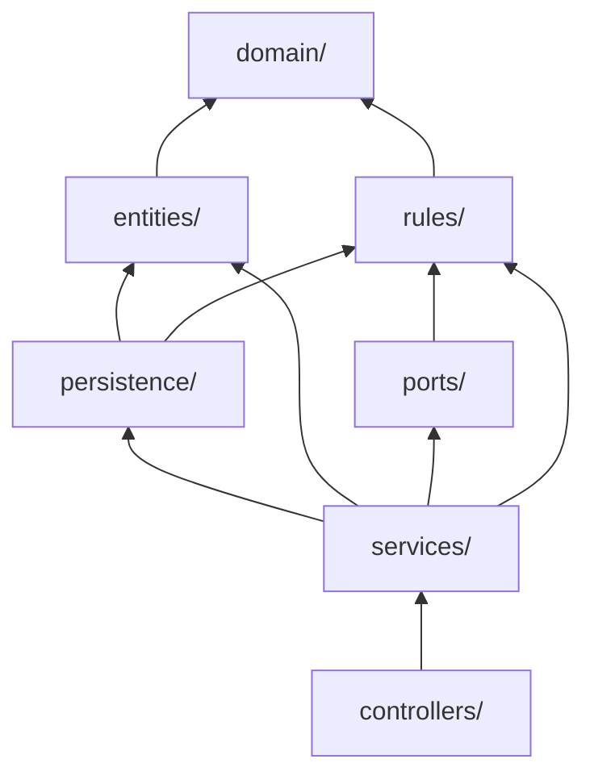

# Arquitectura de reglas financieras

Cómo está construido el motor de M04, y por qué M05 y M06 deberían copiar la
forma. Levantado de `back-walvy` en `feature/m4-ruta-despeje`.

El módulo tiene **15 reglas puras** con unas 300 pruebas propias. Esa capa es el
activo: todo lo demás existe para alimentarla y para guardar lo que devuelve.

## Qué es una regla acá

Una función pura en `rules/`. Sin repositorios, sin inyección, sin `async`.

```ts
export const RULE_VERSION = 'v1_mvp';

export function evaluateBasePressure(input: BasePressureInput): BasePressureResult {
  // …
  return { pressure, c, k, d, unevaluableAxes, reasonCodes, ruleVersion: RULE_VERSION };
}
```

Tres cosas que toda regla cumple:

1. **Exporta su `RULE_VERSION`** y la devuelve en el resultado. Sin eso una
   evaluación guardada no se puede reproducir ni distinguir de una vieja.
2. **Devuelve `reasonCodes` con código estable**, no mensajes. El copy es del
   front; el código es el contrato.
3. **Se prueba por tabla de casos**, incluidos los negativos. Una regla que sólo
   tiene el camino feliz probado no está probada.

## Las capas



**Las dependencias apuntan hacia `domain/`, nunca al revés.** Una regla no
importa de `entities/`, y por eso se prueba sin levantar TypeORM. Si un tipo lo
necesitan las dos capas, vive en `domain/`.

`persistence/` es la única capa que toca los dos lados: traducir entre una
decisión y una columna es su trabajo.

## Los cuatro patrones

### 1 · Regla pura, servicio delgado

El servicio no decide: carga, llama al pipeline, escribe y publica.
`route.service.ts` tiene 172 líneas y tres métodos públicos. El pipeline
—`debt-evaluation.pipeline.ts`— también es puro, así que se prueba entero sin
base ni contenedor.

### 2 · Puerto para lo que no es tuyo

Lo que pertenece a otro módulo se consume por un puerto que declara el owner de
cada campo, y su adaptador nulo devuelve `null` en todo.

```ts
export interface DebtPaymentFact {
  fact: PaymentFact | null;
  cycleClosed?: boolean;
  /** Obligatorio: en la frontera el guardrail es el compilador. */
  inferred: boolean;
}
```

Devolver `null` y no cero es deliberado: el motor lo traduce a «no evaluable», y
devolver ceros diría que el usuario está bien cuando nadie lo calculó.

Es lo que permitió construir el motor completo meses antes de que M05 y M06
existan.

### 3 · Proyección de persistencia

Un archivo por regla que necesite aterrizar en columnas. Convierte el resultado
en los campos a escribir y nada más: **no decide, traduce**.

Acá viven las distinciones que la base tiene que preservar. Ejemplo: el gate
prudencial devuelve `sustainableAmount: null` tanto cuando M05 calculó cero como
cuando no pudo evaluar, y los separa con un booleano. La proyección es el punto
donde ese cero se vuelve una columna con `0` y el otro caso queda en `NULL`.

### 4 · Guardrail en la base, no en un comentario

Cuando un invariante se puede imponer en el motor, se impone ahí.

```sql
CONSTRAINT chk_debt_closure_guardrail
  CHECK (status NOT IN ('closed','paid') OR possible_closure = true)
```

Un bug de servicio no puede violarlo. Lo mismo con el unique
`(user_id, objeto_id, familia)` de `debt_situation`, que **es** la regla de
identidad de situaciones puesta en la base.

## Tres invariantes que no se negocian

**Ausencia de dato no es un valor.** `null` y `0` significan cosas distintas en
todo el módulo, y hay columnas y pruebas dedicadas a que no colapsen. La columna
de presión llega a separar `no_evaluada` —no corrió— de `no_calculable` —corrió
y no pudo concluir—.

**M04 no mueve dinero.** Ninguna acción ejecuta una operación financiera. La
escritura por deuda nunca toca saldo, cuota, estado ni confirmación, y hay una
prueba que lo verifica sobre las claves que la función produce.

**Lo que tiene owner se consume, no se recalcula.** El headroom es de M05 y el
aging de M06. M04 los referencia por el puerto y no mantiene copias.

## Al agregar una regla

1. Escribirla en `rules/` como función pura, con su versión y sus razones.
2. Probarla por tabla de casos **antes** de conectarla a nada.
3. Si necesita persistir, agregar su proyección en `persistence/`.
4. Recién ahí llamarla desde el servicio.

El orden importa: una regla que nace acoplada a un repositorio ya no se puede
probar sola, y es el error que esta estructura existe para evitar.

## Lo que aprendimos construyéndolo

**El `catch` que protege la lectura puede esconder que nada se escribe.** El
servicio degrada si la persistencia falla, por `TEC-M4-021`. Eso está bien, pero
dos veces ocultó que la escritura estaba rota: un mock sin `update` y una entity
sin registrar. Las pruebas verifican **qué** se escribió, no que no haya
explotado, y hay un e2e contra base real que lo confirma.

**Los tests unitarios no ven los DTO.** El flujo de cierre estuvo inalcanzable en
producción porque el DTO de edición no admitía saldo cero, y las pruebas
construían la entity directo. Correr los endpoints contra base real es lo único
que lo encuentra.

**Un vocabulario declarado donde se escribió primero termina invirtiendo las
capas.** Tres veces apareció el mismo bug —una regla dependiendo de una entity,
una entity de una regla, una regla de la entity de otro módulo—. La cura es
mirar el grafo completo de dependencias, no la arista que uno sospecha.
