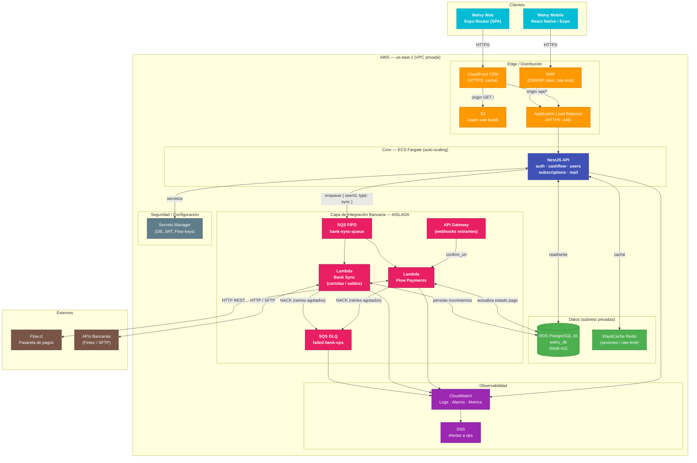

# Arquitectura AWS — Walvy

> Versión: 2026-04-26 | Entorno: producción

## Diagrama general

---

## Descripción de componentes

### Edge
| Componente | Rol |
|---|---|
| CloudFront | CDN global, termina HTTPS, cachea el SPA de S3 |
| S3 | Sirve el bundle estático generado por `expo export --platform web` |
| ALB | Balanceo hacia ECS; gestiona certificados TLS de la API |
| WAF | Filtra tráfico malicioso (rate limit, reglas OWASP Top 10) |

### Core API (ECS Fargate)
NestJS desplegado en contenedores sin gestión de servidores. Auto-scaling basado en CPU/memory. Contiene los módulos: `auth`, `cashflow`, `users`, `subscriptions`, `mail`.

### Datos
| Componente | Rol |
|---|---|
| RDS PostgreSQL | Fuente de verdad. Multi-AZ para alta disponibilidad |
| ElastiCache Redis | Caché de sesiones y datos de corta vida |
| Secrets Manager | Credenciales, JWT secret, API keys de Flow — nunca en variables de entorno hardcodeadas |

### Capa de Integración Bancaria (aislada)
La capa de integración **no es parte del Core API**. Comunicación interna exclusivamente mediante mensajes (SQS FIFO), garantizando que una falla o latencia bancaria **nunca bloquea** el core.

| Componente | Rol |
|---|---|
| SQS FIFO `bank-sync-queue` | Buffer async entre Core y Lambdas |
| Lambda Flow Payments | Procesa pagos con Flow.cl (cargo, confirma, refund) |
| Lambda Bank Sync | Obtiene cartolas/saldos desde APIs bancarias |
| SQS DLQ `failed-bank-ops` | Captura mensajes fallidos tras N reintentos |
| API Gateway | Recibe webhooks entrantes de Flow (`confirm_url`, `return_url`) |

### Observabilidad
- **CloudWatch Logs**: todos los servicios loguean aquí (structured JSON)
- **CloudWatch Alarms**: alertas en `DLQ.ApproximateNumberOfMessagesVisible > 0`, errores 5xx, latencia p99
- **SNS**: notifica al equipo de ops cuando se dispara una alarma

---

## Notas de red
- ECS, RDS y ElastiCache viven en **subnets privadas** (sin IP pública)
- Las Lambdas están en la misma VPC para acceder a RDS sin internet
- Solo ALB y CloudFront tienen IPs/endpoints públicos
