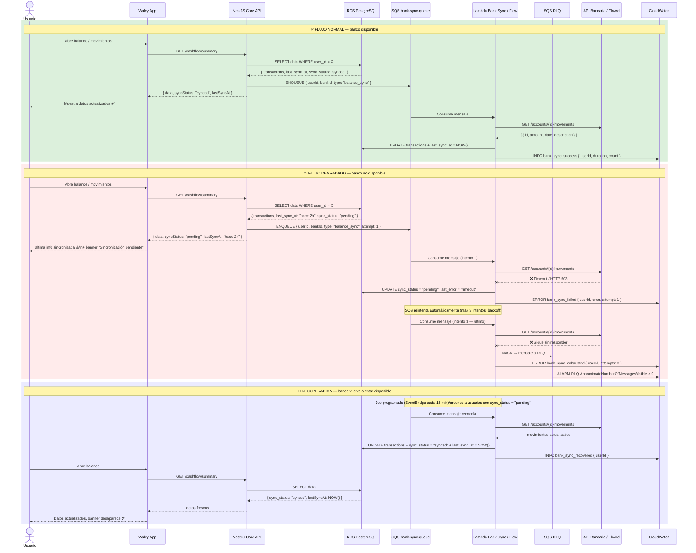

# Flujo de Integración Bancaria — Degradación Controlada

> Versión: 2026-04-26  
> Garantía técnica: fallas bancarias nunca comprometen la estabilidad del core.

---

## Flujo normal vs. degradado



---

## Contrato de degradación

### Estado `sync_status` en base de datos

| Estado | Significado | UX en App |
|---|---|---|
| `synced` | Datos actualizados | Muestra datos sin aviso |
| `pending` | Sincronización en cola o en curso | Banner amarillo: "Actualizando..." |
| `failed` | Reintentos agotados, en DLQ | Banner rojo: "Sincronización pendiente. Última actualización: hace X" |

### Comportamiento del Core API ante falla bancaria

```
GET /cashflow/summary

→ SIEMPRE responde con los datos que tiene en DB (nunca espera al banco)
→ sync_status refleja el estado real de la última sincronización
→ El Core encola una tarea de sincronización en background (fire-and-forget)
→ Si el banco está caído, el usuario ve su última info válida + aviso
→ El Core nunca llama directamente al banco — solo a través de SQS + Lambda
```

### Registro y auditoría

Todo evento de sincronización queda en CloudWatch Logs con estructura JSON:

```json
{
  "level": "ERROR",
  "event": "bank_sync_failed",
  "userId": "uuid",
  "bankId": "banco_estado",
  "attempt": 3,
  "error": "ConnectTimeoutError: 8000ms",
  "timestamp": "2026-04-26T21:00:00Z"
}
```

Alarmas configuradas en CloudWatch:
- `DLQ.ApproximateNumberOfMessagesVisible > 0` → SNS alerta a ops
- `bank_sync_failed` rate > 10/min → posible outage bancario
- `bank_sync_exhausted` por usuario → auditoría manual

---

## Garantías técnicas cumplidas

| Garantía | Cómo se cumple |
|---|---|
| Fallas bancarias no comprometen el Core | Core no llama bancos directamente; usa SQS (async) |
| Sin bloqueo por latencia externa | Las Lambdas corren fuera del ciclo request/response del Core |
| Degradación controlada con última info | Core siempre lee de DB, nunca espera respuesta bancaria |
| Logs y auditoría de errores | CloudWatch Logs estructurado + DLQ + Alarms |
| Recuperación automática | EventBridge reencola pendientes cada 15 min |
