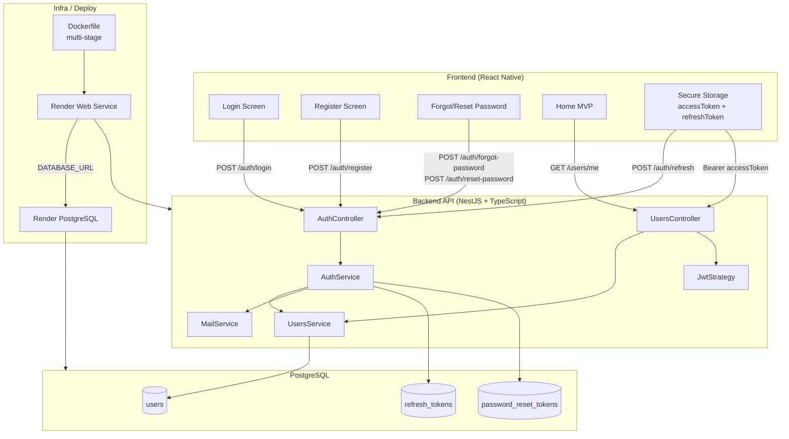

# Arquitectura General

```mermaid
flowchart TB
    subgraph Client["Frontend (React Native)"]
        A1[Login Screen]
        A2[Register Screen]
        A3[Forgot/Reset Password]
        A4[Home MVP]
        A5[Secure Storage<br/>accessToken + refreshToken]
    end

    subgraph API["Backend API (NestJS + TypeScript)"]
        B1[AuthController]
        B2[UsersController]
        B3[AuthService]
        B4[UsersService]
        B5[JwtStrategy]
        B6[MailService]
    end

    subgraph DB["PostgreSQL"]
        C1[(users)]
        C2[(refresh_tokens)]
        C3[(password_reset_tokens)]
    end

    subgraph Infra["Infra / Deploy"]
        D1[Dockerfile<br/>multi-stage]
        D2[Render Web Service]
        D3[Render PostgreSQL]
    end

    A1 -->|POST /auth/login| B1
    A2 -->|POST /auth/register| B1
    A3 -->|POST /auth/forgot-password<br/>POST /auth/reset-password| B1
    A4 -->|GET /users/me| B2
    A5 -->|POST /auth/refresh| B1
    A5 -->|Bearer accessToken| B2

    B1 --> B3
    B2 --> B4
    B2 --> B5
    B3 --> B4
    B3 --> B6

    B4 --> C1
    B3 --> C2
    B3 --> C3

    D1 --> D2
    D2 --> API
    D2 -->|DATABASE_URL| D3
    D3 --> DB
```
