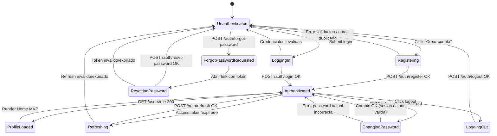

# Maquina de Estados de Autenticacion

```mermaid
stateDiagram-v2
    [*] --> Unauthenticated

    Unauthenticated --> Registering: Click "Crear cuenta"
    Registering --> Authenticated: POST /auth/register OK
    Registering --> Unauthenticated: Error validacion / email duplicado

    Unauthenticated --> LoggingIn: Submit login
    LoggingIn --> Authenticated: POST /auth/login OK
    LoggingIn --> Unauthenticated: Credenciales invalidas

    Authenticated --> ProfileLoaded: GET /users/me 200
    ProfileLoaded --> Authenticated: Render Home MVP

    Authenticated --> Refreshing: Access token expirado
    Refreshing --> Authenticated: POST /auth/refresh OK
    Refreshing --> Unauthenticated: Refresh invalido/expirado

    Unauthenticated --> ForgotPasswordRequested: POST /auth/forgot-password
    ForgotPasswordRequested --> ResettingPassword: Abrir link con token
    ResettingPassword --> Unauthenticated: POST /auth/reset-password OK
    ResettingPassword --> Unauthenticated: Token invalido/expirado

    Authenticated --> ChangingPassword: PATCH /users/me/password
    ChangingPassword --> Authenticated: Cambio OK (sesion actual valida)
    ChangingPassword --> Authenticated: Error password actual incorrecta

    Authenticated --> LoggingOut: Click logout
    LoggingOut --> Unauthenticated: POST /auth/logout OK
```
