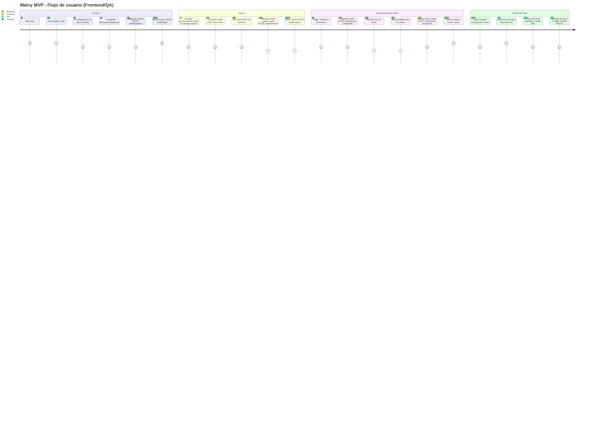

# Flujo Usuario / Frontend / QA

```mermaid
journey
    title Walvy MVP - Flujo de usuario (Frontend/QA)
    section Acceso
      Abrir app: 5: Usuario
      Ver pantalla Login: 5: Usuario, Frontend
      Ir a Registro (si no tiene cuenta): 4: Usuario
      Completar nombre/email/password: 4: Usuario
      Registrar cuenta (POST /auth/register): 4: Frontend, Backend
      Iniciar sesion (POST /auth/login): 5: Usuario, Frontend, Backend
    section Sesion
      Guardar access/refresh token en storage seguro: 4: Frontend
      Consultar perfil (GET /users/me): 4: Frontend, Backend
      Ver Home MVP (UI minima): 4: Usuario, Frontend
      Renovar token cuando expire (POST /auth/refresh): 3: Frontend, Backend
      Cerrar sesion (POST /auth/logout): 3: Usuario, Frontend, Backend
    section Recuperacion de clave
      Elegir "Olvide mi contrasena": 4: Usuario
      Solicitar reset (POST /auth/forgot-password): 4: Frontend, Backend
      Recibir link con token: 3: Usuario, Backend
      Abrir pantalla reset con token: 3: Usuario, Frontend
      Enviar nueva clave (POST /auth/reset-password): 4: Frontend, Backend
      Volver a login e iniciar sesion: 5: Usuario, Frontend, Backend
    section Casos QA clave
      Login invalido muestra error claro: 4: QA, Frontend, Backend
      /users/me sin token responde 401: 5: QA, Backend
      Token de reset expirado o usado falla: 4: QA, Backend
      Cambio de clave invalida refresh anterior: 4: QA, Backend
```
