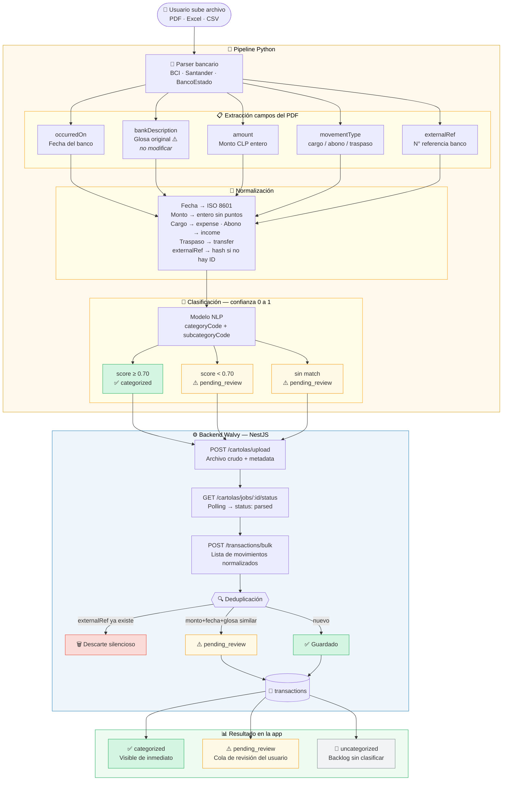
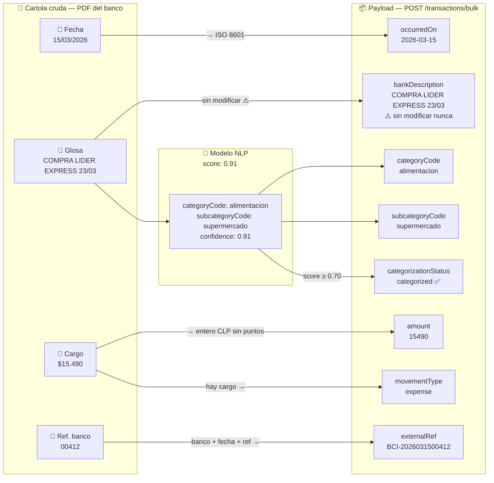

# Reunión: Equipo de Extracción de Cartolas Bancarias
**Walvy — Pipeline de Ingesta de Movimientos**  
**Fecha:** 2026-04-20  

---

## Contexto

Walvy es una app de finanzas personales para Chile. El usuario puede cargar sus **cartolas bancarias** (estados de cuenta) para que el sistema registre automáticamente sus movimientos, los categorice y genere indicadores financieros (capacidad de ahorro, gastos hormiga, semáforo del mes, etc.).

**Su rol:** Extraer los movimientos crudos de los archivos de cartola (PDF, Excel, CSV bancario) y entregarlos al backend de Walvy en el formato normalizado que se describe en este documento.

---

## Flujo general



### Transformación de campos — cartola cruda → payload Walvy



> **Nota:** Los endpoints `POST /cartolas/upload`, `GET /cartolas/jobs/:id/status` y `POST /transactions/bulk` están **por implementarse** en el backend NestJS. Este documento define el contrato para que ambos equipos trabajen coordinados.

---

## Campos que el pipeline debe producir por cada movimiento

### Tabla de campos — `POST /transactions/bulk`

| Campo | Tipo | Requerido | Descripción |
|-------|------|-----------|-------------|
| `occurredOn` | `string` ISO 8601 | ✅ | Fecha del movimiento según el banco. Formato: `"2026-03-15"` |
| `bankDescription` | `string` | ✅ | **Glosa original del banco, sin modificar.** Se guarda como dato inmutable. Ejemplo: `"COMPRA LIDER EXPRESS 23/03"` |
| `amount` | `number` | ✅ | Monto en CLP como número positivo. No incluir signo ni puntos de miles. Ejemplo: `15490` |
| `movementType` | `"income"` \| `"expense"` \| `"transfer"` | ✅ | Tipo de movimiento. Ver reglas abajo. |
| `fundingSourceCode` | `string` | ✅ | Código de la cuenta de origen (ver sección Fuentes de Fondos). Ejemplo: `"cc"` |
| `externalRef` | `string` | ✅ | ID único del banco para este movimiento. Usado para deduplicación. Ejemplo: `"BCI-2026031500412"` |
| `categorizationStatus` | `"categorized"` \| `"pending_review"` \| `"uncategorized"` | ✅ | Estado de categorización. Ver reglas abajo. |
| `description` | `string` | ⬜ | Descripción procesada/legible, si el pipeline la genera. Si no, puede omitirse (el backend usa `bankDescription`). |
| `categoryCode` | `string` | ⬜ | Código de categoría sugerido por el pipeline. Solo enviar si confianza ≥ 0.7. Ejemplo: `"alimentacion"` |
| `subcategoryCode` | `string` | ⬜ | Código de subcategoría sugerido. Solo enviar si confianza ≥ 0.7. |
| `flowType` | `"fixed"` \| `"variable"` | ⬜ | Si el pipeline puede detectarlo: fixed si la misma glosa aparece más de una vez en el histórico. |
| `destinationFundingSourceCode` | `string` | ⬜ | Solo para traspasos entre cuentas propias del usuario. Código de la cuenta destino. |
| `confidence` | `number` (0–1) | ⬜ | Confianza del pipeline en la categorización. No se persiste, solo se usa para determinar `categorizationStatus`. |

---

## Reglas de `movementType`

| Caso | `movementType` |
|------|----------------|
| Compra / gasto / pago a tercero | `"expense"` |
| Abono / depósito / remuneración | `"income"` |
| Traspaso entre cuentas propias (ej: CC → Ahorro) | `"transfer"` |
| Pago de tarjeta de crédito desde cuenta corriente | `"transfer"` |

**Importante:** Los traspasos (`transfer`) **no** son ni ingreso ni gasto neto. Representan movimiento de dinero dentro de la red de cuentas del usuario.

---

## Reglas de `categorizationStatus`

| Condición | `categorizationStatus` |
|-----------|------------------------|
| Pipeline identificó categoría con confianza ≥ 0.70 | `"categorized"` |
| Pipeline identificó categoría con confianza < 0.70 | `"pending_review"` |
| Pipeline no pudo determinar ninguna categoría | `"pending_review"` |
| Movimiento duplicado detectado | `"pending_review"` |
| No se intentó categorizar | `"uncategorized"` |

> Los movimientos en `"pending_review"` aparecen en la app como un backlog que el usuario revisa. No se ocultan ni se descartan.

---

## Fuentes de fondos (`fundingSourceCode`)

El pipeline debe mapear la cuenta bancaria de origen a uno de los códigos de fuente de fondos del usuario. Walvy crea estas fuentes por defecto al registrar un usuario:

| Código | Tipo | Nombre por defecto |
|--------|------|--------------------|
| `cc` | `checking` | Cuenta Corriente |
| `lc` | `credit_line` | Línea de Crédito |
| `tc` | `credit_card` | Tarjeta de Crédito |
| `inv_01` | `investment` | Inversiones |

**Tipos disponibles:** `checking`, `credit_line`, `credit_card`, `investment`, `cash`, `mortgage`, `other`

El pipeline puede crear fuentes adicionales si el usuario tiene más cuentas (ej: dos tarjetas de crédito). Para eso, antes de enviar el bulk, el pipeline debe:

1. `GET /funding-sources` — obtener las fuentes del usuario
2. Si no existe la cuenta, `POST /funding-sources` — crearla
3. Usar el `id` o `code` retornado en el campo `fundingSourceCode`

---

## Regla de gastos hormiga (`isAntExpense`)

El backend calcula automáticamente si un movimiento es "gasto hormiga" al recibirlo. El pipeline **no necesita calcularlo**, pero debe asegurarse de que los datos que envía sean correctos para que la lógica funcione:

| Condición | Valor |
|-----------|-------|
| Es un egreso (`expense`) | ✅ |
| Monto ≤ CLP 16.000 | ✅ |
| No es un traspaso | ✅ |
| Subcategoría no está excluida (ej: cuotas de préstamo) | ✅ |
Si **todas** las condiciones se cumplen → `isAntExpense = true` automáticamente.

---

## Detección de Fijo/Variable

La clasificación `flowType` determina si un gasto es recurrente (fijo) o esporádico (variable):

- **Variable (default):** Primera vez que se ve esa glosa en el histórico del usuario.
- **Fijo:** La misma `bankDescription` aparece más de 1 vez en el histórico.
- **Candidato "Recurrente":** Aparece más de 3 veces → se etiqueta como `recurrente` en el motor de mensajes.

El pipeline puede enviar una sugerencia de `flowType`, pero el backend la puede recalcular comparando con el historial almacenado.

---

## Deduplicación

Antes de guardar, el backend verifica si ya existe un movimiento con:
- Mismo `externalRef` para ese usuario → **descarte silencioso**
- Mismo `amount` + `occurredOn` + `bankDescription` similar (sin `externalRef`) → crear con `categorizationStatus: "pending_review"`

**Implicación para el pipeline:** Incluir siempre `externalRef` con el ID del banco si está disponible. Esto garantiza una deduplicación determinista.

---

## Formato del payload — `POST /transactions/bulk`

```json
{
  "fundingSourceId": "uuid-de-la-cuenta",
  "bankName": "BCI",
  "statementPeriod": {
    "from": "2026-03-01",
    "to": "2026-03-31"
  },
  "transactions": [
    {
      "occurredOn": "2026-03-15",
      "bankDescription": "COMPRA LIDER EXPRESS 23/03",
      "amount": 15490,
      "movementType": "expense",
      "fundingSourceCode": "cc",
      "externalRef": "BCI-2026031500412",
      "categorizationStatus": "categorized",
      "categoryCode": "alimentacion",
      "subcategoryCode": "supermercado",
      "flowType": "variable",
      "confidence": 0.91
    },
    {
      "occurredOn": "2026-03-20",
      "bankDescription": "TRF A CTA 0012345678",
      "amount": 200000,
      "movementType": "transfer",
      "fundingSourceCode": "cc",
      "destinationFundingSourceCode": "lc",
      "externalRef": "BCI-2026032000891",
      "categorizationStatus": "categorized"
    },
    {
      "occurredOn": "2026-03-22",
      "bankDescription": "CARGO DESCONOCIDO REF 99182",
      "amount": 8900,
      "movementType": "expense",
      "fundingSourceCode": "tc",
      "externalRef": "BCI-2026032200045",
      "categorizationStatus": "pending_review"
    }
  ]
}
```

---

## Respuesta esperada — `POST /transactions/bulk`

```json
{
  "jobId": "uuid-del-job",
  "received": 3,
  "created": 2,
  "duplicates": 0,
  "pendingReview": 1,
  "errors": []
}
```

---

## Categorías disponibles (seeds del sistema)

El pipeline debe usar estos `categoryCode` al sugerir categorías:

| Código | Nombre |
|--------|--------|
| `empleador` | Empleador |
| `hogar` | Hogar |
| `familia` | Familia |
| `entretenimiento` | Entretenimiento |
| `inversiones` | Inversiones |
| `gastos_personales` | Gastos Personales |
| `creditos` | Créditos |
| `efectivo` | Efectivo |
| `otros` | Otros |
| `movilizacion` | Movilización |
| `alimentacion` | Alimentación |

> La lista completa y sus subcategorías se obtiene de `GET /categories` (endpoint existente).

---

## Qué necesitamos de este equipo (checklist)

### Mínimo para MVP
- [ ] Parser que soporte al menos: **BCI, Santander, BancoEstado** (los 3 bancos más comunes del segmento objetivo)
- [ ] Extracción de: fecha, glosa, monto, tipo (cargo/abono), número de referencia del banco
- [ ] Normalización de monto a número entero CLP (sin puntos ni signos)
- [ ] Clasificación de `movementType` (income/expense/transfer) basada en la glosa y el signo del monto
- [ ] Generación de `externalRef` determinista (puede ser hash de banco+fecha+glosa+monto si el banco no provee ID)
- [ ] Modelo de categorización con score de confianza 0–1
- [ ] Campo `categorizationStatus` según umbral de confianza (≥ 0.70 → categorized, resto → pending_review)
- [ ] Endpoint de callback o polling para notificar al backend cuando el procesamiento termina

### Deseable para V1
- [ ] Soporte de **Excel `.xlsm`** (formato del cliente actual)
- [ ] Soporte de **PDF** (cartolas escaneadas → OCR)
- [ ] Detección automática de traspasos entre cuentas del mismo usuario
- [ ] Sugerencia de `flowType` (fixed/variable) basada en recurrencia de la glosa en el lote

---

## Preguntas abiertas a resolver en reunión

1. **¿Qué bancos priorizamos primero?** El cliente del piloto usa BCI. ¿Tenemos muestras de sus cartolas reales para construir el parser?
2. **¿Cómo se autentica el pipeline con la API de Walvy?** ¿Token de servicio fijo, o el pipeline actúa en nombre del usuario con su JWT?
3. **¿Sincrónico o asincrónico?** Para lotes grandes (> 200 movimientos) necesitamos polling. Para pruebas podemos empezar sincrónico.
4. **¿Dónde se guardan los archivos subidos?** El backend necesita almacenamiento (S3, local) para auditoría. ¿El pipeline sube directamente o el cliente lo sube y el pipeline descarga?
5. **¿Cuál es el modelo de confianza?** ¿Reglas basadas en keywords, ML, o híbrido? Necesitamos saber para calibrar el umbral 0.70.
6. **Idioma del pipeline:** ¿El equipo trabaja en Python puro? El backend está en NestJS/TypeScript — la interfaz es HTTP REST, no hay dependencia de lenguaje.

---

## Hitos coordinados (propuesta)

| Fecha | Milestone |
|-------|-----------|
| 2026-04-28 | Spec final de endpoints `/cartolas/upload` y `/transactions/bulk` acordada |
| 2026-05-05 | Backend implementa endpoints (stubs que aceptan el payload y responden mock) |
| 2026-05-12 | Pipeline entrega primer parser BCI con campos mínimos |
| 2026-05-19 | Integración end-to-end con datos reales de prueba |
| 2026-05-26 | QA y ajuste de umbral de confianza |
| 2026-06-02 | Ingesta en producción piloto |

---

*Documento preparado para reunión interna de coordinación. Sujeto a cambios según decisiones de arquitectura acordadas en la reunión.*
