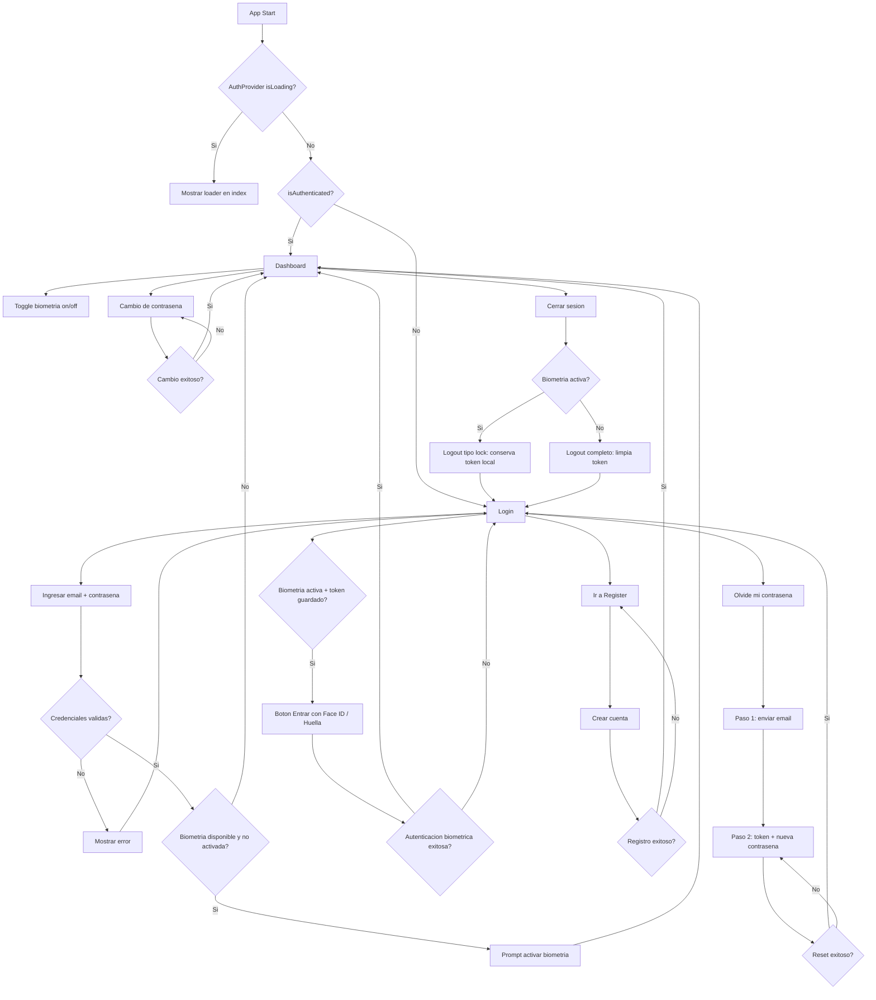

# Diagrama de Caminos de la Aplicacion (Etapa 1)

## Lectura rapida

- `index` decide a donde navegar segun `isAuthenticated`.
- `login` soporta entrada normal + entrada biometrica.
- `forgot-password` opera en 2 pasos (solicitud + reset).
- `dashboard` concentra ajustes de seguridad (biometria y cambio de contrasena).
